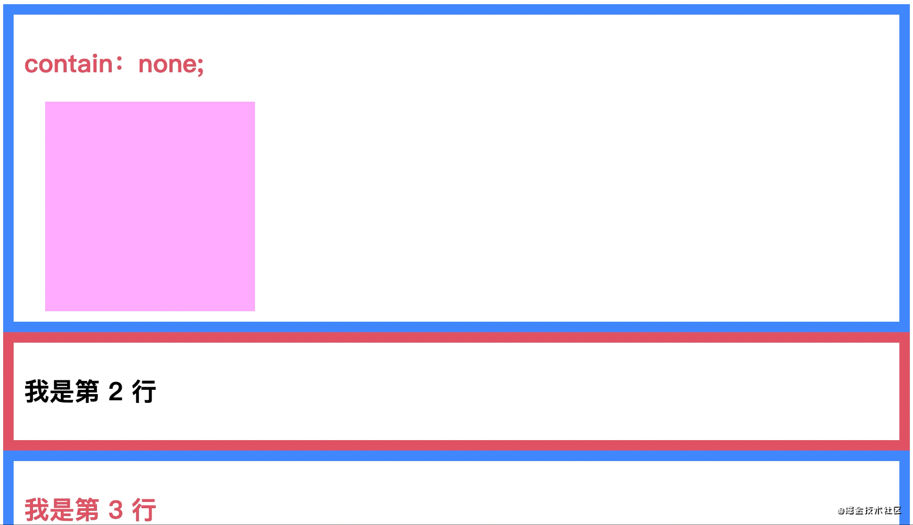
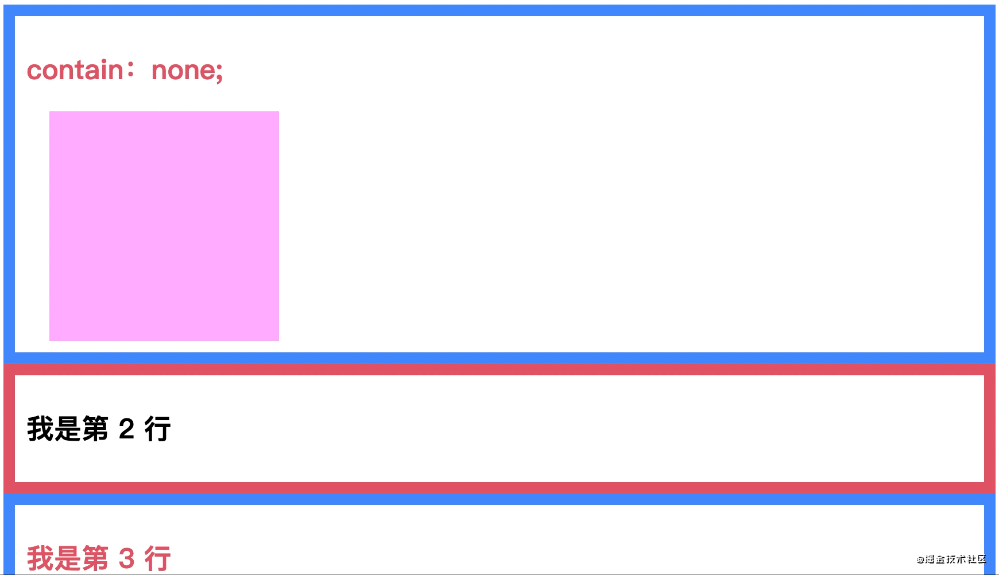
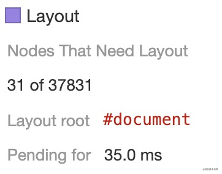
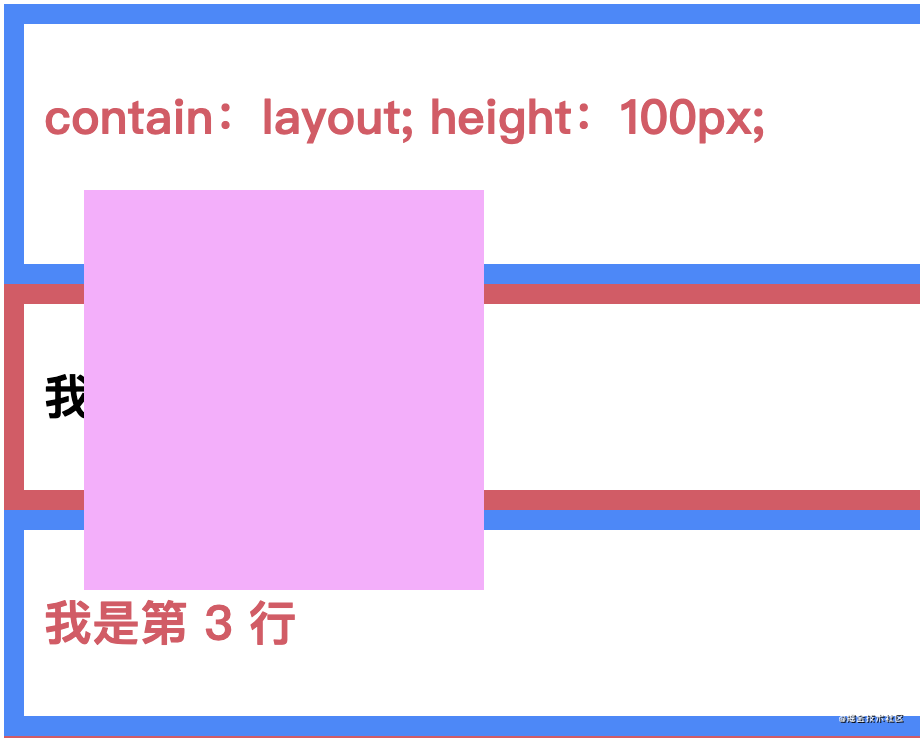
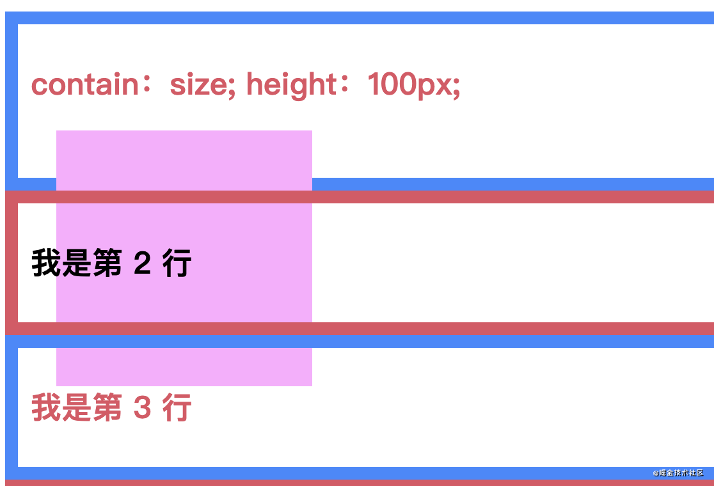
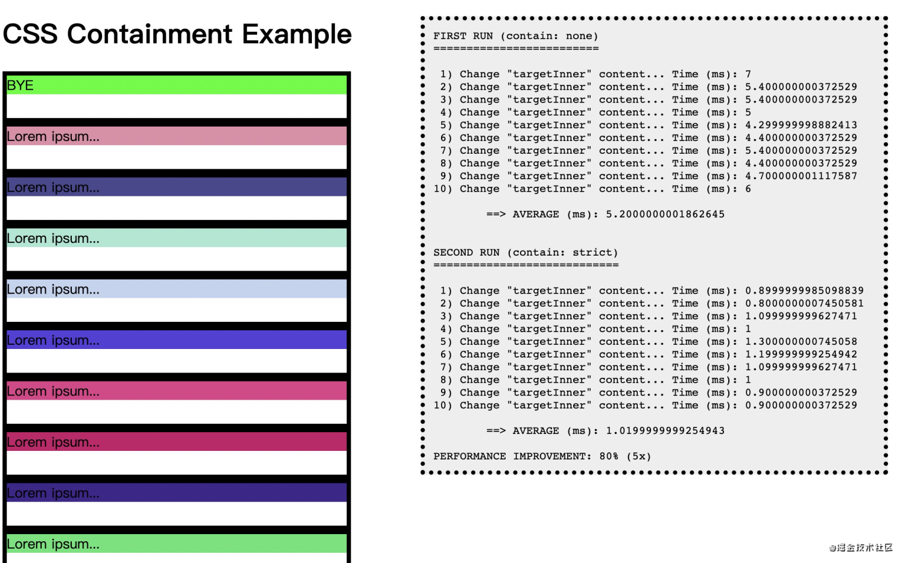
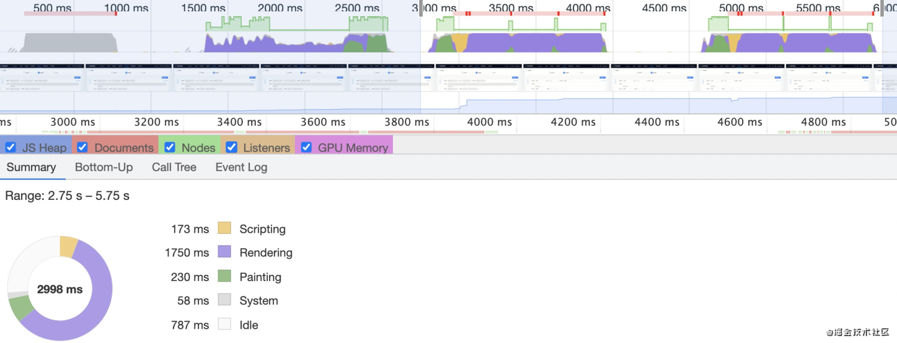
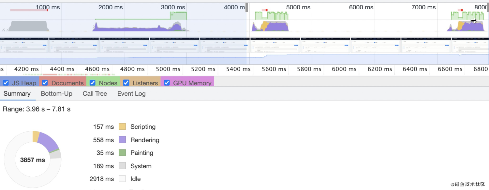
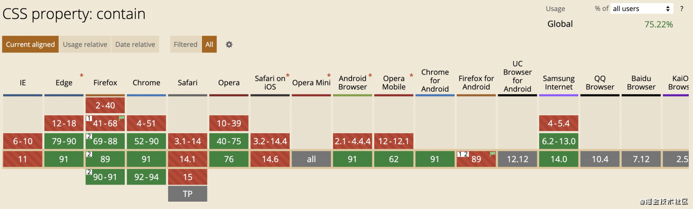

<!--truncate-->

# 引言

在开始介绍今天的主角 _CSS Containment_ 之前，我们需要了解一些前置知识回流和重绘，方便我们理解以及应用的场景。

## 简单回忆下回流和重绘

- 回流（Reflow）：当浏览器必须重新处理和绘制部分或全部页面时，回流就会发生，例如元素的规模尺寸，布局，隐藏等改变而需要重新构建。
- 重绘（Repaint）：当改变元素的部分属性而不影响布局时，重绘就会发生。例如改变元素的背景颜色、字体颜色等。

## 回流会造成什么？

> Reflows are very expensive in terms of performance, and is one of the main causes of slow DOM scripts, In many cases, they are equivalent to laying out the entire page again.

通过翻译，我们可以知道，回流在性能方面消耗非常大，是很多 DOM 加载慢的原因之一。在许多情况下，它们相当于再次渲染整个页面。

接下来，来看看有哪些行为会触发回流/重绘。

### 触发回流/重绘

- 添加，删除，更新 DOM 节点时会发生回流
- 设置元素的属性为`display:none` 时发生回流
- 设置元素的属性`visibility: hidden` 时发生重绘
- DOM 节点上存在动画属性也将触发回流
- 调整窗口的大小将触发回流
- `font-style` 更改字体风格会改变元素的几何形状。 这意味着它可能会影响页面上其他元素的位置或大小,触发回流
- 添加或删除样式文件将导致回流/重绘
- 通过 JavaScript 获取元素的大小等，由于需要确保获取到的值为最新的，浏览器都会先执行一次回流来保证值的正确。例如 _offsetXXX_、_clientXXX_ 和 _scrollXXX_ 等

### 重绘回流优化方案

知道了触发回流/重绘的原因，那么就能根据这些原因，制定相应的优化方案，如下。

- 避免使用触发重绘回流的 CSS 属性。
- 尽量减少 JS 操作修改 DOM 的 CSS 次数。
- 将频繁重绘回流的 DOM 元素单独作为一个独立图层，那么这个 DOM 元素的重绘和回流影响只会在这个图层中。

经过了优化后，回流和重绘的次数已经减少，但是不可避免的，由于各种原因，还是会产生回流和重绘。

试想一下，有一个比较复杂的页面，当用户移动鼠标到一个元素上，触发这个元素`hover`，这个`hover`的效果是使这个元素宽高发生改变（`width`、`height`），当元素的宽高发生改变时，浏览器需要考虑到所有元素，是否发生了相应的更改，所以浏览器需要对整个页面进行重新布局，而实际上改变的可能只有页面的一小部分，页面大部分内容是保持不变的。这对于性能来说，无疑是十分差的。

那么有没有一种办法，能够让浏览器进行局部的回流重绘，从而达到优化性能的目的呢？或者说，减少回流时产生的性能消耗。答案是有的，就是今天所要认识的 _CSS Containment_

# CSS Containment

> CSS Containment 主要是通过允许开发者将某些子树从页面中独立出来，从而提高页面的性能。如果浏览器知道页面中的某部分是独立的，就能够优化渲染并获得性能提升。

由于有很多的交互或者复杂的情况，需要触发回流，重新渲染整个页面。为了改进这个，浏览器必须识别有哪些部分是独立的。当他们的子元素有变化时，浏览器的渲染引擎能够识别到，只对部分元素做回流重绘，而不对整个页面进行。

识别这个标准的属性就是 `contain` 。

## contain

通过 `contain` 属性告诉浏览器，这些节点是独立的。

## 语法：

```javascript
div {
  contain: none; /* 表示元素将正常渲染，没有包含规则 */
  contain: layout; /* 表示元素外部无法影响元素内部的布局，反之亦然 */
  contain: paint; /* 表示这个元素的子孙节点不会在它边缘外显示。如果一个元素在视窗外或因其他原因导致不可见，则同样保证它的子孙节点不会被显示。 */
  contain: size; /* 表示这个元素的尺寸计算不依赖于它的子孙元素的尺寸 */

  contain: content; /* 等价于 contain: layout paint */
  contain: strict; /* 等价于 contain: size layout paint */
}
```

[一个例子](https://codepen.io/zaoei/pen/MWyJrwN)

### Layout

> This value turns on layout containment for the element. This ensures that the containment box is totally opaque for layout purposes; nothing outside can affect its internal layout, and vice versa.

设置了 `layout` 属性，就是告诉浏览器当前元素内部的样式变化不会引起元素外部的样式变化。并且，元素外部的样式变化也不会引起元素内部的样式变化。这样，浏览器就可以相应的减少渲染元素，提高渲染的性能。

如果设置了 `layout` 属性的元素，被遮挡，如屏幕外。则浏览器会把该元素相关的处理，放到较低的优先级中。

```javascript
.container li {
    padding: 10px;
    height: 100px;

    contain: layout;
}
```


值得注意的是，由于元素内部的样式变化，导致了元素本身发生了大小等能触发回流的属性时，那么 `layout` 属性将不生效。

### Paint

> This value turns on paint containment for the element. This ensures that the descendants of the containment box don’t display outside its bounds, so if an element is off-screen or otherwise not visible, its descendants are also guaranteed to be not visible.

设置了 `paint` 属性，表示这个元素的子孙节点不会在它边缘外显示。如果一个元素在视窗外或因其他原因导致不可见，则同样它的子孙节点不会被显示。

```javascript
.container li {
    padding: 10px;
    height: 100px;

    contain: paint;
}
```



对于子元素，部分内容超出边界，那么该部分内容也不会被渲染。

从效果上来看，这有点类似于 `overflow：hidden`，不同的是 `overflow：hidden`，是通过将超出部分进行裁剪的方式。

举个例子，对于有滚动条的元素，由于滚动，会触发多次渲染，这些渲染的元素，包含当前可视区外的元素，造成了性能浪费。而使用 `paint` 就可以忽略这些可视区外元素的渲染，从而达到优化渲染性能。

### Size

> The value turns on size containment for the element. This ensures that the containment box can be laid out without needing to examine its descendants.

设置了 `size` 属性的元素，表示这个元素的尺寸计算不依赖于它的子孙元素的尺寸。

对于浏览器来说，设置 `size` 就是告诉浏览器，这个元素的大小已经固定了，就是这么大，不需要再通过重排子元素来获取当前元素的大小。

设置了 size 属性的元素，不管子元素是怎么布局，什么样式，都不会影响到父元素。

```javascript
.container li {
    padding: 10px;
    height: 100px;

    contain: size;
}
```



使用这个 size 属性，会改变渲染的根结点，从而达到优化的目的

使用前：



使用后：


可以看到，_layout root_ 是完全不同的，前者基于 _document_ 整个页面，而后者是基于当前的 _contain_ 容器元素。

在日常使用中，我们可以对一些容器元素使用，避免因为容器内部的布局改变，而导致整个页面的回流。

### content && strict

> contain：content； // 表示这个元素上有除了 size 和 style 外的所有包含规则。等价于 contain: layout paint。

> contain：strict； // 表示除了 style 外的所有的包含规则应用于这个元素。等价于 contain: size layout paint。

## 布局

不知道大家是否注意到，设置了`contain`的元素，只有在明确了`width`, `height`的情况下，才会产生效果，否则就跟正常元素一样。

真的没有其他任何变化么？其实不是的。

只要设置了`contain`的元素，就类似于使用 `position：relative` 布局，不同的是，`z-index`，以及`top`、`left`等改变位置的属性对其自身是无效。

对于设置`contain: layout`，通过观察可以看到，观感上它与 `position：relative` 并无区别，都是在正常文档流中占据位置，且子元素浮于正常文档流之上。



但是，对于设置`contain: size`的元素，通过观察可以看到，它也是在正常文档流中占据位置，不同的是，子元素浮于正常文档流之下，这就可以说明，只要设置了`contain: size`，它的层级是低于正常文档流的。



## example

为了更直观的看出 contain 的效果，先附上 [Manuel Rego Casasnovas](https://blogs.igalia.com/mrego/files/2019/01/css-contain-example.html) 写的例子。

```javascript
window.performance.now(); // 返回一个表示从性能测量时刻开始经过的毫秒数
```

通过`[window.performance.now()](https://developer.mozilla.org/zh-CN/docs/Web/API/Performance/now)`记录回流的开始时间，在回流结束后再通过`[window.performance.now()](https://developer.mozilla.org/zh-CN/docs/Web/API/Performance/now)`记录一次结束时间，用得到的开始时间和结束时间相减，就得到了一次完整回流所经历的时间。

```javascript
function runTests() {
  setup(); // 创建 1000 个节点

  let avg1 = changeTargetContent(); // 没有设置contain，触发回流

  let targetItem = document.getElementById('targetItem');
  targetItem.style.contain = 'strict';
  let avg2 = changeTargetContent(); // 触发回流
}

function changeTargetContent() {
  // Force layout.
  document.body.offsetLeft;

  let start = window.performance.now();

  let targetInner = document.getElementById('targetInner');
  targetInner.textContent = targetInner.textContent == 'Hello World!' ? 'BYE' : 'Hello World!';

  // Force layout.
  document.body.offsetLeft;

  let end = window.performance.now();
  let time = end - start;
  return time;
}
```



通过对比`cantain: strict`设置前和设置后，可以看到性能的优化达到了 80%左右。

在实际项目里下，使用`cantain: strict`属性后的效果。
截图场景，点击了 2 次按钮，完整触发了一个模块的打开关闭，前者为使用前，后者为使用后的的实际渲染效果。

使用前：


使用后：


通过比较，可以看出使用 `cantain: strict` 后，rendering 时长从 1750ms 降至 558ms，优化了 60%左右。而 painting 时长从 230ms 降至 35ms，优化了 75%的左右。

rendering 和 Painting 的占用时间，都有非常明显的减少。使用后对渲染性能的优化还是非常明显的。

## 兼容性



# 写在最后

在本次的学习中，其实还有一些值得探究或者比较遗憾的地方：

- `contain`在优化页面渲染性能的情况下，是否给浏览器带来了其他负担？个人猜测是通过空间换时间的方式。
- 设计的 demo 的实际效果跟理想中的效果，并不一致，不免有些遗憾。如对于 `contain：paint` 来说，在屏幕外添加子节点，触发回流重绘，根据`contain：paint`属性在屏幕外，不绘制元素的特性，重绘的时间应该是非常小，或者将近 0ms 的，然而在实际中并没有达到这个效果。

如果文章中出现错误，或者有更好的验证 demo，欢迎留言交流哈 😊。

# 参考文献

- [CSS Containment](https://developer.mozilla.org/zh-CN/docs/Web/CSS/CSS_Containment)
- [CSS Containment in Chrome 52](https://developers.google.com/web/updates/2016/06/css-containment)
- [CSS-Tricks](https://css-tricks.com/almanac/properties/c/contain/)
- [caniuse](https://caniuse.com/?search=contain)
- [An introduction to CSS Containment](https://blogs.igalia.com/mrego/2019/01/11/an-introduction-to-css-containment/)
- [CSS Containment Module Level 1](https://www.w3.org/TR/css-contain-1/)
- [CSS Containment Module Level 2](https://www.w3.org/TR/css-contain-2/)
