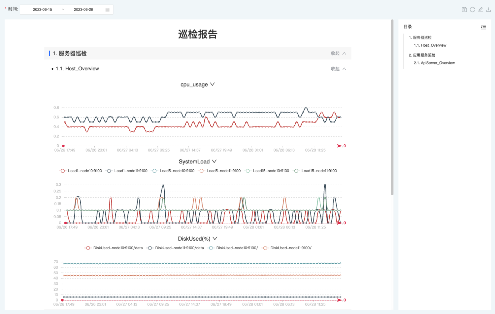
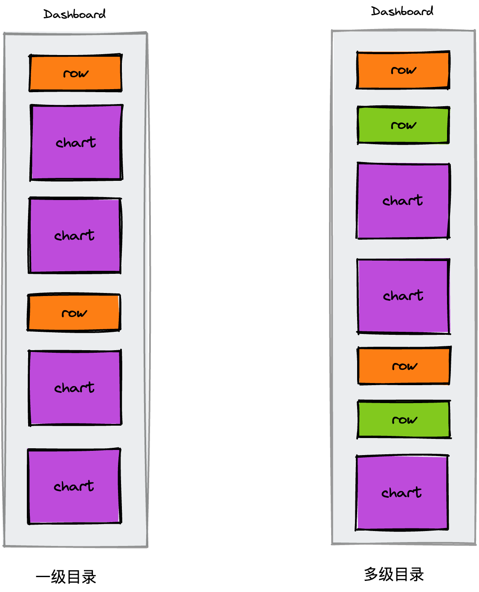
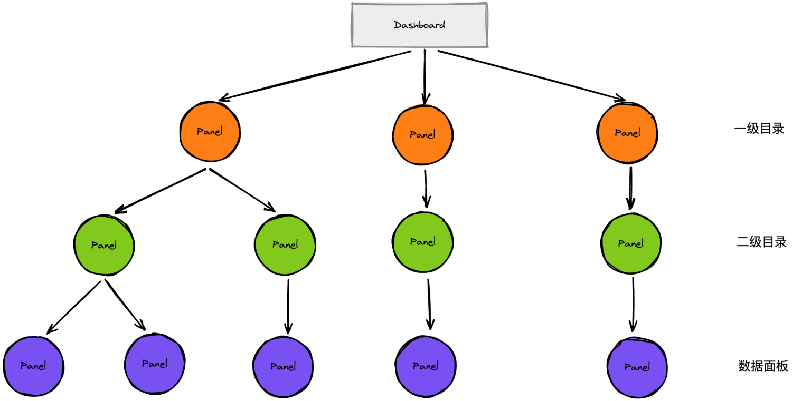
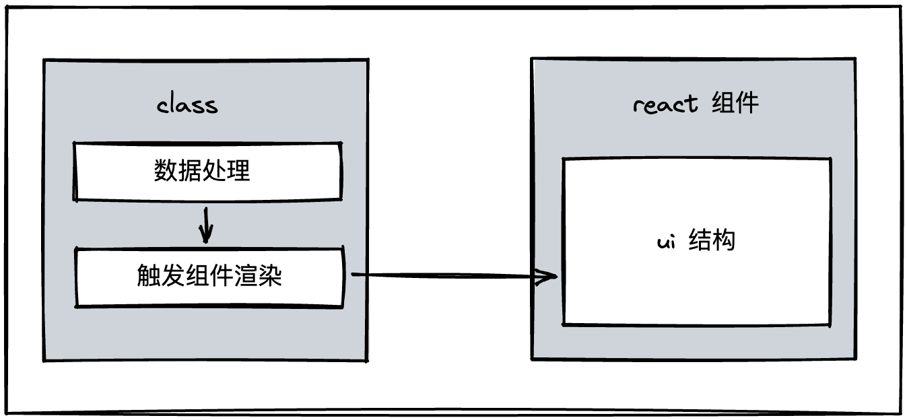
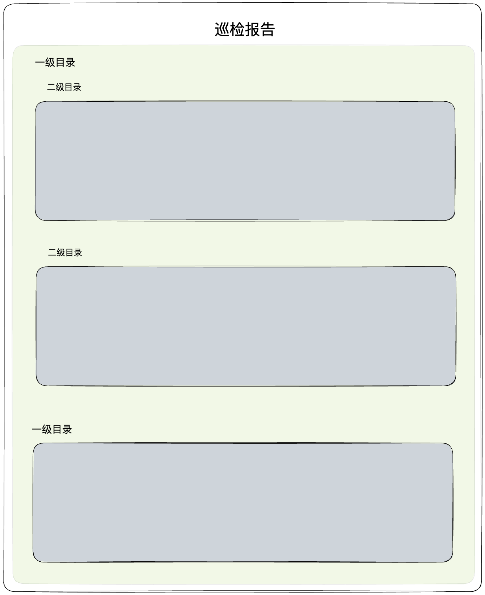

<!--truncate-->

# 什么是巡检报告

巡检报告是指对某一个系统或设备进行全面检查，并把检查结果及建议整理成报告的过程。巡检报告通常用于评估系统或设备的运行状况与性能，以发现问题、优化系统、提高效率、降低故障率等方面提供参考。


# 要实现什么功能


### 1、自定义布局

1. 现报告中的面板可进行拖拽改变布局。
2. 在拖拽的过程中限制拖拽区域，只允许在同一父级内进行拖拽，不允许跨目录移动，不允许改变目录的级别，比如把一级目录移动到另一个一级目录内，变成二级目录

### 2、目录可收缩展开

1. 目录支持收缩展开，收缩时隐藏所以子面板，展开时显示所以子面板
2. 移动目录时，子面板跟随移动
3. 改变目录后，同步更新右侧的目录面板
4. 生成目录编号

.png>)

### 3、右侧目录树

1. 生成目录编号
2. 支持锚点滚动
3. 支持展开收缩
4. 与左侧报告联动

.png>)

### 4、数据面板

1. 根据日期范围获取指标数据
2. 通过图表的形式展示指标信息
3. 查看详情，删除
4. 各面板的请求设计，支持刷新请求

.png>)
.png>)

### 5、面板导入

1. 统计目录下选择的面板数量
2. 导入新面板时，不能破坏已有布局，新面板只能跟在旧面板后
3. 导入已有面板时，需要进行数据比较，有数据变更需要重新获取最新的数据
   .png>)

### 6、保存

在保存前，所有影响布局相关的操作，都是临时的，包括导入面板。只有在点击保存后，才会把当前数据提交给后端进行保存。

### 7、支持 pdf 和 word 导出

.png>)

# 巡检报告实现方案

## 数据结构设计

先看看使用扁平结构下的

在扁平结构下，确定子项只需要找到下一个 row 面板，对于多级目录下也是同理，只是对一级目录需要额外处理。
这种结构上实现简单，但是需求要求我们限制目录的拖拽，限制目录需要一个比较清晰的面板层级关系，很显然，用树能够很清晰的描述一个数据的层级结构，


## 组件设计

与传统组件编程有所区别。
在实现上对渲染和数据处理进行了分离，分为两块：

- react 组件：主要负责页面渲染
- class : 负责数据的处理


DashboardModel

```jsx
class DashboardModel {
  id: string | number;
  panels: PanelModel[]; // 各个面板
  // ...
}
```

PanelModel

```jsx
class PanelModel {
    key?: string;
    id!: number;
    gridPos!: GridPos; // 位置信息
    title?: string;
		type: string;
    panels: PanelModel[]; // 目录面板需要维护当前目录下的面板信息
		// ...
}
```

每一个 Dashboard 组件对应一个 DashboardModel，每一个 Panel 组件对应一个 PanelModel。
react 组建根据类实例中的数据进行渲染。
实例生产后，不会轻易的销毁，或者改变引用地址，这让依赖实例数据进行渲染的 React 组件无法触发更新渲染。
需要一个方式，在实例内数据发生改变后，由我们手动触发组件的更新渲染。

### 组件渲染控制

由于我们采用的是 `hooks` 组件，不像 `class` 组件有 `forceUpdate` 方法触发组件的方法。
而在 `react18` 中有一个新特性 `useSyncExternalStore`，可以让我们订阅外部的数据，如果数据发生改变了，会触发组件的渲染。
实际上 `useSyncExternalStore` 触发组件渲染的原理就是在内部维护了一个 `state`，当更改了 `state` 值，引起了外部组件的渲染。
基于这个思路简单的实现了一个能够触发组件渲染的 `useForceUpdate` 方法。

```jsx
export function useForceUpdate() {
  const [_, setValue] = useState(0);
  return debounce(() => setValue((prevState) => prevState + 1), 0);
}
```

虽说实现了 `useForceUpdate`，但是在实际使用的过程中，还需要在组件销毁时移除事件。
而 `useSyncExternalStore` 已经内部已经实现了，直接使用即可。

```jsx
useSyncExternalStore(dashboard?.subscribe ?? (() => {}), dashboard?.getSnapshot ?? (() => 0));

useSyncExternalStore(panel?.subscribe ?? (() => {}), panel?.getSnapshot ?? (() => 0));
```

根据`useSyncExternalStore`使用，分别添加了 subscribe 和 getSnapshot 方法。

```tsx
class DashboardModel {
  // PanelModel 一样
  count = 0;

  forceUpdate() {
    this.count += 1;
    eventEmitter.emit(this.key);
  }

  /**
   * useSyncExternalStore 的第一个入参，执行 listener 可以触发组件的重渲染
   * @param listener
   * @returns
   */
  subscribe = (listener: () => void) => {
    eventEmitter.on(this.key, listener);
    return () => {
      eventEmitter.off(this.key, listener);
    };
  };

  /**
   * useSyncExternalStore 的第二个入参，count 在这里改变后触发diff的通过。
   * @param listener
   * @returns
   */
  getSnapshot = () => {
    return this.count;
  };
}
```

当改变数据后，需要触发组件的渲染，只需要执行`forceUpdate` 即可。

## 面板拖拽

市面上比较大众的拖拽插件有以下几个：

- react-beautiful-dnd
- react-dnd
- react-grid-layout

经过比较后，发现 `react-grid-layout` 非常适合用来做面板的拖拽功能，`react-grid-layout` 本身使用简单，基本无上手门槛，最终决定使用 `react-grid-layout` 详细说明可以查看以下链接：
[https://github.com/react-grid-layout/react-grid-layout](https://github.com/react-grid-layout/react-grid-layout)
在面板布局改变后触发`react-grid-layout` 的`onLayoutChange` 方法，可以拿到布局后的所有面板最新的位置数据。

```jsx
const onLayoutChange = (newLayout: ReactGridLayout.Layout[]) => {
    for (const newPos of newLayout) {
        panelMap[newPos.i!].updateGridPos(newPos);
    }
    dashboard!.sortPanelsByGridPos();
};
```

panelMap 是一个 map，key 为 Panel.key， value 为面板。是在我们组件渲染时就已经准备好了。

```jsx
const panelMap: Record<PanelModel['key'], PanelModel> = {};
```

可以通过 panelMap 找到对应的面板，执行面板的 `updateGridPos` 方法进行更新面板的布局数据。
到这，我们只是完成了面板本身数据更新，还需要执行仪表盘的 `sortPanelsByGridPos` 方法，对所有的面板进行排序。

```jsx
class DashboardModel {
  sortPanelsByGridPos() {
    this.panels.sort((panelA, panelB) => {
      if (panelA.gridPos.y === panelB.gridPos.y) {
        return panelA.gridPos.x - panelB.gridPos.x;
      } else {
        return panelA.gridPos.y - panelB.gridPos.y;
      }
    });
  }
  // ...
}
```

## 面板拖动范围

目前的拖动范围是整个仪表盘，可随意拖动，如下：

绿色是仪表盘可拖拽区域，灰色为面板。
如果需要限制就需要改成如下的结构：

在原本的基础上，以目录为单位区分，绿色为整体的可移动区域，黄色为一级目录块，可在绿色区域拖动，拖动时以整个黄色块进行拖动，紫色为二级目录块，可在当前黄色区域内拖动，不可脱离当前黄色块，灰色的面板只能在当前目录下拖动。
在原先数据结构基础上进行改造：


```jsx
class PanelModel {
    dashboard?: DashboardModel; // 当前目录下的 dashboard
		// ...
}
```

## 目录

### 目录收缩展开

为目录面板维护一个 `collapsed`属性用来控制面板的隐藏显示

```jsx
class PanelModel {
    collapsed?: boolean; // type = row
		// ...
}

// 组件渲染
{!collapsed && <DashBoard dashboard={panel.dashboard} serialNumber={serialNumber} />}
```

对目录进行收缩展开时，会改变自身的高度，现在还需要把这个改变的高度同步给上一级的仪表盘。
上一级需要做的就是类似我们控制目录的处理。如下，控制第一个二级目录收缩：
[Untitled-2022-03-01-1710 2.png](./imgs/Untitled-2022-03-01-1710%202.png)
当面板发生变更时，需要通知上级面板，进行对应的操作。

增加一个 top 用来获取到父级实例。

```jsx
class DashboardModel {
    top?: null | PanelModel; // 最近的 panel 面板

		/**
     * 面板高度变更，同步修改其他面板进行对应高度 Y 轴的变更
     * @param row 变更高度的 row 面板
     * @param h 变更高度
     */
    togglePanelHeight(row: PanelModel, h: number) {
        const rowIndex = this.getIndexById(row.id);

        for (let panelIndex = rowIndex + 1; panelIndex < this.panels.length; panelIndex++) {
            this.panels[panelIndex].gridPos.y += h;
        }
        this.panels = [...this.panels];

        // 顶级 dashBoard 容器没有 top
        this.top?.changeHeight(h);
        this.forceUpdate();
    }
		// ...
}

class PanelModel {
    top: DashboardModel; // 最近的 dashboard 面板

    /**
     * @returns h 展开收起影响的高度
     */
    toggleRow() {
        this.collapsed = !this.collapsed;
        let h = this.dashboard?.getHeight();
        h = this.collapsed ? -h : h;
        this.changeHeight(h);
    }

    /**
     *
     * @param h 变更的高度
     */
    changeHeight(h: number) {
        this.updateGridPos({ ...this.gridPos, h: this.gridPos.h + h }); // 更改自身面板的高度
        this.top.togglePanelHeight(this, h); // 触发父级变更
        this.forceUpdate();
    }
		// ...
}
```

整理流程与冒泡类型，一直到最顶级的 Dashboard。

展开收缩同理。

## 面板的删除

对于面板的删除，我们只需要在对应的 Dashboard 下进行移除，删除后会改变当前 Dashboard 高度，这块的处理与上面的目录收缩一致。

```jsx
class DashboardModel {
  /**
   * @param panel 删除的面板
   */
  removePanel(panel: PanelModel) {
    this.panels = this.filterPanelsByPanels([panel]);

    // 冒泡父容器，减少的高度
    const h = -panel.gridPos.h;
    this.top?.changeHeight(h);

    this.forceUpdate();
  }

  /**
   * 根据传入的面板进行过滤
   * @param panels 需要过滤的面板数组
   * @returns 过滤后的面板
   */
  filterPanelsByPanels(panels: PanelModel[]) {
    return this.panels.filter((panel) => !panels.includes(panel));
  }
  // ...
}
```

## 面板的保存

PS：与后端沟通后，当前巡检报告数据结构由前端自主维护，最终给后端一个字符串就好。
获取到目前的面板数据，用 JSON 进行转换即可。
面板的信息获取过程，先从根节点出发，遍历至叶子结点，再从叶子结点开始，一层层向上进行返回，也就是回溯的过程。

```jsx
class DashboardModel {
  /**
   * 获取所有面板数据
   * @returns
   */
  getSaveModel() {
    const panels: PanelData[] = this.panels.map((panel) => panel.getSaveModel());
    return panels;
  }
  // ...
}

// 最终保存时所需要的属性，其他的都不需要
const persistedProperties: { [str: string]: boolean } = {
  id: true,
  title: true,
  type: true,
  gridPos: true,
  collapsed: true,
  target: true
};

class PanelModel {
  /**
   * 获取所有面板数据
   * @returns
   */
  getSaveModel() {
    const model: any = {};

    for (const property in this) {
      if (persistedProperties[property] && this.hasOwnProperty(property)) {
        model[property] = cloneDeep(this[property]);
      }
    }
    model.panels = this.dashboard?.getSaveModel() ?? [];

    return model;
  }
  // ...
}
```

## 面板

### 面板的导入设计


后端返回的数据是一颗有着三级层级的树，我们拿到后，在数据上维护成 `moduleMap`， `dashboardMap` 和 `panelMap` 3 个 Map。

```jsx
import { createContext } from 'react';

export interface Module { // 一级目录
    key: string;
    label: string;
    dashboards?: string[];
    sub_module?: Dashboard[];
}

export interface Dashboard { // 二级目录
    key: string;
    dashboard_key: string;
    label: string;
    panels?: number[];
    selectPanels?: number[];
    metrics?: Panel[];
}

export interface Panel {
    expr: Expr[]; // 数据源语句信息
    label: string;
    panel_id: number;
}

type Expr = {
    expr: string;
    legendFormat: string;
};

export const DashboardContext = createContext({
    moduleMap: new Map<string, Module>(),
    dashboardMap: new Map<string, Dashboard>(),
    panelMap: new Map<number, Panel>(),
});
```

我们在渲染模块时，遍历 `moduleMap` ，并通过 `Module` 内的`dashboards`信息找到二级目录。
在交互上设置一级目录不可选中，当选中二级目录时，通过二级目录 `Dashboard` 的 `panels` 找到相关的面板渲染到右侧区域。
对于这 3 个`Map`的操作，维护在 `useHandleData`中，导出：

```jsx
{
		...map, // moduleMap、dashboardMap、panelMap
		getData, // 生成巡检报告的数据结构
		init: initData, // 初始化 Map
}
```

### 面板选中回填

在进入面板管理时，需要回填已选中的面板。我们可以通过 `getSaveModel` 获取到当前巡检报告的信息。把对应的选中信息存放到 `selectPanels` 中。
现在我们只需要改变 `selectPanels` 中的值，就可以做到对应面板的选中。

### 面板选中重置

直接遍历 `dashboardMap`，并把每个`selectPanels`重置。

```jsx
dashboardMap.forEach((dashboard) => {
  dashboard.selectPanels = [];
});
```

### 面板插入

在我们选中面板后，对选中面板进行插入时，有几种情况：

- 巡检报告原本存在的面板，这次也选中，在插入时会比较数据，如果数据发生改变，需要根据最新的数据源信息进行请求，并渲染。
- 巡检报告原本存在的面板，这次未选中，在插入时，需要删除掉未选中的面板。
- 新选中的面板，在插入时，在对应目录的末尾进行插入。

添加新面板需要，与目录收缩类似，不同的是：

1. 目录收缩针对只有一个目录，而插入在针对的是整体。
2. 目录收缩是直接从子节点开始向上冒泡，而插入是先从根节点开始向下插入，插入完成后在根据最新的目录数据，更新一遍布局。

```jsx
class DashboardModel {
  update(panels: PanelData[]) {
    this.updatePanels(panels); // 更新面板
    this.resetDashboardGridPos(); // 重新布局
    this.forceUpdate();
  }

  /**
   * 以当前与传入的进行对比，以传入的数据为准，并在当前的顺序上进行修改
   * @param panels
   */
  updatePanels(panels: PanelData[]) {
    const panelMap = new Map();
    panels.forEach((panel) => panelMap.set(panel.id, panel));

    this.panels = this.panels.filter((panel) => {
      if (panelMap.has(panel.id)) {
        panel.update(panelMap.get(panel.id));
        panelMap.delete(panel.id);
        return true;
      }
      return false;
    });

    panelMap.forEach((panel) => {
      this.addPanel(panel);
    });
  }

  addPanel(panelData: any) {
    this.panels = [...this.panels, new PanelModel({ ...panelData, top: this })];
  }

  resetDashboardGridPos(panels: PanelModel[] = this.panels) {
    let sumH = 0;
    panels?.forEach((panel: any | PanelModel) => {
      let h = ROW_HEIGHT;
      if (isRowPanel(panel)) {
        h += this.resetDashboardGridPos(panel.dashboard.panels);
      } else {
        h = panel.getHeight();
      }

      const gridPos = {
        ...panel.gridPos,
        y: sumH,
        h
      };
      panel.updateGridPos({ ...gridPos });
      sumH += h;
    });

    return sumH;
  }
}

class PanelModel {
  /**
   * 更新
   * @param panel
   */
  update(panel: PanelData) {
    // 数据源语句发生变化需要重新获取数据
    if (this.target !== panel.target) {
      this.needRequest = true;
    }

    this.restoreModel(panel);

    if (this.dashboard) {
      this.dashboard.updatePanels(panel.panels ?? []);
    }

    this.needRequest && this.forceUpdate();
  }
}
```

### 面板请求

`needRequest` 控制面板是否需要进行请求，如果为 `true` 在面板下一次进行渲染时，会进行请求。
请求的处理也放在了 PanelModel 中。(是否单独维护请求的逻辑？)

```jsx
import { Params, params as fetchParams } from '../../components/useParams';

class PanelModel {
		target: string; // 数据源信息

		getParams() {
        return {
            targets: this.target,
            ...fetchParams,
        } as Params;
    }

    request = () => {
        if (!this.needRequest) return;
        this.fetchData(this.getParams());
    };

    fetchData = async (params: Params) => {
        const data = await this.fetch(params);
        this.data = data;
        this.needRequest = false;
        this.forceUpdate();
    };

		fetch = async (params: Params) => { /* ... */ }
}
```

我们数据渲染组件一般层级较深，而请求时会需要时间区间等外部参数。对于这部分参数采用全局变量的方式，用 `useParams` 进行维护。上层组件使用 change 修改参数，数据渲染组件根据抛出的 `params` 进行请求。

```jsx
export let params: Params = {
    decimal: 1,
    unit: null,
};

function useParams() {
    const change = (next: (() => Params) | Params) => {
        if (typeof next === 'function') params = next();
        params = { ...params, ...next } as Params;
    };

    return { params, change };
}

export default useParams;
```

### 面板刷新


从根节点向下查找，找到叶子节点，在触发对应的请求。

```jsx
class DashboardModel {
  /**
   * 刷新子面板
   */
  reloadPanels() {
    this.panels.forEach((panel) => {
      panel.reload();
    });
  }
}

class PanelModel {
  /**
   * 刷新
   */
  reload() {
    if (isRowPanel(this)) {
      this.dashboard.reloadPanels();
    } else {
      this.reRequest();
    }
  }

  reRequest() {
    this.needRequest = true;
    this.request();
  }
}
```

## 右侧目录渲染

### 锚点/序号

锚点采用 Anchor + id 选中组件。
序号根据每次渲染进行生成。

### 采用发布订阅管理渲染

每当仪表盘改变布局的动作时，右侧目录就需要进行同步更新。而任意一个面板都有可能需要触发右侧目录的更新。
如果我们采用实例内维护对应组件的渲染事件，有几个问题：

1. 需要进行区分，比如刷新面板时，不需要触发右侧目录的渲染。
2. 每个面板如何订阅右侧目录的渲染事件？

最终采用了发布订阅者模式，对事件进行管理。

```jsx
class EventEmitter {
    list: Record<string, any[]> = {};

		/**
     * 订阅
     * @param event 订阅事件
     * @param fn 订阅事件回调
     * @returns
     */
    on(event: string, fn: () => void) {}

		/**
     * 取消订阅
     * @param event 订阅事件
     * @param fn 订阅事件回调
     * @returns
     */
    off(event: string, fn: () => void) {}

		/**
     * 发布
     * @param event 订阅事件
     * @param arg 额外参数
     * @returns
     */
    emit(event: string, ...arg: any[]) {
}
```

```jsx
eventEmitter.emit(this.key); // 触发面板的订阅事件

eventEmitter.emit(GLOBAL); // 触发顶级订阅事件，就包括右侧目录的更新
```

## 面板详情展示


对面板进行查看时，可修改时间等，这些操作会影响到实例中的数据，需要对原数据与详情中的数据进行区分。
通过对原面板数据的重新生成一个 `PanelModel` 实例，对这个实例进行任意操作，都不会影响到原数据。

```jsx
const model = panel.getSaveModel();
const newPanel = new PanelModel({ ...model, top: panel.top }); // 创建一个新的实例
setEditPanel(newPanel); // 设置为详情
```

在`dom`上，详情页面是采用绝对定位，覆盖着巡检报告。

## pdf/word 导出

pdf 导出由 html2Canvas + jsPDF 实现。需要注意的是，当图片过长 pdf 会对图片进行切分，有可能出现切分的时内容区域。
需要手动计算面板的高度，是否超出当前文档，如果超出需要我们提前进行分割，添加到下一页中。
尽可能把目录面板和数据面板一块切分。

word 导出由 html-docx-js 实现， 需要保留目录的结构，并可以在面板下添加总结，这就需要我们分别对每一个面板进行图片的转换。
实现的思路是根据 panels 遍历，找到目录面板就是用 `h1、h2` 标签插入，如果是数据面板，在数据面板中维护一个 `ref` 的属性，能让我们拿到当前面板的 `dom` 信息，根据这个进行图片转换，并为 base64 的格式(word 只支持 base64 的图片插入)。

# 写在最后

目前实现的巡检报告只是初版并不是最终版，后续迭代中还要增加总结说明等功能，
采用目前方式实现后，后续迭代上涉及`ui`变更的只需要更改对应的 `ui` 组件，比如增加饼图，表格等。数据交互层面上的变更只需要进入 `DashboardModel` 和 `PanelModel`中进行修改。甚至于根据情况在抽离专门的类进行处理。
