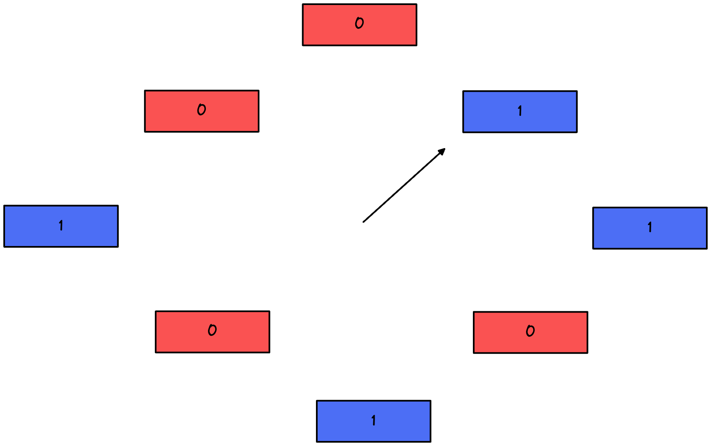

# NRU：Not Recently Used

**考虑到 LRU 实现困难**，Clock 页面置换算法（NRU）应运而生。

记录谁最早被使用很难，那么换一种思路，把时间分成一个个周期，如果最近一个周期都没有被使用，那就干脆当做一直没有被使用。

其中1为使用过，0为未使用过。

如果指针指向当前的节点为1，那么就认为当前的被使用过，并把1置为0。如果指针指向的当前节点为0，说明这个节点一个周期都没有被使用过，就认为它永远不会被使用过，进行替换。

**本质上这可以说是一种逆向思维：**不一定要最早被使用的被淘汰，只要不是最近被使用的被淘汰就好了**。而统计谁最近被使用则成本低廉，只需要在某个时间段清空访问状态，是否新被访问就很容易判断。**

