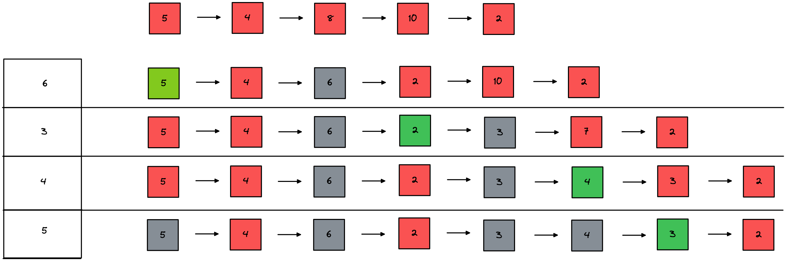

### NF: Next Fit

下次适应算法和最先适应算法（最先适应也称首次适应算法。它总是最先找到的、满足存储要求的那个空闲分区作为分配对象。），不同的是每次找到合适的空闲的分区时就记住它的位置，以便下次就从该位置开始往下查找，而不是每次都像最先适应算法那样从头开始查找。

这种算法的总体结果通常要比最先适应算法差。由于它经常会在内存的末尾分配存储分区，使位于存储空间末尾的最大分区被撕裂成小的外部碎片，因此必须经常不断地进行存储紧凑。在该算法中应采取循环查找方式，即最后上个空闲区的大小仍不能满足要求时，应再从第一个空闲区开始查找，故又称为循环造就算法。

##### 优点：使内存中的空闲分区分布的更为均匀，减少了查找时的系统开销。

##### 缺点：缺乏大的空闲分区，从而导致不能装入大型作业。
