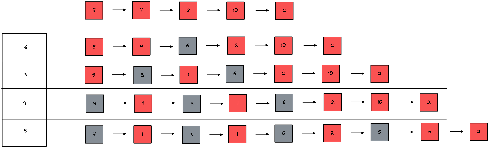

### BF: best Fit

该算法总是把既能满足要求，又是最小的空闲分区分配给作业。为了加速查找，该算法要求将所有的空闲区按其大小排序后，以递增顺序形成一个空白链。这样每次找到的第一个满足要求的空闲区，必然是最优的。孤立地看，该算法似乎是最优的，但事实上并不一定。因为每次分配后剩余的空间一定是最小的，在存储器中将留下许多难以利用的小空闲区。同时每次分配后必须重新排序，这也带来了一定的开销。

##### 优点：每次分配给文件的都是最合适该文件大小的分区。

##### 缺点：内存中留下许多难以利用的小的空闲区。
