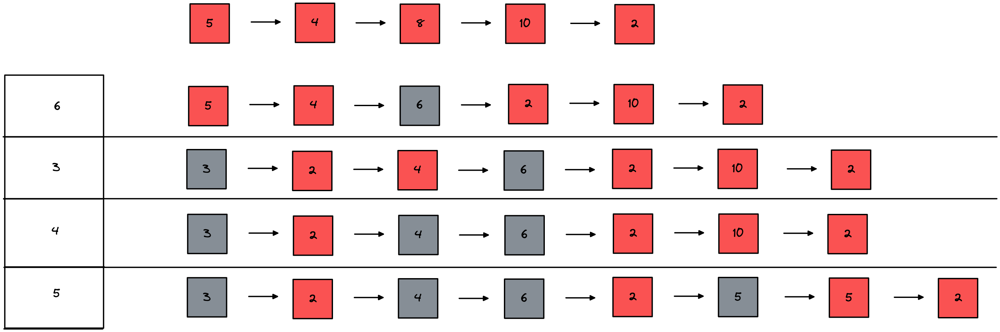

### FF: First Fit

该算法从空闲分区链首开始查找，直至找到一个能满足其大小要求的空闲分区为止。然后再按照作业的大小，从该分区中划出一块内存分配给请求者，余下的空闲分区仍留在空闲分区链中。

##### 优点：优先利用内存中低址部分的空闲分区，从而保留了高址部分的大空闲区，这为以后到达的大作业分配大的内存空间创造了条件。

##### 缺点：低址部分不断被划分，会留下许多难以利用的，很小的空闲分区，称为碎片。而每次查找又都是从低址部分开始的，这无疑又会增加查找可用空闲分区时的开销。