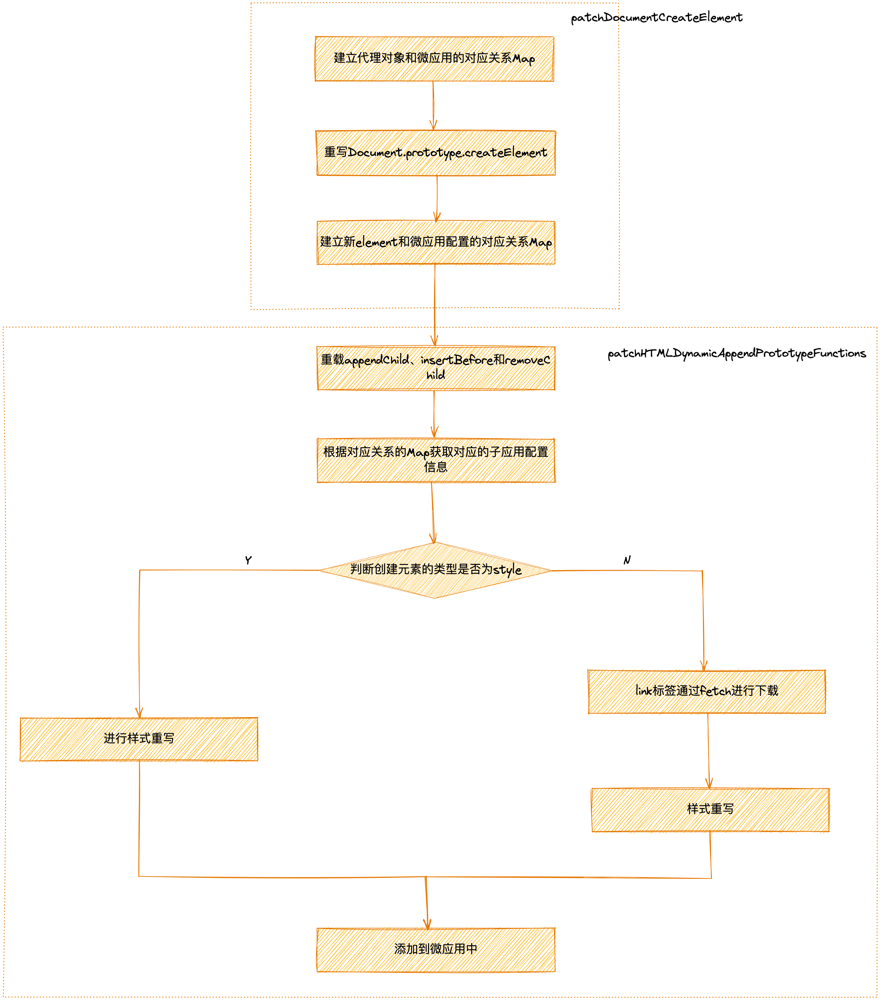

# 回顾和总结

本文主要从以下六个方面对QianKun进行回顾和总结，并且针对一些问题提出自己的看法，如果读者需要详细了解某一方面的话，可以回顾下之前的文章：

- 加载流程
- 预加载——prefetch
- CSS沙箱
- JS沙箱
- 通信和全局状态
- 路由

为什么要从这六个方面呢，主要是因为微前端都会面临两大问题：

一、应用的加载和切换

二、应用的隔离和通信

当把这两个问题攻克以后，那这样的微前端框架算是一个比较完备的了

## 加载流程

QianKun中提供两种加载应用的方式，两种都可以实现加载多实例场景和单实例场景，由于基本的加载流程比较相似，这里主要讲解基于路由配置的加载流程

一、**基于路由配置**

当路由变化的时候自动加载相应的微应用，适用于基于路由的微应用


二、**手动加载微应用**

手动控制某个微应用的加载和卸载，通常适用于不带路由的独立的微应用组件

Q1：大部分情况下，我们使用单实例场景会比较多，那什么情况下会需要多实例场景呢？

我目前想到一个场景是，有两个项目A、B，我需要同时展示项目A的控制台以及项目B的列表页面，虽然我们可以在项目B中把项目A控制台的代码引入，万一后面又需要项目A的其他组件或者页面展示呢，所以我们可以使用微前端，同时加载项目A和项目B。

## 预加载-prefetch

在上面这个流程图中我们可以看到有个通过`importEntry`获取微应用的资源文件的步骤，为了加快打开微应用的速度，`QianKun`中提供预加载-prefetch的功能，并且默认会在第一个微应用 mount 完成后开始预加载其他微应用的静态资源


- 配置为true时：在第一个微应用mount后开始加载其他微应用的资源
- 配置为all时：开始加载所有微应用的资源
- 配置为string[]时：在第一个微应用mount后开始加载数组内微应用的资源
- 配置为function时：返回两个数组，根据两个数组分别执行立即加载和第一个微应用mount后加载的机制

核心是调用浏览器的空闲时间进行资源的加载，优先使用`window.requestIdleCallback`，否则通过`setTimeout`

```tsx
// 开始进行预加载
function prefetch(entry: Entry, opts?: ImportEntryOpts): void {
  ...
	// 设置获取外部引入的脚本文件和样式文件的加载时机
  requestIdleCallback(async () => {
    const { getExternalScripts, getExternalStyleSheets } = await importEntry(entry, opts);
    requestIdleCallback(getExternalStyleSheets);
    requestIdleCallback(getExternalScripts);
  });
}

// 设置加载时间的事件
const requestIdleCallback =
  window.requestIdleCallback ||
  function requestIdleCallback(cb: CallableFunction) {
    const start = Date.now();
    return setTimeout(() => {
      cb({
        didTimeout: false,
        timeRemaining() {
          return Math.max(0, 50 - (Date.now() - start));
        },
      });
    }, 1);
  };
```

通过上面一系列的流程预加载完成，缓存到`importEntry`中，在加载对应微应用的时候获取到缓存中的资源，进入下一个阶段通过CSS沙箱进行样式隔离

## CSS沙箱

Q2：为啥需要解决微应用的CSS污染问题？

因为微前端是聚合一些应用，你不确定你所聚合的应用的样式文件会不会影响到主应用，甚至是多实例情况下的多个子应用间。

Q3：解决样式问题的核心思想是什么？

使CSS选择器作用的Dom元素唯一

**常见的CSS沙箱解决方案**


Tips：当我们在实际的开发中可以根据项目的实际情况进行选择

在QianKun中CSS SandBox有两种模式：

- `strictStyleIsolation`——严格沙箱模式
- `experimentalStyleIsolation`——实验性沙箱模式

### 严格沙箱模式

我们设置`strictStyleIsolation`为`true`时，`QianKun`采用的是`Shadow DOM`方案，核心就是为每个微应用包裹上一个Shadow DOM节点

**流程图**


我们来看下代码里是咋处理的

```tsx
function createElement(appContent: string,strictStyleIsolation: boolean,scopedCSS: boolean,appInstanceId: string) {
...
	// 把微应用的模版字符串转换成dom结构
	const containerElement = document.createElement('div');
  containerElement.innerHTML = appContent;
  const appElement = containerElement.firstChild as HTMLElement;
	// 严格样式沙箱模式
  if (strictStyleIsolation) {
		...
      const { innerHTML } = appElement;
      appElement.innerHTML = '';
      let shadow: ShadowRoot;

			// 创建shadow dom节点
      if (appElement.attachShadow) {
        shadow = appElement.attachShadow({ mode: 'open' });
      } else {
        // 兼容低版本
        shadow = (appElement as any).createShadowRoot();
      }
			// 把子应用的dom结构放入shadow dom中
      shadow.innerHTML = innerHTML;
  }
	...
return appElement;
}
```

**实际效果**


Q4：shadow dom浏览器事件的冒泡机制？

正常的事件冒泡，但是`Target`会有区别

```html
<!DOCTYPE html>
<html lang="zh-cn">
<head>
    <title></title>
    <meta charset="utf-8" />
    <style type="text/css">
    </style>
</head>

<body>
    <div class="container" style="background-color: red; height: 150px;">
        第一层
        <div class="main" style="background-color: blue; height: 100px;">
            第二层
            <div class="shadow-host" style="background-color: yellow;">
            </div>
        </div>
    </div>

</body>
    <script>
        document.onclick = function (e) {
            console.log('事件触发的target: ', e.target, '冒泡到document!')
        }

        document.querySelector('.container').onclick = (e) => {
            console.log('事件触发的target: ', e.target, '冒泡到container')
        }

        document.querySelector('.main').onclick = (e) => {
            console.log('事件触发的target: ', e.target, '冒泡到main')
        }

        const shadowHost = document.querySelector('.shadow-host')
        const shadowRoot = shadowHost.attachShadow({ mode: 'open' })

        const shadowDiv = document.createElement('div')
        shadowDiv.innerHTML = 'I at shadow dom div'

        shadowRoot.appendChild(shadowDiv)

        shadowDiv.onclick = (e) => {
            console.log('事件触发的target: ', e.target, 'shadowDiv')
        }
    </script>
</html>
```

点击`I at shadow dom div`打印信息


### 实验性沙箱模式

我们设置`experimentalStyleIsolation`为`true`时，`QianKun`采用的是`Runtime css transformer` 动态加载/卸载样式表方案，为子应用的样式表增加一个特殊的选择器从而限定影响范围，类似以下结构：

```tsx
// 假设应用名是 react16
<style>
	.app-main {
	  font-size: 14px;
	}
</style>

<style>
	div[data-qiankun="react16"] .app-main {
	  font-size: 14px;
	}
<style>
```

**流程图**


### 动态添加样式

通过JS动态添加的`style`、`link`或者`script`标签是不是也需要运行在相应的`CSS`或者`JS`沙箱中呢，添加这些标签的常见方法无疑是`createElement`、`appendChild`和`insertBefore`，那其实我们只要对他们重写就可以了

`dynamicAppend`就是用来解决上面的问题的，它暴露了两个方法

- patchStrictSandbox：QianKun JS沙箱模式的多例模式



- patchLooseSandbox：QianKun JS沙箱模式的单例模式和快照模式下


## JS沙箱

完成了CSS沙箱的样式隔离，下面我们需要完成JS沙箱的隔离，主要是为了避免父子应用或者是子子应用间声明的变量相互影响，导致应用运行不在预期内的问题。

在实现`JS`沙箱问题之前我们需要有两点需要注意：

- 构建独立的上下文环境
- 模拟浏览器的原生对象

我们先来实现一个简易的JS沙箱，通过`with`、`proxy`以及`iframe`

```jsx
const obj = {
  a: 1
}
const obj2 = {
  b: 2
}
let b = 3

// 用with改变作用域
const withedCode = (code) => {
  code = `with(obj) { ${ code } }`
  const fun = new Function('obj', code)
  return fun
}

// 执行代码
const code = 'console.log(b)'

// 白名单
const whiteList = ['console', 'b']

// // 访问拦截
const ctxProxy = (ctx) => new Proxy(ctx, {
  has: (target, prop) => { // 当返回false的时候会沿着作用域向上查找，true为在当前作用域进行查找
    if(whiteList.includes(prop)) { 
      return false
    }
    if(!target.hasOwnProperty) { 
      throw new Error(`can not find - ${prop}!`)
    }
    return true
  },
})

withedCode(code)(ctxProxy(obj2)) // 3
```

**流程图**


同时我们还需要加固我们的JS沙箱来防止一些沙箱逃逸的操作

### 沙箱逃逸

### Symbol**.unscopables**

`Symbol.unscopables`设置了`true`会对`with`进行无视，沿着作用域进行向上查找。

改进方案：

```tsx
get: (target, prop) => {
    // 处理Symbol.unscopables逃逸
    if(prop === Symbol.unscopables) return undefined
    return target[prop]
}
```

### window.parent

可以在沙箱的执行上下文中通过该方法拿到外层的全局对象

改进方案

```tsx
get: (target, prop) => {
		// 阻止window.parent逃逸
    if(prop === 'parent') {
        return target
    }
    return target[prop]
}
```

……

### QianKun中的JS沙箱

主要分为三个模式：

- SnapshotSandbox：快照沙箱
    
    windowSnapshot：激活时记录window的快照
    
    modifyPropsMap：激活期间修改的值，失活的时候通过遍历window和windowSnapshot对比得到
    
    
    
- LegacySandbox：单实例代理沙箱
    
    addedPropsMapInSandbox：沙箱期间新增的全局变量
    modifiedPropsOriginalValueMapInSandbox：沙箱期间修改的全局变量的原始值
    currentUpdatedPropsValueMap：沙箱期间更新的(新增和修改的)全局变量
    
    
    
- ProxySandbox：多实例代理沙箱
    
    
    

## 通信和全局状态

常见的通信方式大概分为以下几个：

- `通过URL`：使用简单，操作方便适应于一些不太复杂的场景
- `通过Props`：适用于主子应用之间的传值，当层级结构太深时数据流不清晰
- `通过发布/订阅模式`：一对多的关系，发布者和订阅者是解耦的，使用不当情况下可能会造成数据流的混乱
- `通过状态管理`：统一管理，适合复杂场景
- `通过session、localStorage等`：对存储大小有所限制，容易造成数据的丢失比如存储`function`等

**流程图**


## 路由

`QianKun`未对路由进行实现，主要还是调用`single-spa`中的路由，而`single-spa`是支持`Browser Router`以及`Hash Router`两种路由方式的，即核心是对`popstate`和`hashchange`进行监听

**核心流程**


1、第一个步骤设置监听，执行`urlReroute`是为了先让注册的微应用实现生命周期的转化，比如加载⇒启动、启动⇒挂载等，并且执行微应用中收集的回调事件

2、重写监听和移除函数，是为了收集微应用中路由监听的回调事件，存储起来在某一时刻再执行

3、重写`pushState`和`replaceState`主要是为了在路由变更的时候去触发微应用的加载