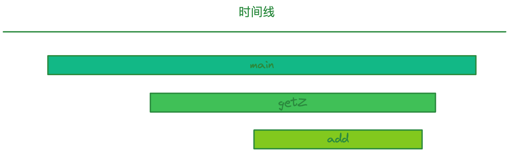
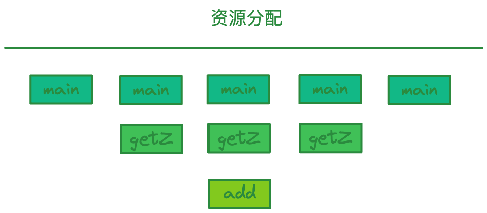
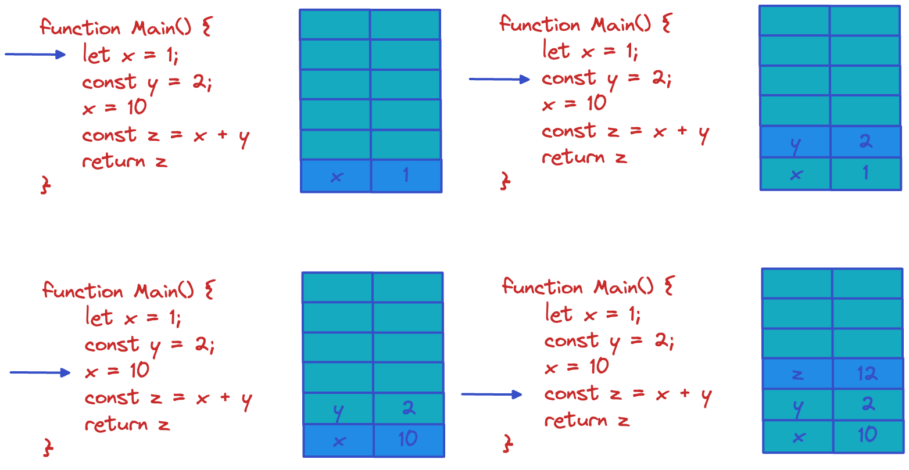
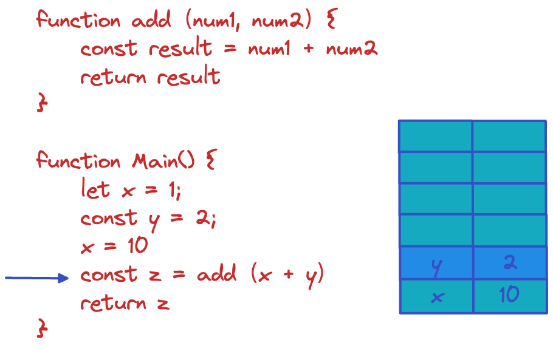
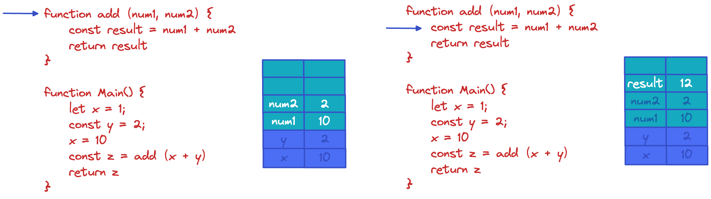
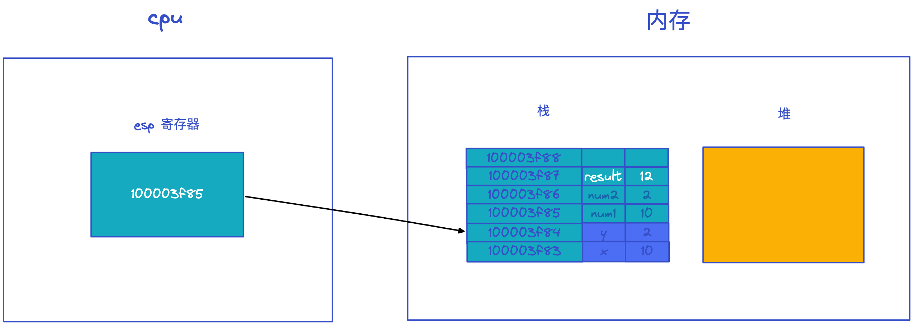
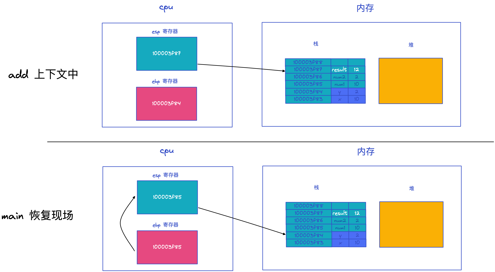
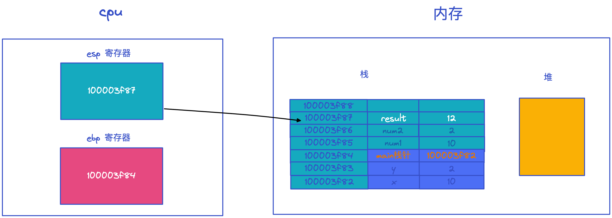

## 为什么使用栈结构来管理函数调用？

为什么大部分高级语言都不约而同地采用栈这种结构来管理函数调用呢？

这与函数的特性有关。通常函数有两个主要的特性：

1. 函数可以被调用，你可以在一个函数中调用另外一个函数，当函数调用发生时，执行代码的控制权将从父函数转移到子函数，子函数执行结束之后，又会将代码执行控制权返还给父函数；
2. 函数具有作用域机制，所谓作用域机制，是指函数在执行的时候可以将定义在函数内部的变量和外部环境隔离，在函数内部定义的变量我们也称为临时变量，临时变量只能在该函数中被访问，外部函数通常无权访问，当函数执行结束之后，存放在内存中的临时变量也随之被销毁。

```js
function add(x, y) {
    return x + y;
}

function getZ(x, y) {
    return add(x, y);
}

function main() {
    const x = 1;
    const y = 2;
    const z = getZ(x, y);
    return z;
}

main();
```

1. 当 main 函数调用 getZ 函数时，需要将代码执行控制权交给 getZ 函数；
2. 然后 getZ 函数又调用了 add 函数，于是又将代码控制权转交给 add 函数；
3. 接下来 add 函数执行完成，需要将控制权返回给 getZ 函数；
4. 同样当 getZ 函数执行结束之后，需要将控制权返还给 main 函数；
5. 然后 main 函数继续向下执行。

通过上述分析，我们可以得出，函数调用者的生命周期总是长于被调用者（后进），并且被调用者的生命周期总是先于调用者的生命周期结束 (先出)。在执行上述流程时，各个函数的生命周期如下图所示：


因为函数是有作用域机制的，作用域机制通常表现在函数执行时，会在内存中分配函数内部的变量、上下文等数据，在函数执行完成之后，这些内部数据会被销毁掉。所以站在函数资源分配和回收角度来看，被调用函数的资源分配总是晚于调用函数 (后进)，而函数资源的释放则总是先于调用函数 (先出)。如下图所示：


通过观察函数的生命周期和函数的资源分配情况，我们发现，它们都符合后进先出 (LIFO)的策略，而栈结构正好满足这种后进先出 (LIFO) 的需求，所以我们选择栈来管理函数调用关系是一种很自然的选择。

## 栈如何管理函数调用？

首先我们来分析最简单的场景：当执行一个函数的时候，栈怎么变化？

当一个函数被执行时，函数的参数、函数内部定义变量都会依次压入到栈中，我们结合实际的代码来分析下这个过程，你可以参考下图：

上图展示的是一段简单的 JS 代码的执行过程，可以看到：

1. 当执行到函数的第一段代码的时候，变量 x 第一次被赋值，且值为 1，这时 1 会被压入到栈中。
1. 然后，执行第二段代码，变量 y 第一次被赋值，且值为 2，这时 2 会被压入到栈中。
1. 接着，执行到第三段代码，注意这里变量 x 是第二次被赋值，且新的值为 10，那么这时并不是将 100 压入到栈中，而是替换以前压入栈的内容，也就是将栈中的 1 替换成 10。
1. 最后，执行第四段代码，这段代码是 const z = x + y，我们会先计算出来 x+y 的值，然后再将 x+y 的值赋值给 z，由于 z 是第一次被赋值，所以 z 的值也会被压入到栈中。

你会发现，函数在执行过程中，其内部的临时变量会按照执行顺序被压入到栈中。

了解了这一点，接下来我们就可以分析更加复杂一点的场景了：当一个函数调用另外一个函数时，栈的变化情况是怎样的？我们还是先看下面这段代码：


在主函数中调用 add 函数方法：



当执行到 add 函数时，会先把参数 num1 和 num2 压栈，接着我们再把常量 result 的值依次压栈，不过执行这里，会遇到一个问题，那就是当 add 函数执行完成之后，需要将执行代码的控制权转交给 main 函数，这意味着需要将栈的状态恢复到 main 函数上次执行时的状态，我们把这个过程叫恢复现场。那么应该怎么恢复 main 函数的执行现场呢？

其实方法很简单，只要在寄存器中保存一个永远指向当前栈顶的指针，栈顶指针的作用就是告诉你应该往哪个位置添加新元素，这个指针通常存放在 esp 寄存器中。如果你想往栈中添加一个元素，那么你需要先根据 esp 寄存器找到当前栈顶的位置，然后在栈顶上方添加新元素，新元素添加之后，还需要将新元素的地址更新到 esp 寄存器中。

有了栈顶指针，就很容易恢复 main 函数的执行现场了，当 add 函数执行结束时，只需要将栈顶指针向下移动就可以了，具体可以参看下图：



观察上图，将 esp 的指针向下移动到之前 main 函数执行时的地方就可以，不过新的问题又来了，CPU 是怎么知道要移动到这个地址呢？

CPU 的解决方法是增加了另外一个 ebp 寄存器，用来保存当前函数的起始位置，我们把一个函数的起始位置也称为栈帧指针，ebp 寄存器中保存的就是当前函数的栈帧指针，如下图所示：



在 main 函数调用 add 函数的时候，main 函数的栈顶指针就变成了 add 函数的栈帧指针，所以需要将 main 函数的栈顶指针保存到 ebp 中，当 add 函数执行结束之后，我需要销毁 add 函数的栈帧，并恢复 main 函数的栈帧，那么只需要取出 main 函数的栈顶指针写到 esp 中即可 (main 函数的栈顶指针是保存在 ebp 中的)，这就相当于将栈顶指针移动到 main 函数的区域。

那么现在，我们可以执行 main 函数了吗？
答案依然是“不能”，这主要是因为 main 函数也有它自己的栈帧指针，在执行 main 函数之前，我们还需恢复它的栈帧指针。如何恢复 main 函数的栈帧指针呢？

通常的方法是在 main 函数中调用 add 函数时，CPU 会将当前 main 函数的栈帧指针保存在栈中，如下图所示：

当函数调用结束之后，就需要恢复 main 函数的执行现场了，首先取出 ebp 中的指针，写入 esp 中，然后从栈中取出之前保留的 main 的栈帧地址，将其写入 ebp 中，到了这里 ebp 和 esp 就都恢复了，可以继续执行 main 函数了。

JavaScript 中，如果调用一个新函数，那么 V8 会为该函数创建栈帧，等函数执行结束之后，销毁该栈帧，而栈结构的容量是固定的，所有如果重复嵌套执行一个函数，那么就会导致栈会栈溢出。

一下三个代码片段，在浏览器中执行会出现什么情况？

```js
function foo() {
    foo();
}

foo();
```

```js
function foo() {
    return Promise.resolve().then(foo);
}

foo();
```

```js
function foo() {
    setTimeout(foo, 0);
}

foo();
```
