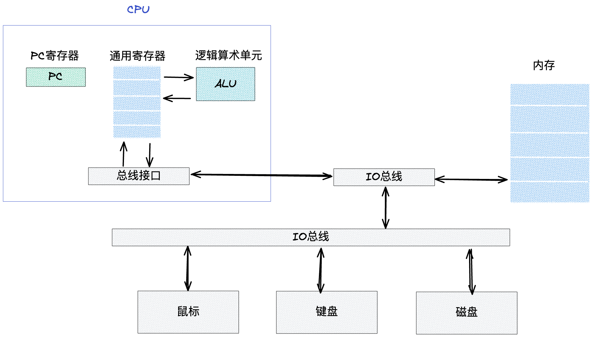
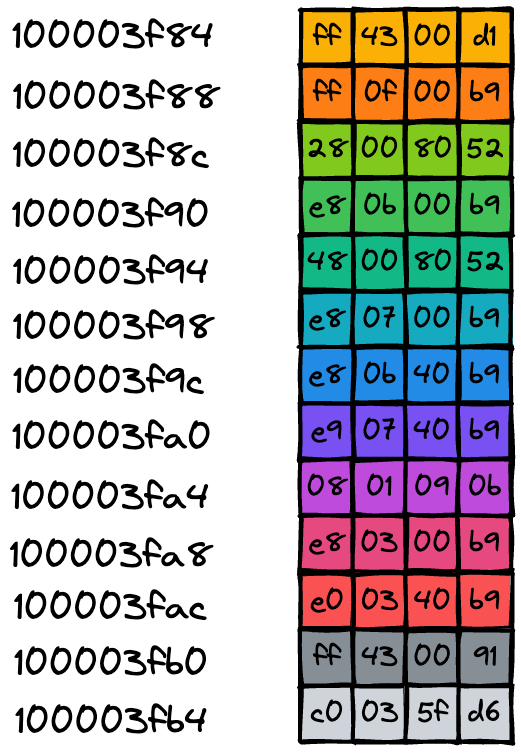
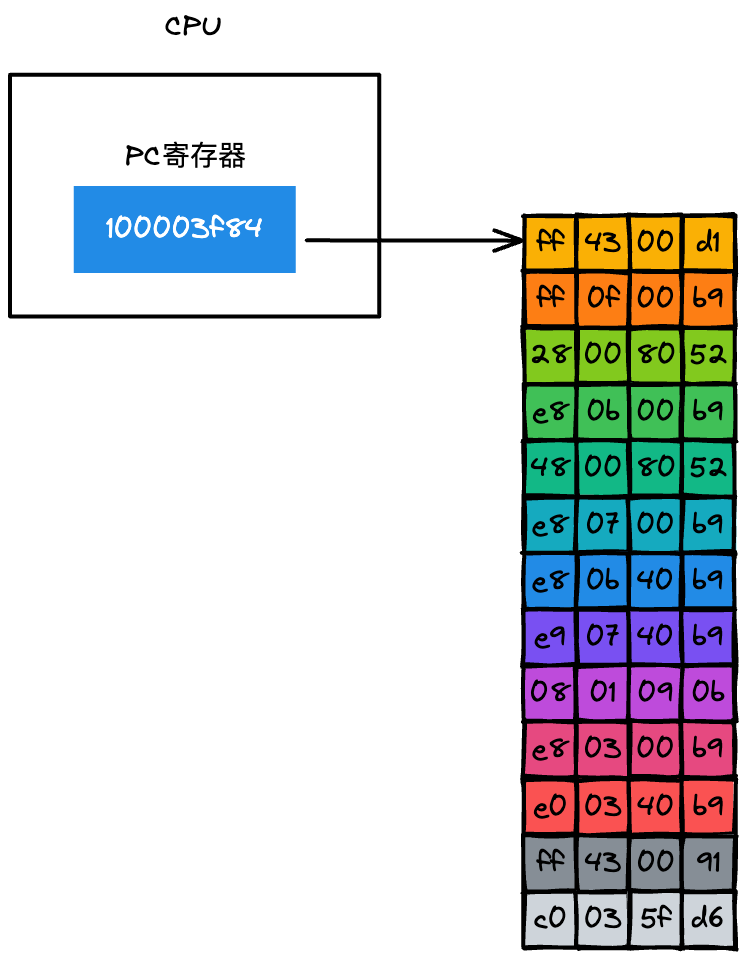
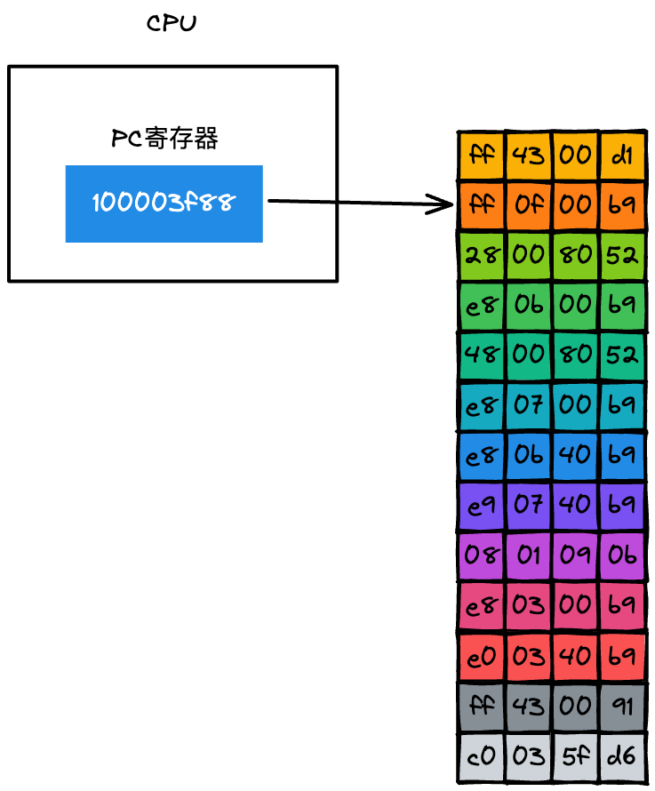
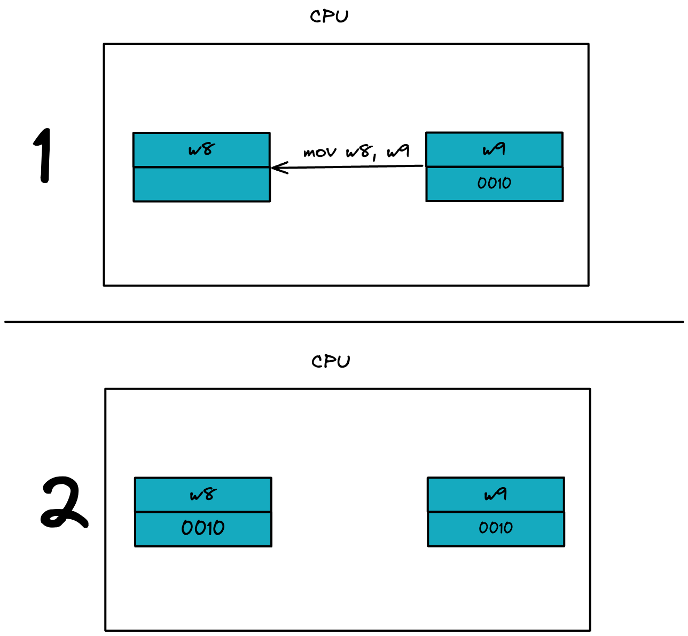
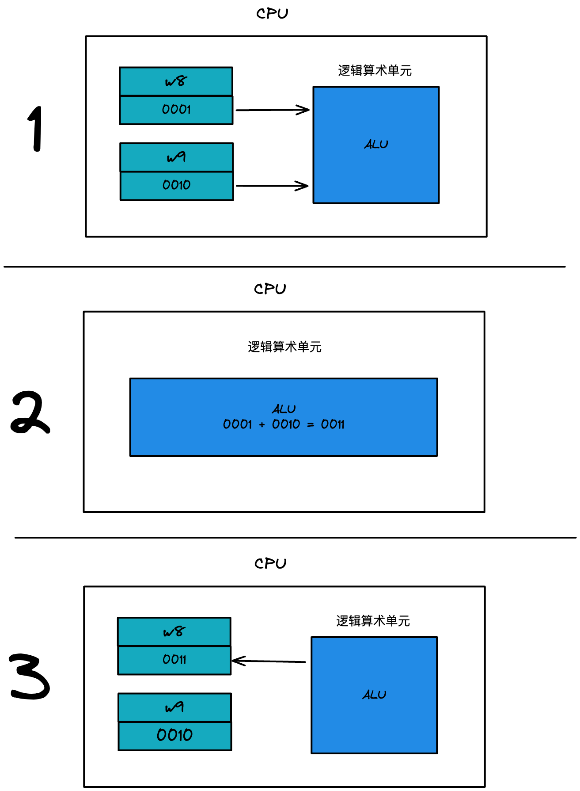

# 代码在 CPU 中如何执行

我们以一段 C 代码为例，来看一下代码被编译成二进制可执行程序之后，是如何被 CPU 执行的。

在这段代码中，只是做了非常简单的加法操作，将 x 和 y 两个数字相加得到 z，并返回结果 z。

```c
int main() {
    int x = 1;
    int y = 2;
    int z = x + y;
    return z;
}
```

我们知道，CPU 并不能直接执行这段 C 代码，而是需要对其进行编译，将其转换为二进制的机器码，然后 CPU 才能按照顺序执行编译后的机器码。

先通过 GCC 编译器将这段 C 代码编译成二进制文件，输入以下命令让其编译成目的文件：

```
gcc -O0 -o code_prog code.c
```

输入上面的命令之后回车，在文件夹中生成名为 code_prog 的可执行程序，接下来再将编译出来的 code_prog 程序进行反汇编，这样就可以看到二进制代码和对应的汇编代码。可以使用 objdump 的完成该任务，命令如下所示：
```
objdump -d code_prog
```

最后编译出来的机器码如下：
```
0000000100003f84 <_main>:
100003f84: ff 43 00 d1  	  sub	sp, sp, #16            // 开辟栈空间。即开辟了四个 4 字节空间
100003f88: ff 0f 00 b9  	  str	wzr, [sp, #12]         // 将 wzr 寄存器的数据存储到 sp 寄存器的 #12 地址上，设为0
100003f8c: 28 00 80 52  	  mov	w8, #1                 // 创建一个 x = 1，并将 1 存入 w8 寄存器中
100003f90: e8 0b 00 b9  	  str	w8, [sp, #8]           // 将 w8 寄存器的数据存入 sp 寄存器中 #8 的地址中，也就是将 x = 1 存入
100003f94: 48 00 80 52  	  mov	w8, #2                 // 创建一个 y = 2，并将 2 存入 w8 寄存器中
100003f98: e8 07 00 b9  	  str	w8, [sp, #4]           // 将 w8 寄存器的数据存入 sp 寄存器中 #4 的地址中，也就是将 y = 2 存入
100003f9c: e8 0b 40 b9  	  ldr	w8, [sp, #8]           // 读取 sp 寄存器中 #8 的数据存入 w8 寄存器中，也就是获取 x = 1
100003fa0: e9 07 40 b9  	  ldr	w9, [sp, #4]           // 读取 sp 寄存器中 #4 的数据存入 w9 寄存器中，也就是获取 y = 2
100003fa4: 08 01 09 0b  	  add	w8, w8, w9             // 将 w8、w9 寄存器的 x,y 数据进行相加，并存入 w8 寄存器中，也就是 z = 3
100003fa8: e8 03 00 b9  	  str	w8, [sp]               // 将 w8 寄存器的数据存入 sp 寄存器中
100003fac: e0 03 40 b9  	  ldr	w0, [sp]               // 读取 sp 寄存器中的数据存到 w0 寄存器中。z = 3
100003fb0: ff 43 00 91  	  add	sp, sp, #16            // 清空开辟的栈空间
100003fb4: c0 03 5f d6  	  ret                          // 返回结果
```

PS: wzr 为 32 的零寄存器，专门用来清零，也就是 sp 上 #12 指向的数据设置为 0

观察上方，左边就是编译生成的机器码，在这里它是使用十六进制来展示的，这主要是因为十六进制比较容易阅读，所以通常使用十六进制来展示二进制代码。

可以观察到上图是由很多行组成的，每一行都是一个指令，该指令可以让 CPU 执行指定的任务。

中间的部分是汇编代码，例如原本是二进制表示的指令，在汇编代码中可以使用单词来表示，比如 mov、add 就分别表示数据的存储和相加。

通常将汇编语言编写的程序转换为机器语言的过程称为“汇编”；反之，机器语言转化为汇编语言的过程称为“反汇编”，比如上图就是对 code_prog 进程进行了反汇编操作。

右边添加的注释，表示每条指令的具体含义。

这一大堆指令按照顺序集合在一起就组成了程序，所以程序的执行，本质上就是 CPU 按照顺序执行这一大堆指令的过程。

## CPU 是怎么执行程序的？
为了更好的分析程序的执行过程，我们还需要了解一下基础的计算机硬件信息，具体如下图：


这张图是比较通用的系统硬件组织模型图，它主要是由 CPU、主存储器、各种 IO 总线，还有一些外部设备组成的。

首先，在一个程序执行之前，程序需要被装进内存，比如在 macOS 下面，你可以通过鼠标点击一个可执行文件，当你点击该文件的时候，系统中的程序加载器会将该文件加载到内存中。

CPU 可以通过指定内存地址，从内存中读取数据，或者往内存中写入数据，有了内存地址，CPU 和内存就可以有序地交互。

内存中的每个存储空间都有其对应的独一无二的地址：


在内存中，每个存放字节的空间都有其唯一的地址，而且地址是按照顺序排放的。

以开头代码为例，这段代码会被编译成可执行文件，可执行文件中包含了二进制的机器码，当二进制代码被加载进了内存后，那么内存中的每条二进制代码便都有了自己对应的地址，如下图所示：



一旦二进制代码被装载进内存，CPU 便可以从内存中取出一条指令，然后分析该指令，最后执行该指令。

把取出指令、分析指令、执行指令这三个过程称为一个 CPU 时钟周期。CPU 是永不停歇的，当它执行完成一条指令之后，会立即从内存中取出下一条指令，接着分析该指令，执行该指令，CPU 一直重复执行该过程，直至所有的指令执行完成。

CPU 是怎么知道要取出内存中的哪条指令呢？：



从上图可以看到 CPU 中有一个 PC 寄存器，它保存了将要执行的指令地址，当二进制代码被装载进了内存之后，系统会将二进制代码中的第一条指令的地址写入到 PC 寄存器中，到了下一个时钟周期时，CPU 便会根据 PC 寄存器中的地址，从内存中取出指令。

PC 寄存器中的指令取出来之后，系统要做两件事：第一件是将下一条指令的地址更新到 PC 寄存器中，如下图所示：



更新了 PC 寄存器之后，CPU 就会立即做第二件事，那就是分析该指令，并识别出不同的类型的指令，以及各种获取操作数的方法。
在指令分析完成之后，就要执行指令了。
在执行指令前，我们还需要认识一下 CPU 中的重要部件：寄存器。

## 寄存器

寄存器是 CPU 中用来存放数据的设备，不同处理器中寄存器的个数也是不一样的，之所要通用寄存器，是因为 CPU 访问内存的速度很慢，所以 CPU 就在内部添加了一些存储设备，这些设备就是寄存器。

他们的读取速度如下：


总结来说，寄存器容量小，读写速度快，内存容量大，读写速度慢。

寄存器通常用来存放数据或者内存中某块数据的地址，我们把这个地址又称为指针，通常情况下寄存器对存放的数据是没有特别的限制的，比如某个通用寄存器既可以存储数据，也可以存储指针。

不过由于历史原因，我们还会将某些专用的数据或者指针存储在专用的通用寄存器中 ，比如 rbp 寄存器通常用来存放栈帧指针的，rsp 寄存器用来存放栈顶指针的，PC 寄存器用来存放下一条要执行的指令等。

### 特殊寄存器
#### Stack Pointer register（SP）
> The use of SP as an operand in an instruction, indicates the use of the current stack pointer.
指向当前栈指针。堆栈指针总是指向栈顶位置。一般堆栈的栈底不能动，所以数据入栈前要先修改堆栈指针，使它指向新的空余空间然后再把数据存进去，出栈的时候相反。

堆栈指针，随时跟踪栈顶地址，按"先进后出"的原则存取数据。

#### Link Register （LR）
连接寄存器，一是用来保存子程序返回地址；二是当异常发生时，LR中保存的值等于异常发生时PC的值减4（或者减2），因此在各种异常模式下可以根据LR的值返回到异常发生前的相应位置继续执行。

#### Program Counter（PC）
> A 64-bit Program Counter holding the address of the current instruction.
保存了将要执行的指令地址

#### Word Zero Register（WZR）
零寄存器，用于给int清零

### tips
**不同指令中寄存器后 #d 有什么区别？**
[#d]在ARM代表的是一个常数表达式。
如：#0x3FC、#0、#0xF0000000、#200、#0xF0000001
都是代表着一个常数。

在 sp 寄存器中，代表的是当前栈顶指针移动的位置。
如： 
```
sub	sp, sp, #16；// 获取 sp 中的栈顶指针移动 16位的位置，并把位置更新到 sp 寄存器中。实现开辟空间
```

在通用寄存器 W0 - W11 中，代表的操作的常数值。

```
mov	w8, #2，// 把常数 2 添加到 w8 寄存器中
```


### ARMv7-A 中的通用寄存器
以 ARMv7-A 体型结构为例。在ARMv7-A体系结构中，有16个供软件使用的32位通用寄存器（R0-R15）。 其中15个（R0-R14）可用于通用数据存储。剩下的R15寄存器是程序计数器（PC）。
以下介绍下比较常见的通用寄存器：

- 其中W0~W3 用于函数调用入参，其中，W0 还用于程序的返回值.
- W4~W11用于保存局部变量。
- W13为SP，时刻指向栈顶，当有数据入栈或出栈时，需要更新SP
- W14为链接寄存器，主要是用作保存子程序返回的地址。
- R15为PC寄存器，指向将要执行的下一条指令地址。

### mov
数据传送指令。将立即数或寄存器(operant2)传送到目标寄存器Rd，可用于移位运算等操作。指令格式如下：
```
MOV{cond}{S} Rd,operand2
```
如:

`mov w8, #1`，就是往 w8 寄存器中写入 #1.

`mov w8, w9`， 就是把 w9 寄存器的数据发送到 w8 寄存器中，最终 w8 和 w9 寄存器的数据一致。如下图：




### ldr
ldr 从内存中读取数据放入寄存器中
```
LDR{cond}{T} Rd,<地址>;加载指定地址上的数据(字)，放入Rd中
```
如：

`ldr w8, [sp, #8]` 读取 sp 寄存器中 #8 位置的数据存入 w8 寄存器中，改变的只有 w8 ，sp 寄存器不变

### str
str 指令用于将寄存器中的数据保存到内存
```
STR{cond}{T} Rd,<地址>;存储数据(字)到指定地址的存储单元，要存储的数据在Rd中
```
如：
`str w8, [sp]` ， 将 w8 寄存器的数据存入 sp 寄存器中

### add
加法运算指令。将operand2 数据与Rn 的值相加，结果保存到Rd 寄存器。指令格式如下：
```arm
ADD{cond}{S} Rd,Rn,operand2
```

以 `add	w8, w8, w9`为例，就是把 w8、w9 寄存器的 x,y 数据进行相加，并存入 w8 寄存器中

如下图：


### sub
减法运算指令。用寄存器Rn 减去operand2。结果保存到Rd 中。指令格式如下：
```
SUB{cond}{S} Rd,Rn,operand2
```
如

`sub R0,R0,#1` -- R0=R0-1

### 执行过程
了解了以上的知识，我们再来分析一遍代码的执行过程。

在 C 程序中，CPU 会首先执行调用 main 函数，在调用 main 函数时，生成一块内存空间，用来存放 main 函数执行过程中的数据。
```
sub	sp, sp, #16
```
将 0 写入到 #12 的字节位置上。
```
str	wzr, [sp, #12]
```
接下来给 x 附值
```
mov	w8, #1
str	w8, [sp, #8]
```
第一行指令是把 1 添加进寄存器中。第二行指令是把 1 存入 #8 地址的内存空间中。

接着给 y 附值
```
mov	w8, #2
str	w8, [sp, #4]
```
第一行指令是把 2 添加进寄存器中。第二行指令是把 2 存入 #4 地址的内存空间中。

执行完 x， y 的生成，接下来执行 `z = x + y`

```
ldr	w8, [sp, #8]
ldr	w9, [sp, #4]
add	w8, w8, w9
```
第一行指令取出内存空间地址为 #8 的数据，也就是 1. 第二行指令去除内存空间地址为 #4 的数据，也就是 2，第三行指令则对取出的数据进行相加操作，并将结果 3 存入寄存器中。

```
str	w8, [sp]
ldr	w0, [sp]
```
第一行指令把寄存器中的最终的数据存入内存中，第二行指令则获取内存中的结果，存入寄存器中。等待返回
```
add	sp, sp, #16
```
把开辟的空间进行清理。
```
ret
```
返回结果


## 参考
-《图解 Google V8》-  李兵