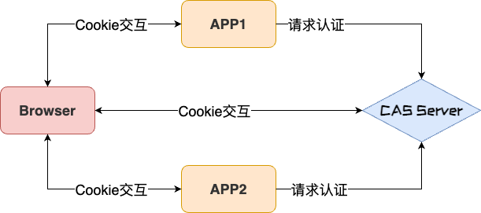

# CAS

## SSO 介绍

### 背景

-   随着企业的发展，一个大型系统里可能包含 n 多子系统, 用户在操作不同的系统时，需要多次登录，很麻烦，我们需要一种**全新的登录方式来实现多系统应用群的登录，这就是单点登录**。
-   web 系统 由单系统发展成**多系统组成的应用群**，复杂性应该由**系统内部**承担，而不是用户。无论 web 系统内部多么复杂，对用户而言，都是一个统一的整体，也就是说，用户访问 web 系统的整个应用群与访问单个系统一样**，**登录/注销 只要 1 次就够了

### SSO 定义

-   **SSO（Single sign-on）**即单点登录，一种对于许多相互关联，但是又是各自独立的软件系统，提供访问控制的方法
-   **SSO（Single sign-on）**是比较流行的企业业务整合的解决方案之一。**SSO（Single sign-on）**定义是在多个应用系统中，**用户只需要登录一次就可以访问所有相互信任的应用系统**
    > 以游乐场的通票为例：我们只要买一次通票，就可以玩所有游乐场内的设施，而不需要在过山车或者摩天轮那里重新买一次票。在这里，买票就相当于登录认证，游乐场就相当于使用一套 SSO 的公司，各种游乐设施就相当于公司的各个产品。

> **类比到各个子系统认证，如图**

## SSO 三种类型

-   **各子系统在同一个站点下**
-   **各子系统在相同的顶级域名下**
    - 同一个站点和相同顶级域下的单点登录是利用了 **Cookie** 顶域共享的特性。目前数栈都是只需要在**UIC**的登录页面进行一次
    - 登录就可以在各个子应用之间进行跳转，这种操作源于根据设置**Cookie**中的**domain**为顶级域名。

-   **各子系统属于不同的顶级域**
    - 如果属于不同的域，不同域之间的 **Cookie** 是不共享的。
    
怎么办？接下来就要说一说**CAS (Central Authentication Service)**流程了，这个流程是**单点登录**的标准流程

## [CAS (Central Authentication Service)](https://apereo.github.io/cas/6.5.x/index.html)

### CAS 是什么

** Central Authentication Service** ——— 中央认证服务，是**Yale** 大学发起的一个企业级的、开源的项目，旨在为**Web 应用**系统提供一种可靠的**SSO**解决方案。只是** SSO**解决方案的一种，它的流程其实跟 **Cookie-session **模式是一样的，单点登录等于说是每个子系统都拥有一套完整的 **Cookie-session **模式，再加上一套 **Cookie-session** 模式的** SSO 系统**。

**第一次访问 APP1:**

1. 用户访问**APP1**，需要登录的时候会重定向到**CAS Server **
2. 在**CAS Server ** 进行账号密码认证，**CAS Server **会保存 **session，**并生成 **sessionId** 返回给 **SSO Client，SSO Client **写入当

前域的**Cookie，**同时根据 **TGT** 签发 1 个 **ST **传入 **APP1**

3. **APP1 **携带 **ST **向** CAS Server 请求校验**
4. **CAS Server **校验成功后，返回 登录态给 **APPI** 服务端
5. **APPI** 服务端 将 登陆态写入 **session **并生成 **sessionId **返回给** APPI Client**
6. 之后再做登录认证，就是同域下的认证了

**第一次访问 APP2: **

1. 用户访问系统 **APP2**，当跳到 **SSO** 里准备登录的时候发现 **SSO** 已经登录了，那 **SSO** 生成一个 **ST**，携带该 **ST** 传入**APP2**
2. **APP2** 携带 **ST** 向** CAS Server **请求校验
3. **CAS Server **校验成功后，返回 登录态给 **APP2** 服务端
4. **APP2** 服务端 将 登陆态写入 **session** 并生成 **sessionId** 返回给 **APPI Client**
5. 在这个流程里，**APP2** 就不用走登录流程了

### CAS 票据

**TGT**
**CAS Server **创建**TGT**，存在 **CAS Server** 的 **Session**里面，根据用户信息签发的
** TGC**
创建**TGT** 的同时，生成**TGC**。通过 **CAS Server **的** response header **的 set-cookie 字段设置**TGC**，唯一标识用户身份（**sessionId**) **ST**
**ST**
根据**TGT**签发的**ST，是 CAS** 为用户签发的访问某一 **service** 的票据

### CAS 单点登录(SSO) & 单点登出(SLO)

#### 单点登录(SSO)

.png>#pic_center)

**第一次访问 APP1:**

1. 访问 **APP1** 服务地址，**APP1 **请求未通过认证，重定向至 **CAS Server** 地址。
2. 访问 **CAS Server **地址，发送认证请求，带上 **Cookie**。
3. **CAS Server **识别出用户没有 **Cookie** 信息，没有登录，返回 **CAS** 登陆页地址。
4. 用户输入正确的账户密码，**CAS Server **用户认证通过，创建** SSO Session**。
5. 重定向回 **APP1** 的服务地址，并在 **cookie** 中创建了**CASTGC**，**TGC**中包含了** Ticket（TGT）**，**TGT** 就是 **SSO Session** 的 **key**。
6. 访问 **APP1** 的服务地址，并带上 **ST**，客户端拿到 **ST** 向** CAS Server **进行认证。
7. **CAS Server **认证成功，返回响应信息给 **APPI**
8. **APPI **拿到成功的响应后，设置 **Session**，并重定向回 **APP1** 的地址，并设置 **Cookie JSESSIONID**。
9. **APPI** 发起请求，带上 **Cookie** 中的信息，其中 **JSESSIONID** 用来确定当前用户所对应的 **session** 信息，发送给客户端进行校验。
10. 客户端使用 **JSESSIONID** 与 **Session** 中存储的数据进行校验。
11. 校验通过，返回正确的内容，展示 **APP1**

**第二次访问 APP1:**

1. **APPI** 发起请求，并带上 **Cookie** 中的 **JSESSIONID** 给 **APPI 服务端。**
2. **APPI 服务端** 使用 **JSESSIONID** 与 **Session** 中存储的数据进行校验。
3. 校验通过，返回正确的内容，展示 **APP1** 。

.png>)

**在 APP1 登陆成功的情况下，第一次访问 APP2:**

1. 访问 **APP2** 服务地址，**APP2** 请求未通过认证，重定向至 **CAS Server **地址。
2. 访问** CAS Server **地址，发送认证请求，带上 **TGT** 信息。
3. **CAS Server **通过 **TGT** 去查找 **SSO** 的信息进行认证。
4. 认证通过，生成票据 **ST** 重定向至 **APP2** 的服务地址。
5. **APP2 服务** 携带 **ST** 向 **CAS Server** 进行认证。
6. **CAS Server** 认证成功，返回客户端通过的响应。
7. 客户端拿到成功的响应后，设置 **Session**，并重定向至 **APP2** 的地址，并设置 **Cookie** **MOD_AUTH_CAS_S**。
8. **APP2** 发起请求，带上 **Cookie** 中的 **MOD_AUTH_CAS_S** ，发送给客户端进行校验。
9. 客户端使用 **MOD_AUTH_CAS_S** 与 **Session** 中存储的数据进行校验。
10. 校验通过，返回正确的内容，展示 **APP2**。

[**官方时序图**](https://github.com/apereo/cas/blob/master/docs/cas-server-documentation/images/cas_flow_diagram.png)

####   单点登出(SLO)

** 1. **在 **APP1** 平台 请求退出登录后, 先在 **query** 中 携带 **service 字段 **重定向 **CAS **登出地址 2. 用户携带 **service query **字段\*\* **和** CASTGC **请求到 **CAS Server\*\*
\*\* ** 3**. \*\* **CAS Server **根据 **CASTGC** 找到 **TGT **的信息，删除 **TGT **完成 **CAS** 的注销 4. **CAS Server **可以在 **TGT **中拿到关联的所有 **ST, ** 根据 **ST **找到对应的应用注册信息，调用其中的**logoutUrl， **
\*\* **把 **ST **包装到 **logoutRequest **发送给 **APP1** 5. **APP1 **根据 **logoutRequest **找到** ST ，**查找** Session **中以 **ST** 为键的值删除，清除登陆状态 6. **APP1** 登出成功 7. **APP2 **根据 **logoutRequest **找到** ST ，**查找** Session **中以 **ST** 为键的值删除，清除登陆状态 8. **APP2\*\* 登出成功

.png>)
