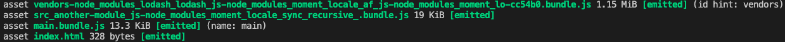

# Code Splitting

> Refers to dividing your code into various bundles/chunks which you can then load on demand instead of loading a single bundle containing everything.
>
> 代码分离指将代码分成不同的包/块，然后可以按需加载，而不是加载包含所有内容的单个包。

适用的场景：

-   抽离相同代码到单个共享块
-   脚本懒加载，使得初始加载的文件更小

## 按需加载

随着互联网的发展，一个网页需要承载的功能越来越多。对于采用单页应用作为前端架构的网站来说，会面临着一个网页需要加载的代码量很大的问题，因为许多功能都集中的做到了一个 `HTML` 里。 这会导致网页加载缓慢、交互卡顿，用户体验将非常糟糕。

导致这个问题的根本原因在于一次性的加载所有功能对应的代码，但其实用户每一阶段只可能使用其中一部分功能。 所以解决以上问题的方法就是用户当前需要用什么功能就只加载这个功能对应的代码，也就是所谓的按需加载。

## 动态导入(dynamic import)

`webpack` 会根据入口的配置生成对应的 `chunk`，一个入口就一个 `chunk`，多个入口就多个 `chunk`。当然了，`webpack` 在对模块依赖查找的过程中，如果发现是异步依赖，也会生成一个新的 `chunk`。

目前推荐使用的是符合 ECMAScript 提案 的 `import()` 语法 来实现动态导入。
```js
import(/* path */ './src/another-module.js')
```



// TODO 未详细了解过
## [预获取/预加载模块(prefetch/preload module)](https://webpack.docschina.org/guides/code-splitting/#prefetchingpreloading-modules)

- prefetch(预获取)：将来某些导航下可能需要的资源
- preload(预加载)：当前导航下可能需要资源

### prefetch
```js
import(/* webpackPrefetch: true */ './another-module.js');
```

这会生成 `<link rel="prefetch" href="login-modal-chunk.js">` 并追加到页面头部，指示着浏览器在闲置时间预取 login-modal-chunk.js 文件。

[**prefetch**](https://developer.mozilla.org/zh-CN/docs/Web/HTML/Link_types/prefetch)

键字 prefetch 作为元素 `<link>`  的属性 rel 的值，是为了提示浏览器，用户未来的浏览有可能需要加载目标资源，所以浏览器有可能通过事先获取和缓存对应资源，优化用户体验。

### prefetch (待定中，在runtime代码中未找到相关处理)
```js
import(/* webpackPreload: true */ './another-module.js');
```

- preload chunk 会在父 chunk 加载时，以并行方式开始加载。prefetch chunk 会在父 chunk 加载结束后开始加载。
- preload chunk 具有中等优先级，并立即下载。prefetch chunk 在浏览器闲置时下载。
- preload chunk 会在父 chunk 中立即请求，用于当下时刻。prefetch chunk 会用于未来的某个时刻。
- 浏览器支持程度不同。

[**preload**](https://developer.mozilla.org/zh-CN/docs/Web/HTML/Link_types/prefetch)

关键字 preload 作为元素 `<link>` 的属性 rel 的值，表示用户十分有可能需要在当前浏览中加载目标资源，所以浏览器必须预先获取和缓存对应资源。 

// preload / prefetch
// 缓存相关