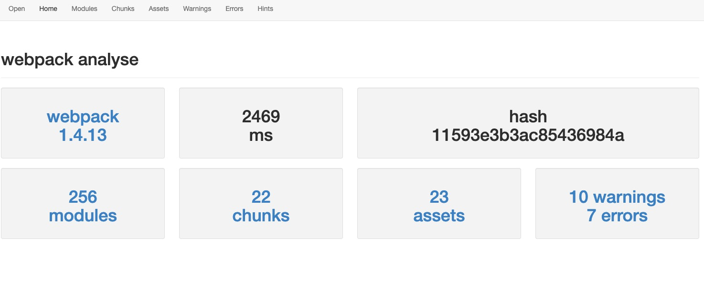
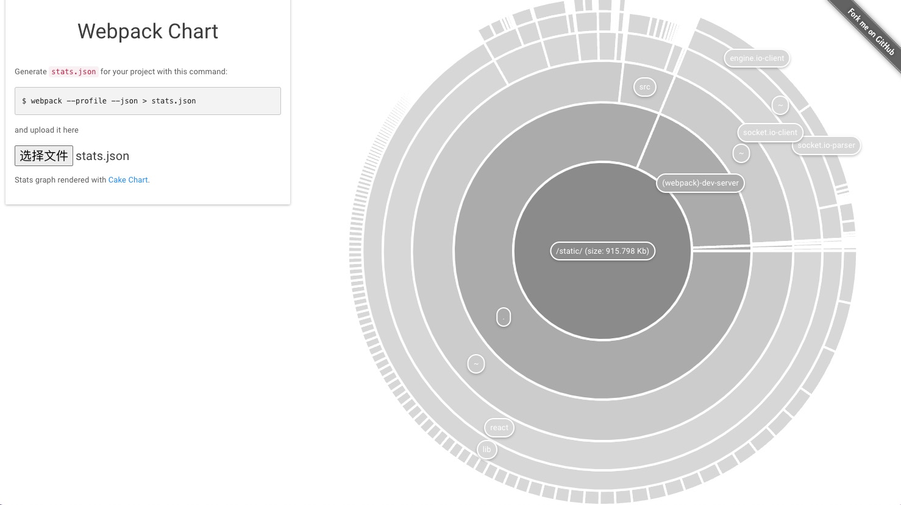
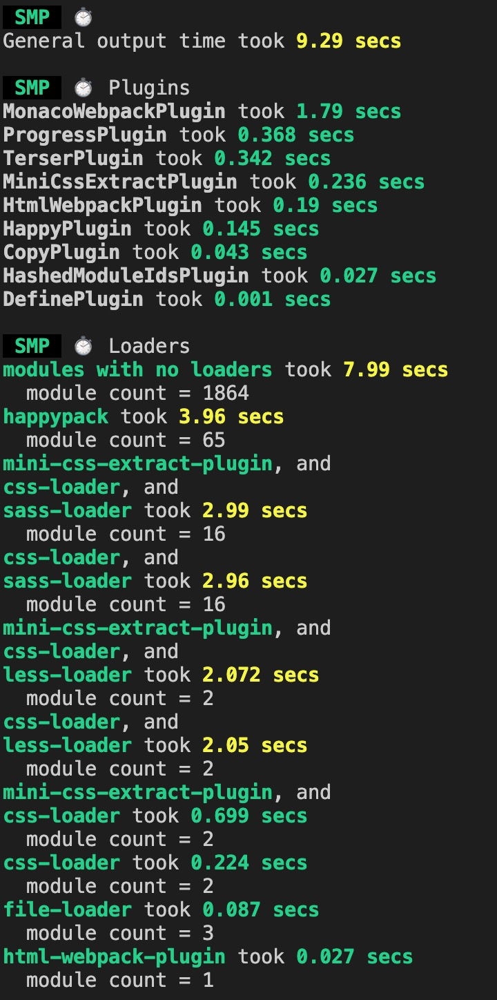

# Stats 对象

stats 选项让你更精确地控制 bundle 信息该怎么显示。

```js
//  webpack.config.js
module.exports = {
    //...
    stats: 'verbose'
};

// package.js    --json > stats.json
"build:stats": "rm -rf dist/* && node --max_old_space_size=4092 ./node_modules/.bin/webpack --config build/prod.js --json > stats.json"
```

执行 `build:stats"` 命令后，根目录地下多出一个 stats.json 文件。

打开 [Webpack github analyse](http://webpack.github.io/analyse/#home) 加载 stats.json

效果如下：



打开 [Webpack Chart](http://alexkuz.github.io/webpack-chart/) 加载 stats.json

效果如下：



## Stats Presets

| 预设 | 可选值 | 描述 |
| -- | -- | -- |
| 'errors-only' | none | 只在发生错误时输出 |
| 'errors-warnings' | none | 只在发生错误或有新的编译时输出 |
|'minimal' | none | 只在发生错误或新的编译开始时输出 |
|'none' | false | 没有输出 |
|'normal' | true | 标准输出 |
|'verbose' | none | 全部输出 |
|'detailed' | none | 全部输出除了 chunkModules 和 chunkRootModules |
|'summary' | none | 输出 webpack 版本，以及警告数和错误数 |


[webpack stats 详细配置](https://webpack.js.org/configuration/stats/#statsassets)


## 第三方插件

[webpack-bundle-analyzer](https://github.com/webpack-contrib/webpack-bundle-analyzer)能很直观的给出每一个打包出来的文件的大小以及各自的依赖，能够更加方便的帮助我们对项目进行分析。

**Install**
```js
# NPM
npm install --save-dev webpack-bundle-analyzer
# Yarn
yarn add -D webpack-bundle-analyzer
```

**Usage (as a plugin)**
```js
const BundleAnalyzerPlugin = require('webpack-bundle-analyzer').BundleAnalyzerPlugin;

module.exports = {
  plugins: [
    new BundleAnalyzerPlugin()
  ]
}
```


[speed-measure-webpack-plugin](https://github.com/stephencookdev/speed-measure-webpack-plugin)分析整个打包的总耗时，以及每一个loader 和每一个 plugins 构建所耗费的时间，从而帮助我们快速定位到可以优化 Webpack 的配置。

**Install**
```js
# NPM
npm install --save-dev speed-measure-webpack-plugin
# Yarn
yarn add -D speed-measure-webpack-plugin
```

**Usage (as a plugin)**
```js
const SpeedMeasurePlugin = require("speed-measure-webpack-plugin");

const smp = new SpeedMeasurePlugin();

const webpackConfig = smp.wrap({
  plugins: [new MyPlugin(), new MyOtherPlugin()],
});
```

