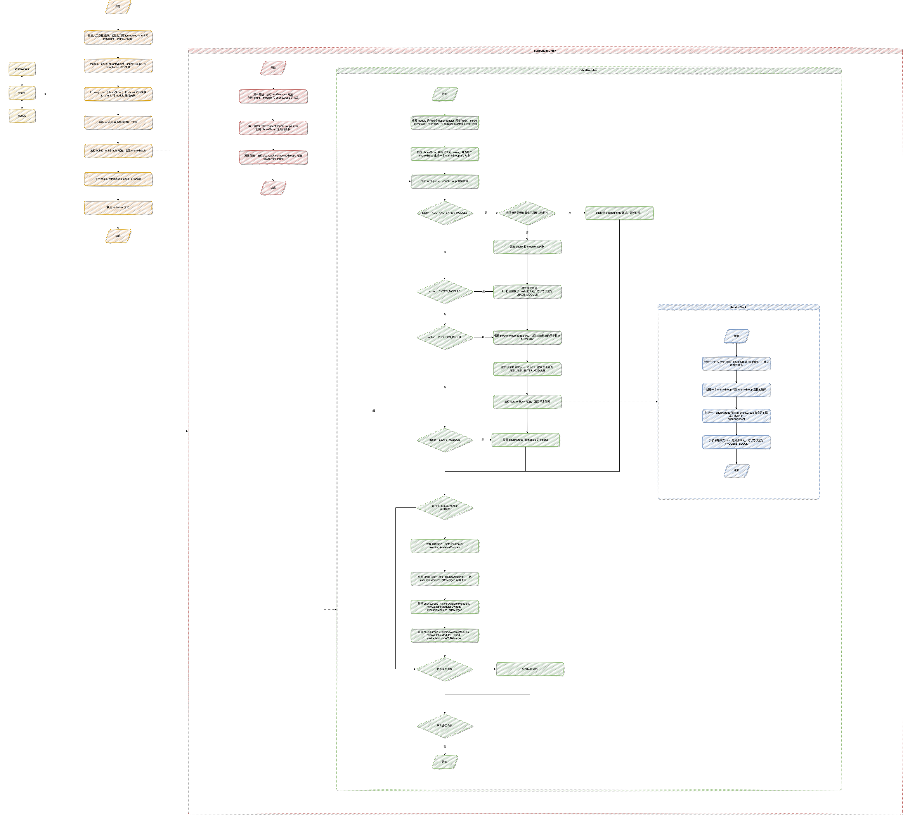
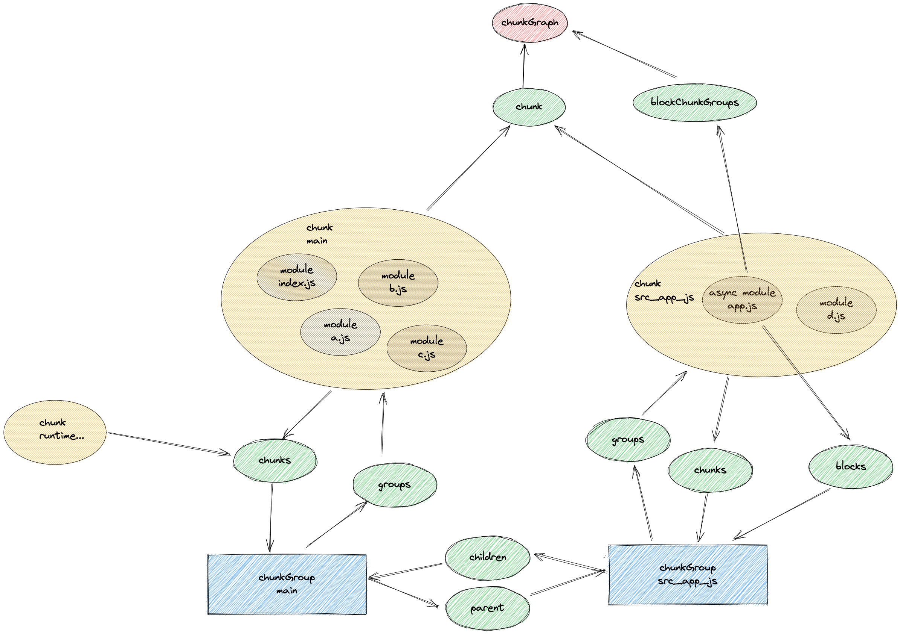
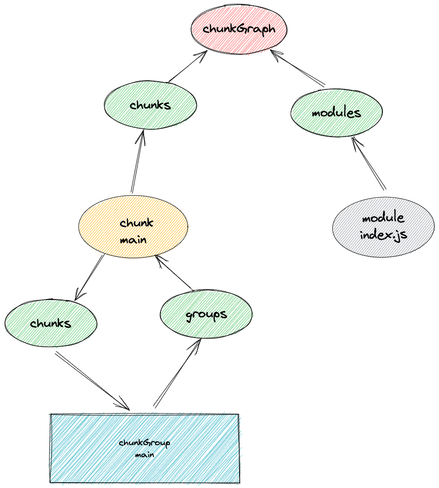
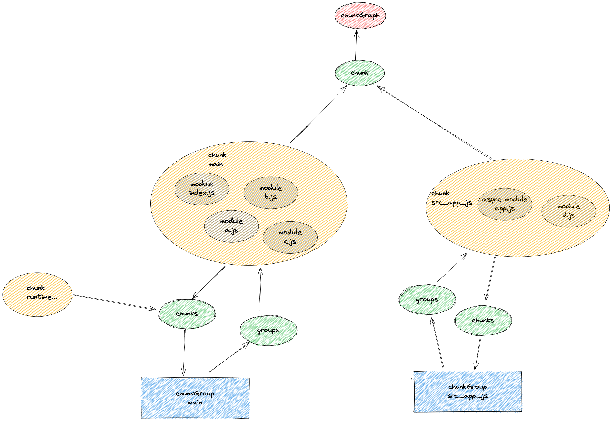
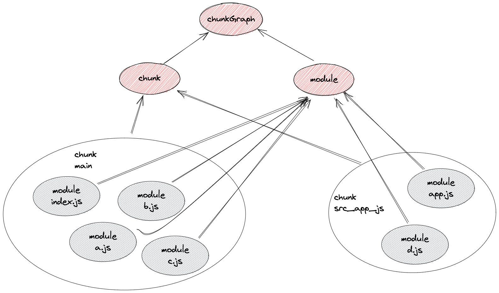

# chunk

Compilation.seal() 开始 chunk 阶段

1. 通过在 module parse 阶段得到的 moduleGraph 信息初始化 ChunkGraph。
1. 根据入口进行遍历
    1. 执行 addChunk 方法，文件名初始化 chunk
    1. 根据入口文件的 option 中得到 chunk 相关的配置。初始化一个 entrypoint（chunkGroup）
    1. 遍历 dependencies 模块依赖信息。
        1. entrypoint 把模块名称（moduleId）存入 origin 中
        1. 获取到入口 module 的详细信息。
        1. 建立 chunkGraph 和 chunk 和 module 的关联, chunkGroup 和 chunk 建立关联
1. 根据入口文件的配置 dependOn（当前入口所依赖的入口。它们必须在该入口被加载前被加载） 和 runtime（运行时 chunk 的名字） 进行处理。
1. 执行 buildChunkGraph ，开始对 chunk 进行处理。
    1. SHARED STATE
    1. PART ONE 阶段 visitModules
        1. 根据 entrypoint（chunkGroup） 创建 chunkGroupInfo
        1. 根据 entrypoint（chunkGroup）中的 module 列表，创建 queue 队列
        1. chunkGroupInfoMap.set(chunkGroup, chunkGroupInfo);
        1. 因为在读取 queue 队列时使用 pop() 读取最后一个，所以我们先要反转 queue.reverse() 队列，保持正确的顺序
        1. 递归 queue。
            1. 执行 processQueue 方法，根据 queueItem.action 进行判断。
                1. ADD_AND_ENTER_MODULE = 1。判断 module 和 chunk 是否建立过联系，如果有 break。如果没有则建立 module 和 chunk 的关系。继续执行 ENTER_MODULE
                1. ENTER_MODULE = 2。
                    1. \*判断 module 在当前 chunkGroup 是否是首次加载，记录当前 chunkGroup 存在的首次加载模块个数。
                    1. _记录当前模块的加载索引，即加载顺序，如果已经有索引，代表已经加载过了。_
                    1. 把 action 设置为 LEAVE_MODULE。 并把当前 queueItem，在一次压入 queueItem 中。由于 queue.pop() 取的最后一位，相当于执行完这次的 processQueue 方法。立即在执行一次。没有 break ，继续执行 action = PROCESS_BLOCK 的逻辑。
                1. PROCESS_BLOCK = 3。执行 processBlock 方法。
                    1. 根据当前 module 在 moduleGraph 中查找当前模块的依赖模块，存入 blockModules 中。如果是异步模块，会转化成普通模块。
                    1. 遍历 blockModules ,根据 module 建立 queueBuffer。其实就是 queueItem 集合。再把 queueBuffer 按照倒叙一个个添加进 queue 中。到这完成了同步模块的新增。
                    1. 接下来判断是否存在异步模块。如果存在遍历 block.blocks（异步模块数据）。 block 就是 module。block.blocks 就是 module 的异步模块数据。
                    1. 生成一个新的 chunkGroup、chunkGroupInfo，生成新的 chunk
                    1. 记录到 blockConnections 中。第二步进行块和组，以及组和组之间的连接就通过这个。
                    1. 建立连接关系。在第二步进行连接。
                    1. 把当前 module 的 chunkGroupInfo 和异步模块 chunkGroupInfo 信息存入一个公共 queueConnect 中，为接下来的组与组的关联做准备。
                    1. 根据建好的异步模块 chunkGroup 等信息。压入 queueDelayed 队列中，等同步队列执行完毕了，在执行这个。
                    1. 把存在异步模块的模块。存入 blocksWithNestedBlocks 总，猜测后续 hmr 等能用上。
                    1. break 结束。
                1. LEAVE_MODULE = 5。重新执行 ENTER_MODULE 中压入队列的 module。
                    1. 判断 module 在当前 chunkGroup 是否是最后一次加载，记录当前 chunkGroup 中模块加载数量。
        1. 如果存在异步模块则执行 processConnectQueue。
            1. 根据 queueConnect 进行遍历，把关系信息转化成 children 数组。
            1. 计算可用模块
            1. 更新 chunkGroup 的信息
            1. 清除 queueConnect
            1. 执行 processchunkGroupForCombining，计算可用模块
            1. 执行 processConnectQueue，processchunkGroupForMerging，计算最小可用模块
        1. 当所有同步模块处理完之后，在进行处理异步模块
    1. PART TWO 阶段 connectchunkGroup 创建完整的 chunkGraph
        1. 检查是否需要连接
        1. 建立异步模块 与 chunkGroup 之间的联系
        1. 建立 chunkGroup 和 chunkGroup 之间的联系
    1. 遍历 chunkGroupInfoMap， 为 chunk 加上公共的 runtime 模块
    1. Cleanup work 阶段 cleanupUnconnectedGroups 清除无用的连接

`this.hooks.beforeChunks.call();`

4、遍历我们在 module parse 阶段得到的 dependencies 依赖集合。
4.1、用模块名（一般就是 moduleId）,存入 chunkGroup 中。
4.2

```js
this.hooks.beforeChunks.call();
for (const preparedEntrypoint of this._preparedEntrypoints) {
    // 初始化相关数据
    const module = preparedEntrypoint.module;
    const name = preparedEntrypoint.name;
    const chunk = this.addChunk(name); // 查找缓存，没有则新建
    const entrypoint = new Entrypoint(name);
    entrypoint.setRuntimeChunk(chunk);
    entrypoint.addOrigin(null, name, preparedEntrypoint.request);

    // 跟 compilation 进行关联
    this.namedchunkGroup.set(name, entrypoint);
    this.entrypoints.set(name, entrypoint);
    this.chunkGroup.push(entrypoint);

    // chunk、chunkGroup和module 互相关联
    GraphHelpers.connectChunkGroupAndChunk(entrypoint, chunk);
    GraphHelpers.connectChunkAndModule(chunk, module);

    chunk.entryModule = module;
    chunk.name = name;

    this.assignDepth(module); // 获取模块依赖的深度
}
```

```js
/**
 * This method creates the Chunk graph from the Module graph
 * @param {Compilation} compilation the compilation
 * @param {Entrypoint[]} inputchunkGroup chunk groups which are processed
 * @returns {void}
 */
const buildChunkGraph = (compilation, inputchunkGroup) => {
    // SHARED STATE

    /** @type {Map<AsyncDependenciesBlock, BlockChunkGroupConnection[]>} */
    const blockConnections = new Map();

    /** @type {Set<ChunkGroup>} */
    const allCreatedchunkGroup = new Set();

    /** @type {Map<ChunkGroup, ChunkGroupInfo>} */
    const chunkGroupInfoMap = new Map();

    /** @type {Set<DependenciesBlock>} */
    const blocksWithNestedBlocks = new Set();

    // PART ONE
    // 从入口chunk开始，创建 chunk、module和chunkGroup 的关系

    visitModules(
        compilation,
        inputchunkGroup,
        chunkGroupInfoMap,
        blockConnections,
        blocksWithNestedBlocks,
        allCreatedchunkGroup
    );

    // PART TWO

    connectchunkGroup(blocksWithNestedBlocks, blockConnections, chunkGroupInfoMap);

    // Cleaup work

    cleanupUnconnectedGroups(compilation, allCreatedchunkGroup);
};

module.exports = buildChunkGraph;
```

第一阶段：

1、根据 module 的依赖项 dependencies(同步依赖)， blocks（异步依赖）进行遍历，生成 blockInfoMap 的数据结构。

2、

```js
switch(){
		case ADD_AND_ENTER_MODULE: {
        // 判断当前模块是否在最小可用模块数组内，如果在说明这个模块已经关联过了，把这个模块加入  skippedItems 跳过数组中。 如果不在，建立当前 chunk 和 module 的关联。
      },
		case ENTER_MODULE: {
        // 查找模块内对应 chunkGroup 的索引，如果没有赋值一个。
		  // push 进队列，把状态设置为 LEAVE_MODULE
      }
		case PROCESS_BLOCK: {
        // 根据 blockInfoMap.get(block)， 找到当前模块的同步模块和异步模块，
 		  // 把同步依赖依次 push 进队列，把状态设置为 ADD_AND_ENTER_MODULE
		  // 1.遍历异步依赖
		  // 1.1 创建一个对应异步依赖的 chunkGroup 和 chunk，并建立两者的联系
        // 1.2 创建一个 chunkGroup 和新 chunkGroup 直接的联系 ?
		  // 1.3 创建一个 chunkGroup 和当前 chunkGroup 集合的的联系 ?
		  // 1.4 把异步依赖依次 push 进异步队列，把状态设置为 PROCESS_BLOCK
      }
		case LEAVE_MODULE: {
        // 设置 chunkGroup 和 module 的 index2
      }

}

```

3、查找可用模块，设置 children 和 resultingAvailableModules。
4、在根据 target 初始化新的 chunkGroupInfo，并把 availableModulesToBeMerged 设置上去。
5、合并可用模块，处理 chunkGroup 内的 minAvailableModules、minAvailableModulesOwned、availableModulesToBeMerged。
6、如果当前的可用模块有修改则 push 进队列中。
7、同步队列执行完毕，判断是否存在异步队列，如果有把异步队列 push 进同步队列中。

第二阶段：
根据第一阶段建立起的 chunkGroup 之家的联系 blockConnections
1、检查是否需要进行关联
2、遍历连接关系
3、根据 chunkGroup 之间的相同 module 进行关联，建立父子关系

第三阶段：
清理无用的 chunk。
通过判断是否存在父级关联，如果没有则删除对应 chunk

至此 chunkGroup 生成完毕 

执行 afterChunk hooks，内部是

```js
compilation.hooks.afterChunks.tap('WebAssemblyModulesPlugin', () => {
    for (const chunk of compilation.chunks) {
        if (chunk.canBeInitial()) {
            for (const module of chunk.modulesIterable) {
                if (module.type.startsWith('webassembly')) {
                    initialWasmModules.add(module);
                }
            }
        }
    }
    // .....
});
```

接下来就是执行一写 optimize 的 hooks



#webpack

#wip






[深入理解 webpack 的 chunkId 对线上缓存的思考] https://juejin.cn/post/6844903924818771981#heading-5
