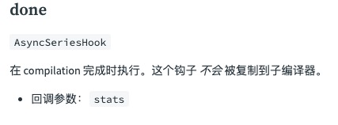
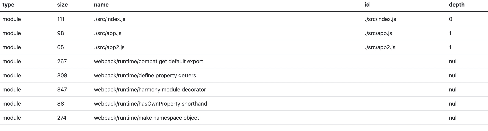

# webpack-plugin
## 目的
插件目的在于解决  loader 无法实现的**其他事**

## plugin 原理
Webpack 的插件机制，是一种事件流的机制，按照一定的顺序，依次触发对应的事件。

webpack 内部使用 tapable 拓展了类，用来注册和调用事件。
``` js
// 注册事件
this.hooks.emit.tap(compilation, err => { /* ... */ }); // 注册同步事件
this.hooks.emit.tapAsync(compilation, err => { /* ... */ }); // 注册异步事件

// 调用事件
this.hooks.emit.call(compilation, err => { /* ... */ }); // 调用同步事件
this.hooks.emit.callAsync(compilation, err => { /* ... */ }); // 调用异步事件
```
> [GitHub - webpack/tapable: Just a little module for plugins.](https://github.com/webpack/tapable)  

Webpack 的执行过程中，在不同的阶段，会调用对应的事件，这保证了插件的有序性。用户只需要根据执行阶段在对应的钩子上注册事件即可。

## compiler 和 compilation
* **Compiler**：该对象包含了 Webpack 环境所有的的配置信息，包含 options、loaders 和 plugins 这些信息，以及webpack执行阶段的生命周期。这个对象在 Webpack 启动时候被实例化，它是全局唯一的，可以简单地把它理解为 Webpack 实例。
* **Compilation**：该对象包含了当前的模块资源、编译生成资源、变化的文件等。当 Webpack 以开发模式运行时，每当检测到一个文件变化，一次新的 Compilation 将被创建。Compilation 对象也提供了很多事件回调供插件做扩展。通过 Compilation 也能读取到 Compiler 对象。

## compiler 钩子
> Compiler 模块是 webpack 的主要引擎，它通过 CLI 或者 Node API 传递的所有选项创建出一个 compilation 实例。它扩展（extends）自 Tapable 类，用来注册和调用插件。 大多数面向用户的插件会首先在 Compiler 上注册。  

 可以通过如下方式访问：
``` js
compiler.hooks.someHook.tap('MyPlugin', (params) => {
  /* ... */
});
```

具体的钩子说明可以看: [compiler 钩子 | webpack 中文文档](https://webpack.docschina.org/api/compiler-hooks/#hooks)

## compilation 钩子
> Compilation 模块会被 Compiler 用来创建新的 compilation 对象（或新的 build 对象）。 compilation 实例能够访问所有的模块和它们的依赖（大部分是循环依赖）。 它会对应用程序的依赖图中所有模块， 进行字面上的编译(literal compilation)。 在编译阶段，模块会被加载(load)、封存(seal)、优化(optimize)、 分块(chunk)、哈希(hash)和重新创建(restore)。  

可以通过如下方式访问：
``` js
compilation.hooks.someHook.tap('MyPlugin', (params) => {
  /* ... */
});
```

具体的钩子说明可以看:[compilation 钩子 | webpack 中文文档](https://webpack.docschina.org/api/compilation-hooks/)


## 用法
### 配置方式
webapck.config.js
```js
const HtmlWebpackPlugin = require('html-webpack-plugin');
const webpack = require('webpack'); // 访问内置的插件
const path = require('path');

module.exports = {
  entry: './src/index.js',
  output: {
    path: path.join(__dirname, './dist')
  },
  module: {
    rules: [
      {
        test: /\.(js|jsx)$/,
        use: 'babel-loader',
      },
    ],
  },
  plugins: [
    new webpack.ProgressPlugin(),
    new HtmlWebpackPlugin({ template: './src/index.html' }),
  ],
};
```


### Node API 方式
```js
const webpack = require('webpack'); // 访问 webpack 运行时(runtime)
const configuration = require('./webpack.config.js');

let compiler = webpack(configuration);

new webpack.ProgressPlugin().apply(compiler);

compiler.run(function (err, stats) {
  // ...
});
```


## 如何写一个插件
webpack 在注册时，执行插件的 apply 方法`plugin.apply(compiler)`。所以我们在写插件时，把事件注册写在`apply`内。

如下：
``` js
const pluginName = 'ConsoleLogOnBuildWebpackPlugin';

class ConsoleLogOnBuildWebpackPlugin {
  apply(compiler) {
    compiler.hooks.run.tap(pluginName, (compilation) => {
      console.log('webpack 构建正在启动！');
    });
  }
}

module.exports = ConsoleLogOnBuildWebpackPlugin;
```

Compiler hook 的 tap 方法的第一个参数，应该是驼峰式命名的插件名称。建议为此使用一个常量，以便它可以在所有 hook 中重复使用。

## 一个简单 Analyze 插件
首先我们需要分析一下 Analyze 插件有什么？

1. 分析的数据
2. 展示数据的页面

### 确认执行阶段
要有分析的数据，那么就要先确定在哪个阶段进行获取，我们知道在整个 webpack 的执行过程中，compilation 负责每一次的模块的编译。只有等 compilation 结束之后，我们才能够拿到模块编译的结果。根据这个我们就可以去找在哪个生命周期 compilation 结束。

在 compiler 的 done 生命周期钩子，在 compilation 完成时执行。




```js
class AnalyzerPlugin {
    apply(compiler) {
        compiler.hooks.done.tapAsync('analyzerPlugin', (stats, callback) => {

		  });
    }
}
```

### 获取分析数据
Webpack 可分析的数据有非常多的，比如时间、chunk和bundle等。

在 done 回调中返回的 stats 是有包含相应的信息的，这里我们以模块的部分信息为例进行分析。

```js
function getModules(stats) {
    const modules = stats.toJson().modules.map(({ type, size, name, id, depth }) => {
        return {
            type,
            size,
            name,
            id,
            depth
        };
    });

    return modules
}
```

### 展示数据
展示数据有两种方式。
第一种就是通过 `console.log()`，直接在终端进行展示，比较简单，但是不好用。
```js
class AnalyzerPlugin {
    apply(compiler) {
        compiler.hooks.done.tapAsync('analyzerPlugin', (stats, callback) => {
			  const modules = getModules(stats)

			  console.log(modules)
		  });
    }
}
```

第二种就是在页面中进行展示。

首先我们通过 node 的 http 模块创建一个 server，内容是我们自定义的 html 模版。
```js
function createServer(modules) {
    const server = http.createServer((req, res) => {
        if (req.method === 'GET' && req.url === '/') {
            const html = renderViewer({
                title: 'MyAnalyzerPlugin',
                data: modules
            });
            res.writeHead(200, { 'Content-Type': 'text/html' });
            res.end(html);
        }
    });

    return server
}
```

启动这个服务，并通过 opener 在服务启动成功之后的回调里，自动打开浏览器页面进行展示。
```js
function serverListen(server){
    const port = 8888;
    const host = '127.0.0.1';

    server.listen(port, host, () => {
        const url = `http://${host}:${port}`;
        opener(url);
    })
}
```

完整代码：
``` js
const http = require('http');

const opener = require('opener');

class AnalyzerPlugin {
    apply(compiler) {
        compiler.hooks.done.tapAsync('analyzerPlugin', (stats, callback) => {
            const modules = getModules(stats)

            const server = createServer(modules)     

            serverListen(server)
        });
    }
}

function getModules(stats) {
    const modules = stats.toJson().modules.map(({ type, size, name, id, depth }) => {
        return {
            type,
            size,
            name,
            id,
            depth
        };
    });

    return modules
}

function createServer(modules) {
    const server = http.createServer((req, res) => {
        if (req.method === 'GET' && req.url === '/') {
            const html = renderViewer({
                title: 'MyAnalyzerPlugin',
                data: modules
            });
            res.writeHead(200, { 'Content-Type': 'text/html' });
            res.end(html);
        }
    });

    return server
}

function serverListen(server){
    const port = 8888;
    const host = '127.0.0.1';

    server.listen(port, host, () => {
        const url = `http://${host}:${port}`;
        opener(url);
    })
}

function renderViewer({ title, data } = {}) {
    return `<!DOCTYPE html>
        <html>
            <head>
                <meta charset="UTF-8" />
                <meta
                    name="viewport"
                    content="width=device-width, initial-scale=1"
                />
                <title>${title}</title>
            </head>
            <body>
                <div id="app">
                <table>
                    <thead>
                        <tr>
                            <th>type</th>
                            <th>size</th>
                            <th>name</th>
                            <th>id</th>
                            <th>depth</th>
                        </tr>
                    </thead>
                    <tbody>
                        ${data.map((item) => {
                            return `<tr>
                            <td>${item.type}</td>
                            <td>${item.size}</td>
                            <td>${item.name}</td>
                            <td>${item.id}</td>
                            <td>${item.depth}</td>
                        </tr>`;
                        })}
                </tbody>
                </table>
                </div>
            </body>
        </html>`;
}

module.exports = AnalyzerPlugin;
```

最终的效果如下：


**参考文献**
* https://webpack.docschina.org/concepts/plugins/
* [GitHub - webpack-contrib/webpack-bundle-analyzer: Webpack plugin and CLI utility that represents bundle content as convenient interactive zoomable treemap](https://github.com/webpack-contrib/webpack-bundle-analyzer)
* [Plugin 机制 - Webpack Guidebook](https://tsejx.github.io/webpack-guidebook/infra/implementation-principle/plugin)
* [webpack plugin](https://webpack.docschina.org/plugins/)
