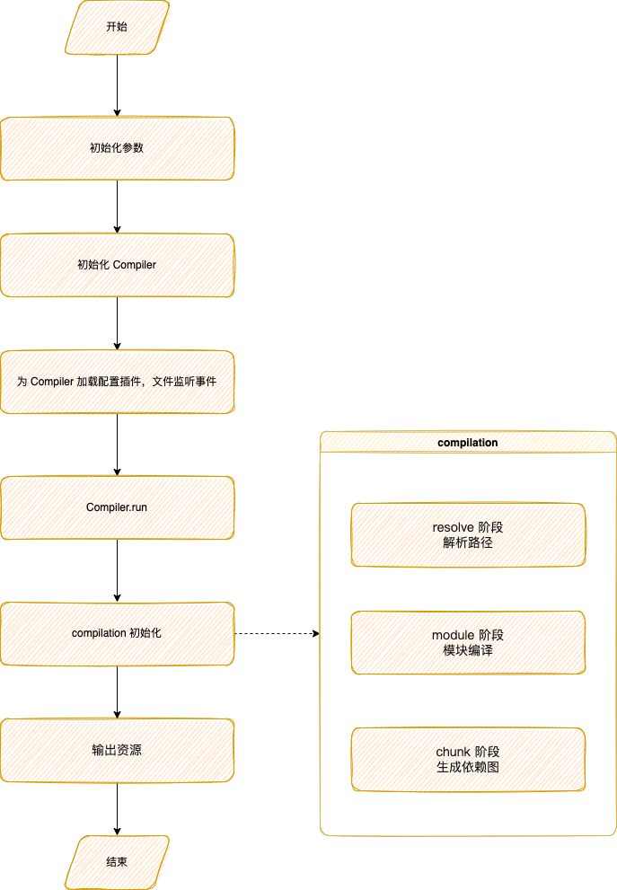
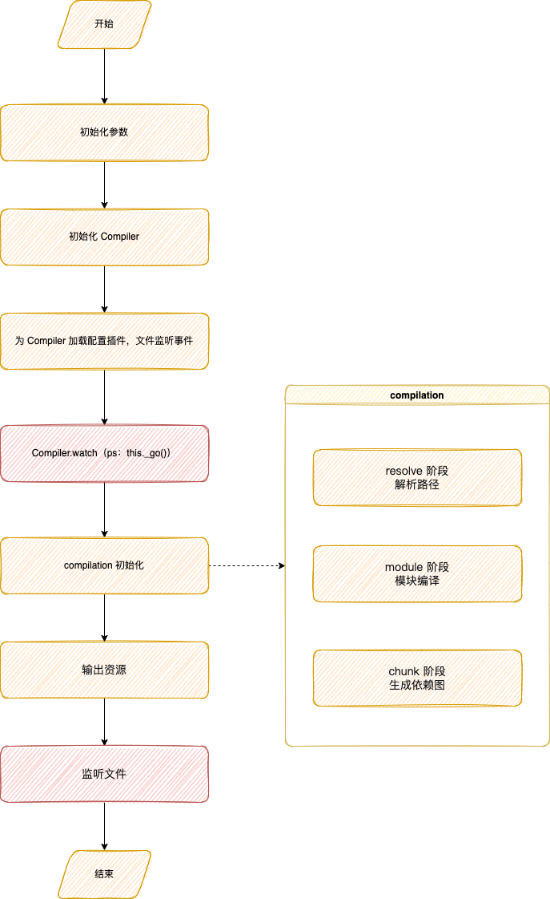
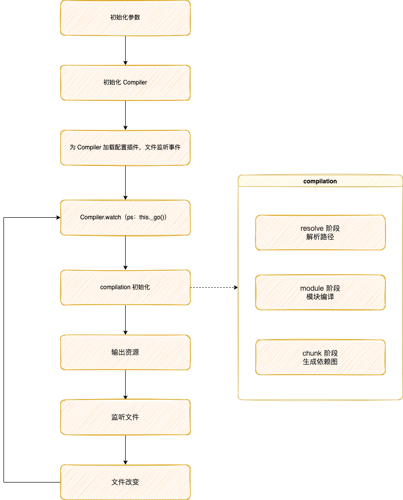
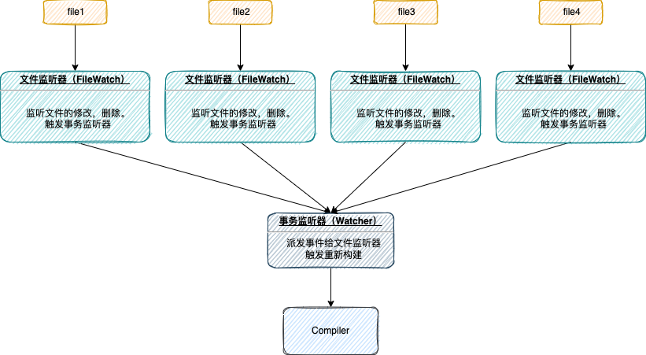

# Watch

启用 Watch 模式。这意味着在初始构建之后，webpack 将继续监听任何已解析文件的更改。Watch 模式默认关闭。

```
watch: true
```

> **webpack-dev-server** 和 **webpack-dev-middleware** 里 Watch 模式默认开启。  
> [watch 和 watchOptions | webpack 中文网](https://www.webpackjs.com/configuration/watch/)







在一开始的创建 compiler 对象添加文件的处理方法。

```js
// webpack.js
const webpack = (options, callback) => {
	// ...
	new NodeEnvironmentPlugin({2
		infrastructureLogging: options.infrastructureLogging
	}).apply(compiler);
    // ...
}


// /node/NodeEnvironmentPlugin.js
class NodeEnvironmentPlugin {
	  apply(compiler) {
		  // ...
        compiler.inputFileSystem = new CachedInputFileSystem(
            new NodeJsInputFileSystem(),
            60000
        );
        const inputFileSystem = compiler.inputFileSystem;
        compiler.outputFileSystem = new NodeOutputFileSystem();
        compiler.watchFileSystem = new NodeWatchFileSystem(
            compiler.inputFileSystem
        ); // 生成一个监听器，没有绑定任何事件
        compiler.hooks.beforeRun.tap("NodeEnvironmentPlugin", compiler => {
            if (compiler.inputFileSystem === inputFileSystem) inputFileSystem.purge();
        });
    }
}
```

普通模式下执行 `compiler.run` 方法。在开启了`watch` 模式后，执行 `compiler.watch` 方法：

```js
watch(watchOptions, handler) {
	  // ...
	  return new Watching(this, watchOptions, handler);
}
```

初始化`new Watching`，内部最终执行到 `this._go()`，内部与 `compiler.run` 有些类似，最终会执行 `this._done(null, compilation)`

```js
class Watching {
    constructor(compiler, watchOptions, handler) {
        // ...
        this.compiler.readRecords((err) => {
            if (err) return this._done(err);

            this._go();
        });
    }

    _go() {
        this.startTime = Date.now();
        this.running = true;
        this.invalid = false;
        this.compiler.hooks.watchRun.callAsync(this.compiler, (err) => {
            if (err) return this._done(err);
            const onCompiled = (err, compilation) => {
                if (err) return this._done(err);
                if (this.invalid) return this._done();

                if (
                    this.compiler.hooks.shouldEmit.call(compilation) === false
                ) {
                    return this._done(null, compilation);
                }

                this.compiler.emitAssets(compilation, (err) => {
                    if (err) return this._done(err);
                    if (this.invalid) return this._done();
                    this.compiler.emitRecords((err) => {
                        if (err) return this._done(err);

                        if (compilation.hooks.needAdditionalPass.call()) {
                            compilation.needAdditionalPass = true;

                            const stats = new Stats(compilation);
                            stats.startTime = this.startTime;
                            stats.endTime = Date.now();
                            this.compiler.hooks.done.callAsync(stats, (err) => {
                                if (err) return this._done(err);

                                this.compiler.hooks.additionalPass.callAsync(
                                    (err) => {
                                        if (err) return this._done(err);
                                        this.compiler.compile(onCompiled);
                                    }
                                );
                            });
                            return;
                        }
                        return this._done(null, compilation);
                    });
                });
            };
            this.compiler.compile(onCompiled);
        });
    }
}
```

在 `this._done`中，触发了 hooks.done 。在构建完成之后执行 `this.watch` 为文件添加监听器。传入`fileDependencies`,`contextDependencies`,`missingDependencies`这 3 个参数。

```js
    _done(err, compilation) {
        this.running = false;
        if (this.invalid) return this._go();

        const stats = compilation ? this._getStats(compilation) : null;
        if (err) {
            this.compiler.hooks.failed.call(err);
            this.handler(err, stats);
            return;
        }
        this.compiler.hooks.done.callAsync(stats, () => {
            this.handler(null, stats);
            if (!this.closed) {
                this.watch(
                    Array.from(compilation.fileDependencies),
                    Array.from(compilation.contextDependencies),
                    Array.from(compilation.missingDependencies)
                );
            }
            for (const cb of this.callbacks) cb();
            this.callbacks.length = 0;
        });
    }

    watch(files, dirs, missing) {
        this.pausedWatcher = null;
        this.watcher = this.compiler.watchFileSystem.watch(
            files,
            dirs,
            missing,
            this.startTime,
            this.watchOptions,
            (
                err,
                filesModified,
                contextModified,
                missingModified,
                fileTimestamps,
                contextTimestamps,
                removedFiles
            ) => {
                this.pausedWatcher = this.watcher;
                this.watcher = null;
                if (err) {
                    return this.handler(err);
                }
                this.compiler.fileTimestamps = fileTimestamps;
                this.compiler.contextTimestamps = contextTimestamps;
                this.compiler.removedFiles = removedFiles;
                if (!this.suspended) {
                    this._invalidate();
                }
            },
            (fileName, changeTime) => {
                this.compiler.hooks.invalid.call(fileName, changeTime);
            }
        );
    }
```

Watcher 继承至 node 的 EventEmitter，可以进行事件的绑定监听。绑定了 `change`， `aggregated`事件。

```js
this.watcher.once('change', callbackUndelayed);
this.watcher.once('aggregated', (changes, removals) => {
    changes = changes.concat(removals);
    if (this.inputFileSystem && this.inputFileSystem.purge) {
        this.inputFileSystem.purge(changes);
    }
    const times = objectToMap(this.watcher.getTimes());
    files = new Set(files);
    dirs = new Set(dirs);
    missing = new Set(missing);
    removals = new Set(removals.filter((file) => files.has(file)));
    callback(
        null,
        changes.filter((file) => files.has(file)).sort(),
        changes.filter((file) => dirs.has(file)).sort(),
        changes.filter((file) => missing.has(file)).sort(),
        times,
        times,
        removals
    );
});
```

fileWatcher 使用 chokidar 进行监听

```js
var chokidar = require('./chokidar');

this.watcher = chokidar.watch(directoryPath, {
    ignoreInitial: true,
    persistent: true,
    followSymlinks: false,
    depth: 0,
    atomic: false,
    alwaysStat: true,
    ignorePermissionErrors: true,
    ignored: options.ignored,
    usePolling: options.poll ? true : undefined,
    interval: interval,
    binaryInterval: interval,
    disableGlobbing: true
});
this.watcher.on('add', this.onFileAdded.bind(this));
this.watcher.on('addDir', this.onDirectoryAdded.bind(this));
this.watcher.on('change', this.onChange.bind(this));
this.watcher.on('unlink', this.onFileUnlinked.bind(this));
this.watcher.on('unlinkDir', this.onDirectoryUnlinked.bind(this));
this.watcher.on('error', this.onWatcherError.bind(this));
```

在 done.hooks 中为每个文件增加一个监听器。



#webpack
