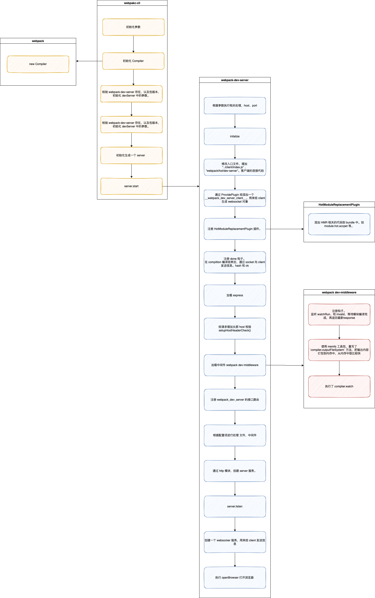

# 模块热替换

## 什么是热模块替换

> 模块热替换(HMR - Hot Module Replacement)功能会在应用程序运行过程中替换、添加或删除模块 ，而无需重新加载整个页面。

## 有什么好处？

- 保留在完全重新加载页面时丢失的应用程序状态。
- 只更新变更内容，以节省宝贵的开发时间。
- 调整样式更加快速，几乎相当于在浏览器调试器中更改样式。

[Webpack HMR 原理解析 - 知乎](https://zhuanlan.zhihu.com/p/30669007)

## 模块功能介绍

webpack-dev-server:

- 开启 webpack server 服务的，建立 socket 链接
- 模块编译后发送 hash 等信息给前端
- 为浏览器注册一个 **webpack_dev_server_client** 对象，client 通过这个全局对象，能够创建一个 socket 服务，其中包含连接服务的信息，不需要 client 去考虑， client 只需要关心消息的监听
- 前端入口文件新增 dev-server、client 模块

HotModuleReplacementPlugin

- 开启 hot，给 bundle 注入 hot 相关 runtime 代码，如 module.hot.accpet 等

webpack-dev-middleware:

- 执行 webpack watch
- 修改资源存储，由磁盘改为内存。
- 服务中间件，为请求增加拦截，延迟返回响应。模块编译完成后在进行响应，

dev-server

- 模块的变更校验，触发 .hot-update.json，.hot-update.js。。。。

client

- 新建 socket 建立与服务器的连接

## 执行过程

1. 启动 webpack-dev-server
2. 在 webpack 中判断是否有安装 webpack-dev-server 这个包，且版本为 v4 以上
3. 查找 cli 命令中的参数，与 webpack.config.js 中 devServer 配置进行合并，得到最终的配置结构 devServerOptions
4. 如果 webpack-dev-server 不是 v4 版本上，做兼容处理
5. 判断 port 端口是否被用过
6. 创建开发环境的服务。执行 webpack-dev-server，把 compiler 缓存在 this.compiler 上，执行 start 方法开始启动服务

   1. 进行一大堆的参数处理，执行 initialize 方法，在其中，修改 enrty 的内容，增加两个入口内容 `”../client/index.js”`，`webpack/hot/dev-server`
   2. 把客户端的所需要的代码，通过插件，命名成 `__webpack_dev_server_client__`。后面用到，其实就是我们的 secket.js 文件。
   3. 分别在 compiler 对象上为 `invalid` 和 `done`添加钩子，`done`钩子监听模块编译完成，发送信息给服务端，服务端在把改变的 hash 值发给客户端。
   4. 加载 express
   5. 为所有请求添加请求头 host 校验
   6. 加载 webpack-dev-middleware，并执行。
      1. 设置 `done`，在编译完成之后，遍历执行回调事件
      2. 使用 memfs 工具包，重写了 `compiler.outputFileSystem` 方法，把输出内容打包到内存中，从内存中取比较快。
      3. 执行 `compiler.watch(watchOptions, errorHandler);`编译模块并监听文件。
   7. 通过 http 模块，创建 server，并为 `request`监听 `connection` 和 `error`事件。`connection`中会注册 `socket`
   8. 设置 this.listeners， 用于 stop 后关闭对应 server。
   9. 通过配置项 host 和 port 启动 server，开发环境的服务就启动好了

7. 接下来进行 webpack 和服务端的通信过程。

   1. 执行 `this.createWebSocketServer` 方法，获取服务器传输模块 `return implementation = require(“./servers/SockJSServer”);`，并执行生成一个 `WebsocketServer`对象，存在 `this.webSocketServer`中
   2. 通过 `ws`模块生成一个 WebSocket.Server 对象。注册对应的 connection 和 errer 事件

8. 执行 `this.openBrowser`打开浏览器页面



[webpack-dev-middleware](https://github.com/webpack/webpack-dev-middleware)

1. 使用 memfs 工具包，重写了 `compiler.outputFileSystem` 方法，把输出内容打包到内存中，从内存中取比较快。 [webpack-dev-middleware/setupOutputFileSystem.js at master · webpack/webpack-dev-middleware · GitHub](https://github.com/webpack/webpack-dev-middleware/blob/master/src/utils/setupOutputFileSystem.js)
   ` outputFileSystem = memfs.createFsFromVolume(new memfs.Volume());`
2. 在 watch 模式下，等待模块编译完成，在发生请求。
3. 支持模块热替换

增加 入口文件片段。

```
for (const additionalEntry of additionalEntries) {
        new webpack.EntryPlugin(compiler.context, additionalEntry, {
          // eslint-disable-next-line no-undefined
          name: undefined,
        }).apply(compiler);
      }
```

https://webpack.docschina.org/configuration/dev-server/#websockettransport
[webpack-dev-server API | webpack](https://webpack.js.org/api/webpack-dev-server/)
[模块热替换(hot module replacement) | webpack 中文网](https://www.webpackjs.com/api/hot-module-replacement/)
