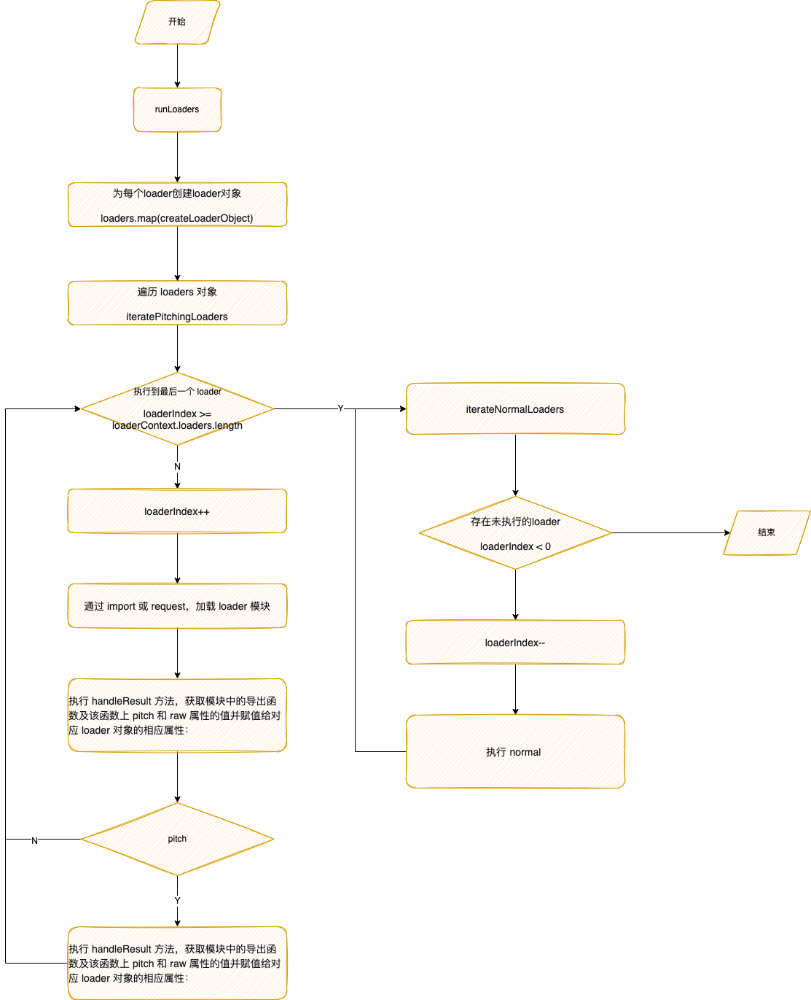
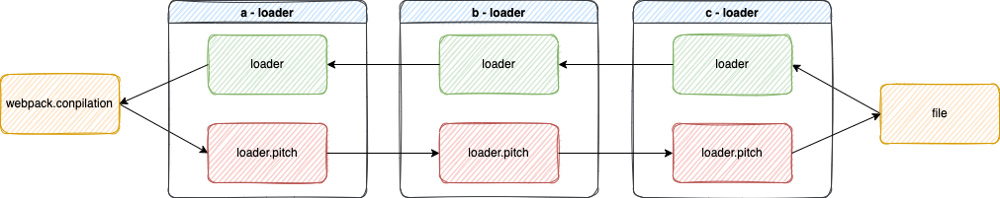
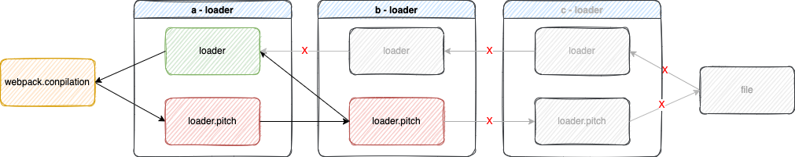

# loader

## 什么是 loader ？

Webpack 只能处理 javascript 的模块，如果要处理其他类型的文件，就需要使用 loader 来转换。loader 是 webpack 中一个重要的概念，它是指用来降一段代码转换成另一端代码的 webpack 加载器。

## Loader 的本质是什么？

loader 本质上是一个导出函数的 javaScript 模块。

```js
/**
 * @param {string | Buffer} 内容
 * @return {string}
 */
export default function loader(source) {
    const options = this.getOptions();

    source = source.replace(/\[name\]/g, options.name);

    return `export default ${JSON.stringify(source)}`;
}
```

## 为什么 webpack 需要 loader？

Webpack 底层的使用 aorcn 来解析 js 语法。对于 css 和图片等文件是无法进行解析的，这时候就需要 loader 把资源转换成 aorcn 能够解析的语法。

## webpack 如何运行 loader？

在 NormalModule.js 文件中的 \_doBuild 方法中，通过调用 loader-runner 包中的 runLoaders 的方法运行 loader。



可以看到在 runLoaders 方法内部，先通过 `loaders.map(createLoaderObject)` 为每一个 loader 创建对象，包含 normal、pitch、raw 和 data 等属性。
最后在执行 iteratePitchingLoaders 方法。

```js
exports.runLoaders = function runLoaders(options, callback) {
    // read options
    /** ... **/

    // execution state
    /** ... **/

    // prepare loader objects
    loaders = loaders.map(createLoaderObject);

    /** ... **/

    iteratePitchingLoaders(
        processOptions,
        loaderContext,
        function (err, result) {
            if (err) {
                return callback(err, {
                    cacheable: requestCacheable,
                    fileDependencies: fileDependencies,
                    contextDependencies: contextDependencies,
                    missingDependencies: missingDependencies
                });
            }
            callback(null, {
                result: result,
                resourceBuffer: processOptions.resourceBuffer,
                cacheable: requestCacheable,
                fileDependencies: fileDependencies,
                contextDependencies: contextDependencies,
                missingDependencies: missingDependencies
            });
        }
    );
};
```

```js
// loader-runner/lib/LoaderRunner.js
function iteratePitchingLoaders(options, loaderContext, callback) {
    // abort after last loader
    if (loaderContext.loaderIndex >= loaderContext.loaders.length)
        // 在processResource函数内，会调用iterateNormalLoaders函数
        // 开始执行normal loader
        return processResource(options, loaderContext, callback);

    // 首次执行时，loaderContext.loaderIndex的值为0
    var currentLoaderObject =
        loaderContext.loaders[loaderContext.loaderIndex];

    // 如果当前loader对象的pitch函数已经被执行过了，则执行下一个loader的pitch函数
    if (currentLoaderObject.pitchExecuted) {
        loaderContext.loaderIndex++;
        return iteratePitchingLoaders(options, loaderContext, callback);
    }

    // 加载loader模块
    loadLoader(currentLoaderObject, function (err) {
        if (err) {
            loaderContext.cacheable(false);
            return callback(err);
        }
        // 获取当前loader对象上的pitch函数
        var fn = currentLoaderObject.pitch;
        // 标识loader对象已经被iteratePitchingLoaders函数处理过
        currentLoaderObject.pitchExecuted = true;
        if (!fn) return iteratePitchingLoaders(options, loaderContext,
            callback);

        // 开始执行pitch函数
        runSyncOrAsync(fn, loaderContext, ...);
        // 省略部分代码
    });
}
```

在 loadLoader 加载中，存在两种加载方式，import 和 require。
```js
// loader-runner/lib/loadLoader.js
module.exports = function loadLoader(loader, callback) {
    if (loader.type === 'module') {
        try {
            if (url === undefined) url = require('url');
            var loaderUrl = url.pathToFileURL(loader.path);
            var modulePromise = eval(
                'import(' + JSON.stringify(loaderUrl.toString()) + ')'
            );
            modulePromise.then(function (module) {
                handleResult(loader, module, callback);
            }, callback);
            return;
        } catch (e) {
            callback(e);
        }
    } else {
        try {
            var module = require(loader.path);
        } catch (e) {
            // it is possible for node to choke on a require if the FD descriptor
            // limit has been reached. give it a chance to recover.
            if (e instanceof Error && e.code === 'EMFILE') {
                var retry = loadLoader.bind(null, loader, callback);
                if (typeof setImmediate === 'function') {
                    // node >= 0.9.0
                    return setImmediate(retry);
                } else {
                    // node < 0.9.0
                    return process.nextTick(retry);
                }
            }
            return callback(e);
        }
        return handleResult(loader, module, callback);
    }
};
```

loader 加载完成后，最终都会执行 handleResult 方法，获取模块中的导出函数及该函数上 pitch 和 raw 属性的值并赋值给对应 loader 对象的相应属性：
```js
function handleResult(loader, module, callback) {
    if (typeof module !== 'function' && typeof module !== 'object') {
        return callback(
            new LoaderLoadingError(
                "Module '" +
                    loader.path +
                    "' is not a loader (export function or es6 module)"
            )
        );
    }
    loader.normal = typeof module === 'function' ? module : module.default;
    loader.pitch = module.pitch;
    loader.raw = module.raw;
    if (
        typeof loader.normal !== 'function' &&
        typeof loader.pitch !== 'function'
    ) {
        return callback(
            new LoaderLoadingError(
                "Module '" +
                    loader.path +
                    "' is not a loader (must have normal or pitch function)"
            )
        );
    }
    callback();
}
```


## loader 分类

**loader 分为 4 种**：
_ pre: 前置 loader
_ normal：普通 loader
_ inline： 内联 loader
_ post：后置 loader

### pre、normal 和 post loader

通过在 `webpack` 配置项中增加配置`rule`：

```js
module.exports = {
    //...
    module: {
        rules: [
            {
                test: /\.css$/,
                use: 'css-loader'
                // enforce: 'pre' | 'post',
            }
        ]
    }
};
```

在默认情况下为普通 loader。在 rule 中可以通过 enforce 配置项进行设置 ‘pre’ | ‘post’，分别对应前置 loader 和后置 loader。

> https://webpack.js.org/configuration/module/#ruleenforce

### inline loader

```js
import 'style-loader!!css-loader!!./index.css';
```

### Inline loader 修饰符

-   `-!` 跳过 pre loader
    `const noPreAutoLoaders = requestWithoutMatchResource.startsWith("-!");`

-   `!` 跳过 pre loader 和 normal loader
    `const noAutoLoaders = noPreAutoLoaders || requestWithoutMatchResource.startsWith("!");`

-   `!!` 跳过 pre loader、normal loader 和 post loader
    `const noPrePostAutoLoaders = requestWithoutMatchResource.startsWith("!!");`

## 执行顺序

loader 的执行顺序是正序加载，倒序执行。
比如：

```js
module: {
    rules: [
        {
            test: /\.css$/,
            use: ['style-loader', 'css-loader']
        }
    ];
}
```

按照正序依次加载 `style-loader`， `css-loader`，在执行的时候倒序进行，先执行 `css-loader`, 再执行`style-loader`。

在加载时通过 `LoaderContext.loaderIndex++`,而在执行时就通过`loaderContext.loaderIndex—`进行。

对于不同分类的 loader 而言，在最终的 loaders 集合中，先添加后置 loader，在根据 `matchResource`来添加内联 loader 和普通 loader，最后在添加前置 loader。

这种添加顺序也是按照 loader 的执行顺序来进行的。正序加载，倒序执行。先添加的往往是后执行。

```js
// results[0]: post loader 集合
// results[1]: normal loader 集合
// results[2]: pre loader 集合
// loaders: inline loader 集合
if (matchResource === undefined) {
    loaders = results[0].concat(loaders, results[1], results[2]);
} else {
    loaders = results[0].concat(results[1], loaders, results[2]);
}
```

## loader 执行过程

1. 在 `Compilation` 开始对模块进行编译时，它会先进行资源绝对路径的处理，也就是 `resolve` 过程，把路径都转换成绝对路径。在这个过程中会收集跟当前资源相关的 `loader`。并且按照顺序存入一个 `loaders` 数组中。
1. 执行 `loader-runner` 中的 `runLoaders`，开始 loader 的转译。
1. 遍历 loaders，对 loader 进行对象转换，初始化一些`loader`对象信息。
1. 执行 iteratePitchingLoaders 方法，开始加载 loader。
1. 加载时判断当前 loader 是否有导出 `pitch` 方法，如果存在则执行 pitch。如果 pitch 存在返回值，则跳过接下来的 loader 加载，并直接执行以加载完成的。
1. 执行时先调用`node`的`fs`模块，根据资源文件的绝对路径，读取文件内容并存入一个 `buffer` 对象中，再传入 loader 中进行处理，并将处理完的内容返回给下一个 loader 进行处理。
   11≠. 将 loader 处理完的内容，添加至模块信息内，并设置 ast 状态，到此一个模块文件的 loader 过程执行完毕。

## 实现一个 loader

新建一个项目，进行初始化`npm init`，生成 `package.js`文件。

安装一下相关依赖。
`yarn add webpack webpack-cli babel-loader @babel/core css-loader style-loader -D`

新增一个`src`目录，在 `src`目录下添加一个`index.js`、`index.css`文件。

```js
// src/index.js
import './index.css';

console.log('很高兴认识你，webpack');
```

```css
/* src/index.css */
body {
    margin: 0;
    padding: 0;
}
```

在根目录新建一个 `custom-loader`目录，用来存放我们的自己写的 loader，并添加一个 css-loader.js 文件。

```js
// custom-loader/css-loader.js
module.exports = function (sourceCode) {
    console.log(arguments);

    return sourceCode;
};
```

在根目录新建一个 `webpack.config.js`文件，写一个简单的配置：

```js
// webpack.config.js
const path = require('path');

module.exports = {
    mode: 'development',
    context: __dirname,
    entry: './src/index.js',
    output: {
        path: path.join(__dirname, './dist')
    },
    // 配置loader
    module: {
        rules: [
            {
                test: /\.js$/,
                use: ['babel-loader'],
                exclude: /node_modules/
            },
            {
                test: /\.css$/,
                use: [
                    'style-loader',
                    'css-loader',
                    './custom-css-loader/index.js'
                ]
            }
        ]
    }
};
```

最终的目录结构如下：

```tree
├── custom-css-loader
│   └── index.js
├── src
│   ├── index.css
│   └── index.js
├── package.json
├── webpack.config.js
└── yarn.lock
```

执行 `build`，可以在终端看到如下输出，这个就是我们写在 `loader` 的 `console.log` 语句内容，可以看到入参只有一个，就是当前匹配文件的内容。


到这，其实就已经实现了一个最简单的 loader。

## 同步 loader

无论是 return 还是 this.callback 都可以同步地返回转换后的 content 值：

```js
module.exports = function (sourceCode) {
    return handle(sourceCode);
};
```

This.callback 方法则更灵活，因为它允许传递多个参数，而不仅仅是 content。

```js
module.exports = function (sourceCode) {
    this.callback(null, handle(sourceCode));
    return;
};
```

## 异步 Loaders

对于异步 loader，使用 this.async 来获取 callback 函数：

```js
module.exports = function (content, map, meta) {
    var callback = this.async();
    someAsyncOperation(content, function (err, result) {
        if (err) return callback(err);
        callback(null, result, map, meta);
    });
};
```

在源码里：
`this.async()` 返回的其实是 `innerCallback`。

在 `innerCallback` 和 `context.callback` 中，都会修改 `isSync` 的值为 `false`。
```js
context.async = function async() {
    if (isDone) {
        if (reportedError) return; // ignore
        throw new Error('async(): The callback was already called.');
    }
    isSync = false;
    return innerCallback;
};
var innerCallback = (context.callback = function () {
    if (isDone) {
        if (reportedError) return; // ignore
        throw new Error('callback(): The callback was already called.');
    }
    isDone = true;
    isSync = false;
    try {
        callback.apply(null, arguments);
    } catch (e) {
        isError = true;
        throw e;
    }
});
try {
    var result = (function LOADER_EXECUTION() {
        return fn.apply(context, args); //  执行 fn，如果内部有使用 this.async 或 this.callback 时，就会改变 isSync
    })();
    // 会根据 isSync 的值来判断，如果 isSync 为 true 则同步执行，如果 isSync 为 false 则不执行
    if (isSync) {
        isDone = true;
        if (result === undefined) return callback();
        if (
            result &&
            typeof result === 'object' &&
            typeof result.then === 'function'
        ) {
            return result.then(function (r) {
                callback(null, r);
            }, callback);
        }
        return callback(null, result);
    }
} catch (e) {}
```


## 资源 Loader

默认情况下，资源文件会被转化为 UTF-8 字符串，然后传给 loader。通过设置 raw 为 true，loader 可以接收原始的 Buffer。每一个 loader 都可以用 String 或者 Buffer 的形式传递它的处理结果。complier 将会把它们在 loader 之间相互转换。

```js
module.exports = function (content) {
    assert(content instanceof Buffer);
    return someSyncOperation(content);
    // 返回值也可以是一个 `Buffer`
    // 即使不是 "raw"，loader 也没问题
};
module.exports.raw = true;
```

## Pitching Loader

Loader 总是从右到左被调用。有些情况下，loader 只关心 request 后面的元数据(metadata)，并且忽略前一个 loader 的结果。在实际（从右到左）执行 loader 之前，会先 从左到右 调用 loader 上的 pitch 方法。

对于以下 use 配置:

```js
module.exports = {
    //...
    module: {
        rules: [
            {
                //...
                use: ['a-loader', 'b-loader', 'c-loader']
            }
        ]
    }
};
```

执行顺序如下:


在给其中的 b-loader 增加一个返回值如下：

```js
module.exports = function (content) {
    return handle(content);
};

module.exports.pitch = function (remainingRequest, precedingRequest, data) {
    return (
        'module.exports = require(' +
        JSON.stringify('-!' + remainingRequest) +
        ');'
    );
};
```

执行过程会变成如下：


### pitch 参数说明

-   **remainingRequest**：loader 链中排在自己后面的 loader 以及资源文件的绝对路径以`!`作为连接符组成的字符串。
    数据如下：
    `'_Users_edy_Desktop_word_game_webpack-loader_node_modules_style-loader_dist_cjs.js !_Users_edy_Desktop_word_game_webpack-loader_node_modules_css-loader_dist_cjs.js !_Users_edy_Desktop_word_game_webpack-loader_node_modules_sass-loader_dist_cjs.js !_Users_edy_Desktop_word_game_webpack-loader_src_index.scss`
-   **precedingRequest**：loader 链中排在自己前面的 loader 的绝对路径以`!`作为连接符组成的字符串。数据格式同 remainingRequest
-   **data**：每个 loader 中存放在上下文中的固定字段。

```js
// remainingRequest：loader链中排在自己后面的 loader 以及资源文件的绝对路径以`!`作为连接符组成的字符串。
// precedingRequest：loader链中排在自己前面的 loader 的绝对路径以`!`作为连接符组成的字符串。
// data：每个 loader 中存放在上下文中的固定字段，可用于 pitch 给 loader 传递数据
module.exports.pitch = function (remainingRequest, precedingRequest, data) {
    // ...
};
```

[Loader Interface | webpack 中文文档](https://webpack.docschina.org/api/loaders/#root)
[编写 loader](https://webpack.docschina.org/contribute/writing-a-loader/)


[loaderContext 对象上的方法说明](https://webpack.docschina.org/api/loaders/)

webpack 的 loaderContext.loadeModule 的原意为解析指定的 request 到一个模块，并对其应用已经配置的 loader，最后向其接收到的 callback 中传入 source、sourceMap、Module实例。

在 webpack loaderContext 中 resolve 方法的作用是向 require 方法一样解析一个 request；

在 webpack 的 loaderContext.getResolve 这个方法用于创建一个类似上面 resolve 的函数，它接收配置选项，这些配置自动会和 webpack 配置的 resolve 选项合并，它接收可以接收回调，也可以返回一个 Promise 对象；

在 webpack loaderContext.getOptions 中，该方法用于提取给定的 loader 的选项，它接收一个可选的 json-schema 对象，用于校验选项；

loaderContext.emitWarning/emitError 用于向 webpack 编译后输出的的警告、错误中写入 loader 运行过程中遇到的警告和错误；


1. webpack 的loader默认配置是在哪处理的，有哪些loader默认配置么？ 
1. webpack中有一个resolver的概念，用于解析模块文件的真实绝对路径，那么loader和普通模块的resolver使用的是同一个么？
TODO 有什么区别。

1. 我们知道，除了config中的loader，还可以写inline的loader，那么inline loader和normal config loader执行的先后顺序是什么？
1. 配置中的module.rules在webpack中是如何生效与实现的？
1. webpack编译流程中loader是如何以及在何时发挥作用的？
1. loader为什么是自右向左执行的？
TODO

1. 如果在某个pitch中返回值，具体会发生什么？
1. 如果你写过loader，那么可能在loader function中用到了this，这里的this究竟是什么，是webpack实例么？
1. loader function中的this.data是如何实现的？
1. 如何写一个异步loader，webpack又是如何实现loader的异步化的？


