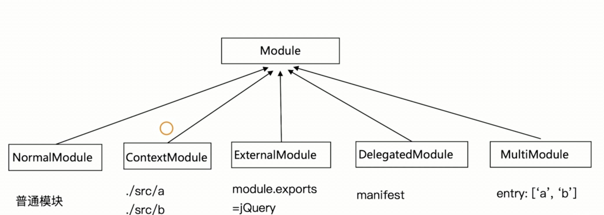
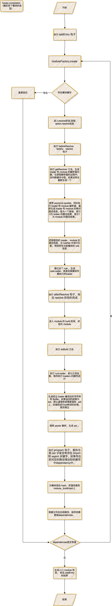

# webpack modules

## 模块的类型

-   NormalModule: 普通模块，我们的入口模块，loader
-   ContextModule: ['./a.js', './b.js'], 尚未确定干嘛用的
-   ExternalModule: 外部模块 module.exports = jQuery
-   DelegatedModule: 委托模块，在开启 DLLPlugin 的时候，会生成 manifest 文件，这个 manifest 就是委托模块
-   RawModule: 原始模块
-   RuntimeModule: 运行时模块

模块的分类，不同的模块使用不同的类。


## 执行过程

webpack 执行 Complier.run(), 最终执行 compile 方法，开始创建 compilation 对象。

```js
// lib/Compiler.js 419
const run = () => {
    this.hooks.beforeRun.callAsync(this, (err) => {
        if (err) return finalCallback(err);

        this.hooks.run.callAsync(this, (err) => {
            if (err) return finalCallback(err);

            this.readRecords((err) => {
                if (err) return finalCallback(err);

                this.compile(onCompiled);
            });
        });
    });
};
```

创建 compilation 对象，并且执行 make 钩子，进行编译。

```js
// lib/Compiler.js 1092
compile(callback) {
    const params = this.newCompilationParams();
    this.hooks.beforeCompile.callAsync(params, err => {
        /* ... */
        this.hooks.compile.call(params);

        const compilation = this.newCompilation(params);

        this.hooks.make.callAsync(compilation, err => {
          /* ... */
        });
    });
}
```

在 EntryPlugin 插件中注册 make 钩子，执行 compilation.addEntry 方法。

```js
// lib/EntryPlugin.js 48
compiler.hooks.make.tapAsync('EntryPlugin', (compilation, callback) => {
    compilation.addEntry(context, dep, options, (err) => {
        callback(err);
    });
});
```

执行 addEntry 的 hooks。可以做 ProgressPlugin 插件的逻辑，用来控制进度条等。

```js
// lib/Compilation.js 2174
this.hooks.addEntry.call(entry, options);
```

调用 `moduleFactory.create`，创建 module

```js
// lib/Compilation.js 1968
factory.create(/* ... */);
```

一开始会先判断一下这个模块有没有被构建过，或者在缓存中是否有。

```js
const dependencies = data.dependencies;
const cacheEntry = dependencyCache.get(dependencies[0]);
if (cacheEntry) return callback(null, cacheEntry);
```

查看当前模块是否有 resolveOptions 配置（从这里开始进入解析）

什么是 resolveoptions ， [Resolve | webpack](https://webpack.js.org/configuration/resolve/)

```javascript
const path = require('path');

module.exports = {
    //...
    resolve: {
        alias: {
            Utilities: path.resolve(__dirname, 'src/utilities/'),
            Templates: path.resolve(__dirname, 'src/templates/')
        }, // 别名
        extensions: ['.js', '.json', '.wasm'] // 忽略文件后缀
    }
};
```

执行 beforeResolve 钩子, 在回调中触发 factory、resolver 钩子，使用`asyncLib.parallel`，同时调用 loader 解析器和模块解析器，最终返回一个数组
，索引 0 为行内 lodaer 的路径结果，索引 1 为模块的路径结果。

```js
// lib/NormalModuleFactory.js 395 v4
const factory = this.hooks.factory.call(null);

// lib/NormalModuleFactory.js 123 v4
this.hooks.factory.tap('NormalModuleFactory', () => (result, callback) => {
    let resolver = this.hooks.resolver.call(null);

    // Ignored
    if (!resolver) return callback();

    resolver(result, (err, data) => {
        if (err) return callback(err);

        // Ignored
        if (!data) return callback();

        // direct module
        if (typeof data.source === 'function') return callback(null, data);

        this.hooks.afterResolve.callAsync(data, (err, result) => {
            if (err) return callback(err);

            // Ignored
            if (!result) return callback();

            let createdModule = this.hooks.createModule.call(result);
            if (!createdModule) {
                if (!result.request) {
                    return callback(new Error('Empty dependency (no request)'));
                }

                createdModule = new NormalModule(result);
            }

            createdModule = this.hooks.module.call(createdModule, result);

            return callback(null, createdModule);
        });
    });
});
this.hooks.resolver.tap('NormalModuleFactory', () => (data, callback) => {
    const contextInfo = data.contextInfo;
    const context = data.context;
    const request = data.request;

    const loaderResolver = this.getResolver('loader'); // 获取 loader 路径的解析器
    const normalResolver = this.getResolver('normal', data.resolveOptions); // 获取模块路径的解析器

    let matchResource = undefined;
    let requestWithoutMatchResource = request;
    const matchResourceMatch = MATCH_RESOURCE_REGEX.exec(request);
    if (matchResourceMatch) {
        matchResource = matchResourceMatch[1];
        if (/^\.\.?\//.test(matchResource)) {
            matchResource = path.join(context, matchResource);
        }
        requestWithoutMatchResource = request.substr(
            matchResourceMatch[0].length
        );
    }

    const noPreAutoLoaders = requestWithoutMatchResource.startsWith('-!');
    const noAutoLoaders =
        noPreAutoLoaders || requestWithoutMatchResource.startsWith('!');
    const noPrePostAutoLoaders = requestWithoutMatchResource.startsWith('!!');
    let elements = requestWithoutMatchResource
        .replace(/^-?!+/, '')
        .replace(/!!+/g, '!')
        .split('!');
    let resource = elements.pop();
    elements = elements.map(identToLoaderRequest);

    asyncLib.parallel(
        [
            (callback) =>
                this.resolveRequestArray(
                    contextInfo,
                    context,
                    elements,
                    loaderResolver,
                    callback
                ),
            (callback) => {
                if (resource === '' || resource[0] === '?') {
                    return callback(null, {
                        resource
                    });
                }

                normalResolver.resolve(
                    contextInfo,
                    context,
                    resource,
                    {},
                    (err, resource, resourceResolveData) => {
                        if (err) return callback(err);
                        callback(null, {
                            resourceResolveData,
                            resource
                        });
                    }
                );
            }
        ],
        (err, results) => {
            if (err) return callback(err);
            let loaders = results[0]; // 行内 loaders 的结果
            const resourceResolveData = results[1].resourceResolveData;
            resource = results[1].resource; // 模块的路径结果

            // translate option idents
            try {
                for (const item of loaders) {
                    if (
                        typeof item.options === 'string' &&
                        item.options[0] === '?'
                    ) {
                        const ident = item.options.substr(1);
                        item.options = this.ruleSet.findOptionsByIdent(ident);
                        item.ident = ident;
                    }
                }
            } catch (e) {
                return callback(e);
            }

            if (resource === false) {
                // ignored
                return callback(
                    null,
                    new RawModule(
                        '/* (ignored) */',
                        `ignored ${context} ${request}`,
                        `${request} (ignored)`
                    )
                );
            }

            const userRequest =
                (matchResource !== undefined ? `${matchResource}!=!` : '') +
                loaders.map(loaderToIdent).concat([resource]).join('!');

            let resourcePath =
                matchResource !== undefined ? matchResource : resource;
            let resourceQuery = '';
            const queryIndex = resourcePath.indexOf('?');
            if (queryIndex >= 0) {
                resourceQuery = resourcePath.substr(queryIndex);
                resourcePath = resourcePath.substr(0, queryIndex);
            }

            const result = this.ruleSet.exec({
                resource: resourcePath,
                realResource:
                    matchResource !== undefined
                        ? resource.replace(/\?.*/, '')
                        : resourcePath,
                resourceQuery,
                issuer: contextInfo.issuer,
                compiler: contextInfo.compiler
            });
            const settings = {};
            const useLoadersPost = [];
            const useLoaders = [];
            const useLoadersPre = [];
            for (const r of result) {
                if (r.type === 'use') {
                    // 处理前置loader，后置loader，以及普通 loader
                    if (r.enforce === 'post' && !noPrePostAutoLoaders) {
                        useLoadersPost.push(r.value);
                    } else if (
                        r.enforce === 'pre' &&
                        !noPreAutoLoaders &&
                        !noPrePostAutoLoaders
                    ) {
                        useLoadersPre.push(r.value);
                    } else if (
                        !r.enforce &&
                        !noAutoLoaders &&
                        !noPrePostAutoLoaders
                    ) {
                        useLoaders.push(r.value);
                    }
                } else if (
                    typeof r.value === 'object' &&
                    r.value !== null &&
                    typeof settings[r.type] === 'object' &&
                    settings[r.type] !== null
                ) {
                    settings[r.type] = cachedCleverMerge(
                        settings[r.type],
                        r.value
                    );
                } else {
                    settings[r.type] = r.value;
                }
            }
            asyncLib.parallel(
                [
                    this.resolveRequestArray.bind(
                        this,
                        contextInfo,
                        this.context,
                        useLoadersPost,
                        loaderResolver
                    ),
                    this.resolveRequestArray.bind(
                        this,
                        contextInfo,
                        this.context,
                        useLoaders,
                        loaderResolver
                    ),
                    this.resolveRequestArray.bind(
                        this,
                        contextInfo,
                        this.context,
                        useLoadersPre,
                        loaderResolver
                    )
                ],
                (err, results) => {
                    // results[0]: post loader 集合
                    // results[1]: normal loader 集合
                    // results[2]: pre loader 集合
                    // loaders: inline loader 集合
                    if (err) return callback(err);
                    if (matchResource === undefined) {
                        loaders = results[0].concat(
                            loaders,
                            results[1],
                            results[2]
                        );
                    } else {
                        loaders = results[0].concat(
                            results[1],
                            loaders,
                            results[2]
                        );
                    }
                    process.nextTick(() => {
                        const type = settings.type;
                        const resolveOptions = settings.resolve;
                        callback(null, {
                            context: context,
                            request: loaders
                                .map(loaderToIdent)
                                .concat([resource])
                                .join('!'),
                            dependencies: data.dependencies,
                            userRequest,
                            rawRequest: request,
                            loaders,
                            resource,
                            matchResource,
                            resourceResolveData,
                            settings,
                            type,
                            parser: this.getParser(type, settings.parser),
                            generator: this.getGenerator(
                                type,
                                settings.generator
                            ),
                            resolveOptions
                        });
                    });
                }
            );
        }
    );
});
```

触发 afterResolve 钩子，执行回调，通过传入的数据，初始化 NormalModule 对象，到这模块的生成完成了，接下来就要对模块进行 build 处理

```js
// result 即为 resolver 返回的组合对象 data
if (!createdModule) {
    if (!result.request) {
        return callback(new Error('Empty dependency (no request)'));
    }

    createdModule = new NormalModule(result);
}
createdModule = this.hooks.module.call(createdModule, result);

return callback(null, createdModule);
```

执行 buildModule 方法开始 build 模块

```js
//  lib/Compilation.js 1111 v4
this.buildModule(module, false, null, null, err => {
    /* */
    afterBuild();
});

buildModule(module, optional, origin, dependencies, thisCallback) {
    /**/
		module.build(
      /**/
    )
}

build()
```

最终会找到 doBuild 方法，开始对模块进行 loader 的处理。

```js
doBuild(options, compilation, resolver, fs, callback) {
  const loaderContext = this.createLoaderContext(
    resolver,
    options,
    compilation,
    fs
  );

  runLoaders(
    {
      resource: this.resource,
      loaders: this.loaders,
      context: loaderContext,
      readResource: fs.readFile.bind(fs)
    },
    (err, result) => {
      /* ... */
      this._source = this.createSource(
        this.binary ? asBuffer(source) : asString(source),
        resourceBuffer,
        sourceMap
      );
      this._sourceSize = null;
      this._ast =
        typeof extraInfo === "object" &&
        extraInfo !== null &&
        extraInfo.webpackAST !== undefined
          ? extraInfo.webpackAST
          : null;
      return callback();
    }
  );
}
```

loader 处理完后，执行 doBuild 的回调。调用 this.parser.parse 对 module 进行 ast 的转译。

```js
this.doBuild(options, compilation, resolver, fs, err => {
    /* ... */
    try {
        const result = this.parser.parse(
            this._ast || this._source.source(),
            {
                current: this,
                module: this,
                compilation: compilation,
                options: options
            },
            (err, result) => {
                if (err) {
                    handleParseError(err);
                } else {
                    handleParseResult(result);
                }
            }
        );
        if (result !== undefined) {
            // parse is sync
            handleParseResult(result);
        }
    } catch (e) {
        handleParseError(e);
    }
})
```

使用 acorn 包进行 ast 处理

```js
parse(source, initialState) {
    let ast;
    let comments;
    if (typeof source === "object" && source !== null) {
        ast = source;
        comments = source.comments;
    } else {
        comments = [];
        ast = Parser.parse(source, {
            sourceType: this.sourceType,
            onComment: comments
        });
    }

    const oldScope = this.scope;
    const oldState = this.state;
    const oldComments = this.comments;
    this.scope = {
        topLevelScope: true,
        inTry: false,
        inShorthand: false,
        isStrict: false,
        isAsmJs: false,
        definitions: new StackedSetMap(),
        renames: new StackedSetMap()
    };
    const state = (this.state = initialState || {});
    this.comments = comments;
    if (this.hooks.program.call(ast, comments) === undefined) {
        // 便利 ast, 收集 Statements 上的声明，变量等
        this.detectMode(ast.body);
        this.prewalkStatements(ast.body);
        this.blockPrewalkStatements(ast.body);
        this.walkStatements(ast.body);
    }
    this.scope = oldScope;
    this.state = oldState;
    this.comments = oldComments;
    return state;
}
```
，并在这个过程中通过 program 钩子收集 module 的依赖。
```js
parser.hooks.program.tap("HarmonyDetectionParserPlugin", ast => {
    const isStrictHarmony = parser.state.module.type === "javascript/esm";
    const isHarmony =
        isStrictHarmony ||
        ast.body.some(
            statement =>
                statement.type === "ImportDeclaration" ||
                statement.type === "ExportDefaultDeclaration" ||
                statement.type === "ExportNamedDeclaration" ||
                statement.type === "ExportAllDeclaration"
        );
    if (isHarmony) {
        const module = parser.state.module;
        const compatDep = new HarmonyCompatibilityDependency(module);
        compatDep.loc = {
            start: {
                line: -1,
                column: 0
            },
            end: {
                line: -1,
                column: 0
            },
            index: -3
        };
        module.addDependency(compatDep);
        const initDep = new HarmonyInitDependency(module);
        initDep.loc = {
            start: {
                line: -1,
                column: 0
            },
            end: {
                line: -1,
                column: 0
            },
            index: -2
        };
        module.addDependency(initDep);
        parser.state.harmonyParserScope = parser.state.harmonyParserScope || {};
        parser.scope.isStrict = true;
        module.buildMeta.exportsType = "namespace";
        module.buildInfo.strict = true;
        module.buildInfo.exportsArgument = "__webpack_exports__";
        if (isStrictHarmony) {
            module.buildMeta.strictHarmonyModule = true;
            module.buildInfo.moduleArgument = "__webpack_module__";
        }
    }
});
```

接下来就是收集我们的标识符，在后续的 tree shaking 中使用，暂时不说。

执行 handleParseResult 方法，设置 module 的 _buildHash。

```js
const handleParseResult = result => {
    this._lastSuccessfulBuildMeta = this.buildMeta;
    this._initBuildHash(compilation);
    return callback();
};

_initBuildHash(compilation) {
    const hash = createHash(compilation.outputOptions.hashFunction);
    if (this._source) {
        hash.update("source");
        this._source.updateHash(hash);
    }
    hash.update("meta");
    hash.update(JSON.stringify(this.buildMeta));
    this._buildHash = /** @type {string} */ (hash.digest("hex"));
}
```

回到 build 的回调中,进行一些错误的处理，对 dependencies 进行排序，最终执行 this.hooks.succeedModule.call(module); 钩子，标志着当前 module build 的完成。

```js
module.build(
    this.options,
    this,
    this.resolverFactory.get("normal", module.resolveOptions),
    this.inputFileSystem,
    error => {
        const errors = module.errors;
        for (let indexError = 0; indexError < errors.length; indexError++) {
            const err = errors[indexError];
            err.origin = origin;
            err.dependencies = dependencies;
            if (optional) {
                this.warnings.push(err);
            } else {
                this.errors.push(err);
            }
        }

        const warnings = module.warnings;
        for (
            let indexWarning = 0;
            indexWarning < warnings.length;
            indexWarning++
        ) {
            const war = warnings[indexWarning];
            war.origin = origin;
            war.dependencies = dependencies;
            this.warnings.push(war);
        }
        const originalMap = module.dependencies.reduce((map, v, i) => {
            map.set(v, i);
            return map;
        }, new Map());
        module.dependencies.sort((a, b) => {
            const cmp = compareLocations(a.loc, b.loc);
            if (cmp) return cmp;
            return originalMap.get(a) - originalMap.get(b);
        });
        if (error) {
            this.hooks.failedModule.call(module, error);
            return callback(error);
        }
        this.hooks.succeedModule.call(module);
        return callback();
    }
);
```

执行 buildModule 回调，调用 afterBuild 方法，开始根据收集到的 dependencies 进行遍历模块。
```js
const afterBuild = () => {
    /* ... */
    this.processModuleDependencies(module, err => {
        if (err) return callback(err);
        callback(null, module);
    });
};

processModuleDependencies(module, callback) {
    const dependencies = new Map();

    const addDependency = dep => {
        const resourceIdent = dep.getResourceIdentifier();
        if (resourceIdent) {
            const factory = this.dependencyFactories.get(dep.constructor);
            if (factory === undefined) {
                throw new Error(
                    `No module factory available for dependency type: ${dep.constructor.name}`
                );
            }
            let innerMap = dependencies.get(factory);
            if (innerMap === undefined) {
                dependencies.set(factory, (innerMap = new Map()));
            }
            let list = innerMap.get(resourceIdent);
            if (list === undefined) innerMap.set(resourceIdent, (list = []));
            list.push(dep);
        }
    };

    const addDependenciesBlock = block => {
        if (block.dependencies) { // 普通模块
            iterationOfArrayCallback(block.dependencies, addDependency);
        }
        if (block.blocks) { // 异步模块
            iterationOfArrayCallback(block.blocks, addDependenciesBlock);
        }
        if (block.variables) {
            iterationBlockVariable(block.variables, addDependency);
        }
    };

    try {
        addDependenciesBlock(module);
    } catch (e) {
        callback(e);
    }

    const sortedDependencies = [];

    for (const pair1 of dependencies) {
        for (const pair2 of pair1[1]) {
            sortedDependencies.push({
                factory: pair1[0],
                dependencies: pair2[1]
            });
        }
    }

    this.addModuleDependencies(
        module,
        sortedDependencies,
        this.bail,
        null,
        true,
        callback
    );
}
```

最终会得到一个 sortedDependencies ，数据结构如下：
```js
{
    factory: NormalModuleFactory, // 依赖模块类型
    dependencies: [HarmonyImportSideEffectDependency, HarmonyImportSpecifierDependency], // Map
},
```

执行 addModuleDependencies 方法，根据 sortedDependencies 进行遍历。通过 factory.create 开始执行新的 module build 过程。
```js
addModuleDependencies(
    module,
    dependencies,
    bail,
    cacheGroup,
    recursive,
    callback
) {
    const start = this.profile && Date.now();
    const currentProfile = this.profile && {};

    asyncLib.forEach(
        dependencies,
        (item, callback) => {
            const dependencies = item.dependencies;
            /* ... */
            const semaphore = this.semaphore;
            semaphore.acquire(() => {
                const factory = item.factory;
                factory.create(
                    {
                        contextInfo: {
                            issuer: module.nameForCondition && module.nameForCondition(),
                            compiler: this.compiler.name
                        },
                        resolveOptions: module.resolveOptions,
                        context: module.context,
                        dependencies: dependencies
                    },
                    (err, dependentModule) => {
                        /* ... */
                        if (addModuleResult.build) {
                            this.buildModule(
                                dependentModule,
                                isOptional(),
                                module,
                                dependencies,
                                err => {
                                    if (err) {
                                        semaphore.release();
                                        return errorOrWarningAndCallback(err);
                                    }

                                    if (currentProfile) {
                                        const afterBuilding = Date.now();
                                        currentProfile.building = afterBuilding - afterFactory;
                                    }

                                    semaphore.release();
                                    afterBuild();
                                }
                            );
                        } else {
                            semaphore.release();
                            this.waitForBuildingFinished(dependentModule, afterBuild);
                        }
                    }
                );
            });
        },
        err => {
            // In V8, the Error objects keep a reference to the functions on the stack. These warnings &
            // errors are created inside closures that keep a reference to the Compilation, so errors are
            // leaking the Compilation object.

            if (err) {
                // eslint-disable-next-line no-self-assign
                err.stack = err.stack;
                return callback(err);
            }

            return process.nextTick(callback);
        }
    );
}
```

在所有的依赖执行后，会执行回调生成入口 module 信息
这里标志着 addEntry 的结束

## chunk 生成


