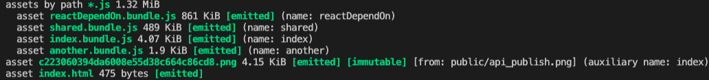

# Bundle Splitting

[Bundle Splitting](https://webpack.docschina.org/guides/code-splitting/)

> This process offers one way of optimizing a build, allowing webpack to generate multiple bundles for a single application. As a result, each bundle can be isolated from changes effecting others, reducing the amount of code that needs to be republished and therefore re-downloaded by the client and taking advantage of browser caching.
>
> 这个过程提供了一种优化构建的方法，允许 webpack 为单个应用程序生成多个 bundle 文件。因此，可以将每个 bundle 文件与影响其他文件的更改进行分离，从而减少重新发布并由此被客户端重新下载的代码量，并且运用浏览器缓存。

打包分离背后的思想非常简单。如果你有一个体积巨大的文件，并且只改了一行代码，用户仍然需要重新下载整个文件。但是如果你把它分为了两个文件，那么用户只需要下载那个被修改的文件，而浏览器则可以从缓存中加载另一个文件。

常用的代码分离方法有三种：

-   入口起点：使用 entry 配置手动地分离代码。
-   防止重复：使用 Entry dependencies 或者 SplitChunksPlugin 去重和分离 chunk。
-   动态导入：通过模块的内联函数调用来分离代码。

## 多入口(entry point)

这是最简单的代码分割方式，相对应的需要很多的手动配置，下面一一进行说明。

我们在开发中，最常接触到的是单文件应用，通常对于入口 `entry` 配置，也只是配置一个地址，如：

```js
entry: path.join(__dirname, 'src/index.jsx');
```


`webpack` 会根据入口的配置生成对应的 `chunk`，一个入口就一个 `chunk`，多个入口就多个 `chunk`。当然了，`webpack` 在对模块依赖查找的过程中，如果发现是异步依赖，也会生成一个新的 `chunk`。

我们修改下 `entry` 的配置:

```js
entry: {
    index: {
        import: './src/index.jsx',
        dependOn: 'shared'
    },
    another: {
        import: './src/another-module.js',
        dependOn: 'shared'
    },
    shared: 'lodash',
}
```

执行打包，生成结果如下：


打包的结果从原先的 `main.bundle.js` 文件，变成了 `index.bundle.js`、和 `another.bundle.js` 两个文件。实现了代码的拆分。

但是整体体积，从原先单 `main.bundle.js` 文件的 `1.31 MiB` 增加成多文件后 `1.78 MiB`，这是为什么呢？

这种方式存在一些隐患：

-   如果入口 `chunk` 之间包含一些重复的模块，那些重复模块都会被引入到各个 `bundle` 中。
-   这种方法不够灵活，并且不能动态地将核心应用程序逻辑中的代码拆分出来

## 防止重复(prevent duplication)

如果入口 `chunk` 之间包含一些重复的模块，那些重复模块都会被引入到各个 `bundle` 中。

可以在配置中增加 [`Dependencies`](https://webpack.docschina.org/configuration/entry-context/#dependencies) 配置。

```js
entry: {
    index: {
        import: './src/index.jsx',
        dependOn: 'shared'
    },
    another: {
        import: './src/another-module.js',
        dependOn: 'shared'
    },
    shared: 'lodash',
}
```

执行打包，生成结果如下：


与未增加 `dependOn` 进行对比:

-   总的打包提交从 `1.78 MiB` 降至 `1.32 MiB`，已经与单入口打包的体积基本上一致了。
-   `index.bundle.js` 从 `1.31 MiB` 降至 `858 KiB`
-   `another.bundle.js` 从 `485 KiB` 降至 `1.9 KiB`

`index` 模块中有对 `another` 进行使用，在打包中，`index` 内也把 `another` 的内容进行了打包。

我们继续增加配置，在 `index` 的 `dependOn` 的增加 `another` 进行优化:

```js
entry: {
    index: {
        import: './src/index.jsx',
        dependOn: ['shared', 'another']
    },
    another: {
        import: './src/another-module.js',
        dependOn: 'shared'
    },
    shared: 'lodash',
}
```


与上面的进行比较，其他的大小不变，`index.bundle.js` 减少了 `1 KiB`，当然小小的 `1 KiB` 对整体影响并没有多少，但是这是建立在 `another` 内容小的情况下，如果内容大，这个优化就很明显。

我们还能继续优化，把一下常用模块依赖进行拆分：

```js
entry: {
    index: {
        import: './src/index.jsx',
        dependOn: ['another', 'shared', 'reactDependOn']
    },
    another: {
        import: './src/another-module.js',
        dependOn: 'shared'
    },
    shared: 'lodash',
    reactDependOn: ['react', 'react-dom']
}
```


整体体积不变，但是拆分出了一个 `react` 相关的文件，相对应的 `index.bundle.js` 的大小也明显的缩小了，从原先的 `857 KiB` 变成了现在的 `4.07 KiB`。

## SplitChunksPlugin

### 默认值

webpack 将根据以下条件自动拆分 chunks：

-   新的 chunk 可以被共享，或者模块来自于 node_modules 文件夹
-   新的 chunk 体积大于 20kb（在进行 min+gz 之前的体积）
-   当按需加载 chunks 时，并行请求的最大数量小于或等于 30
-   当加载初始化页面时，并发请求的最大数量小于或等于 30

```js
module.exports = {
    //...
    optimization: {
        splitChunks: {
            // 表示选择哪些 chunks 进行分割，可选值有：async，initial和all
            chunks: 'async',
            // 表示新分离出的chunk必须大于等于minSize，默认为20000，约20kb。
            minSize: 20000,
            // 通过确保拆分后剩余的最小 chunk 体积超过限制来避免大小为零的模块。
            minRemainingSize: 0,
            // 表示一个模块至少应被minChunks个chunk所包含才能分割。默认为1
            minChunks: 1,
            // 表示按需加载文件时，并行请求的最大数目。默认为30。
            maxAsyncRequests: 30,
            // 表示加载入口文件时，并行请求的最大数目。默认为30。
            maxInitialRequests: 30,
            // 如果 chunk 的体积超过了 50k, 强制执行拆分的体积阈值和其他限制（minRemainingSize，maxAsyncRequests，maxInitialRequests）将被忽略。
            enforceSizeThreshold: 50000,
            // cacheGroups 下可以可以配置多个组，每个组根据test设置条件，符合test条件的模块，就分配到该组。模块可以被多个组引用，但最终会根据priority来决定打包到哪个组中。默认将所有来自node_modules目录的模块打包至vendors组，将两个以上的chunk所共享的模块打包至default组。
            cacheGroups: {
                defaultVendors: {
                    test: /[\\/]node_modules[\\/]/,
                    // 优先级，优先级越高，越先进行拆分
                    priority: -10,
                    // 已经被拆分过来，不用在进行拆分
                    reuseExistingChunk: true
                },
                default: {
                    minChunks: 2,
                    priority: -20,
                    reuseExistingChunk: true
                }
            }
        }
    }
};
```

### 实操

我们把原有 `entry` 配置调整一下

```js
entry: {
    index: {
        import: './src/index.jsx',
    },
    another: {
        import: './src/another-module.js',
    },
}
```

并在 `webpack.config.js` 中加上上述默认值， 并把 chunk 改成 `all`，支持异步模块和同步模块的代码拆分，在开发中也推荐使用 `all` 作为选项。


如果觉得打包出来的 defaultVendors 文件还是太大，我们可以继续在 `cacheGroups` 中增加分组。

```js
cacheGroups: {
    react: {
        test: /[\\/]node_modules[\\/]react/,
        priority: 0,
        reuseExistingChunk: true
    },
    defaultVendors: {
        test: /[\\/]node_modules[\\/]/,
        priority: -10,
        reuseExistingChunk: true
    },
    default: {
        minChunks: 2,
        priority: -20,
        reuseExistingChunk: true
    }
}
```


