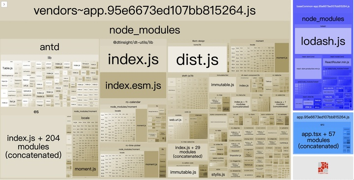
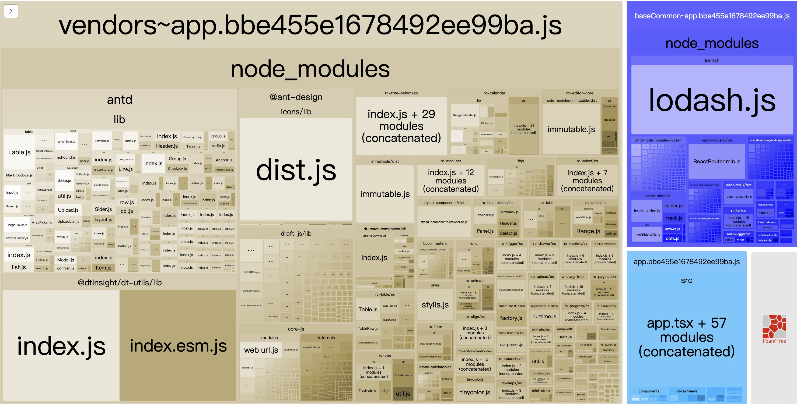

# external
防止将某些 import 的包(package)打包到 bundle 中，而是在运行时(runtime)再去从外部获取这些扩展依赖(external dependencies)。

以 moment 为列，在当前打包中把 moment 打包到了我们的项目内，可以看到体积还是挺大的。

现在我不希望 moment 被打包到这个项目内，可以使用 cdn 引用 moment 包的方式。

使用以下配置：



```javaScript
`<script src="https://cdn.bootcss.com/react/16.7.0/umd/react.production.min.js"></script>`
`<script src="https://cdn.bootcss.com/react-dom/16.7.0/umd/react-dom.production.min.js"></script>`
`<script src="https://cdn.bootcss.com/moment.js/2.23.0/moment.min.js"></script>`


// key 为当前项目内引用模块的名字， value 为挂载在 window 对象的属性。
module.exports = {
    //...
    externals: {
        react: 'React',
        'react-dom': 'ReactDOM',
        'moment': 'Moment',
    },
};                
```

配置后：




