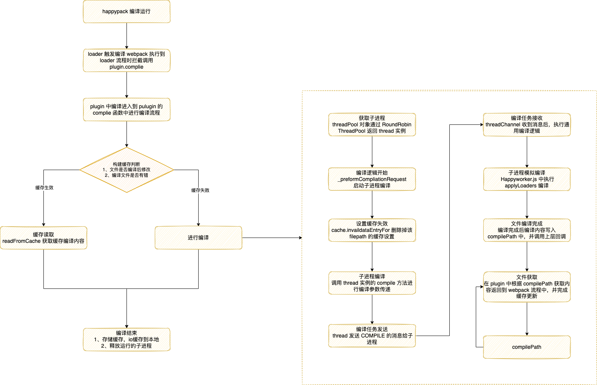

# 多进程/多实例构建

运行在 Node.js 之上的 webpack 是单线程模式的，也就是说，webpack 打包只能逐个文件处理，当 webpack 需要打包大量文件时，打包时间就会比较漫长。

多进程/多实例构建的方案比较知名的有以下三种：

- thread-loader（官方推出）
- parallel-webpack
- HappyPack

## [thread-loader](https://www.webpackjs.com/loaders/thread-loader/)

**install**
```js
npm install --save-dev thread-loader
```

**用法**
把这个 loader 放置在其他 loader 之前， 放置在这个 loader 之后的 loader 就会在一个单独的 worker 池(worker pool)中运行

在 worker 池(worker pool)中运行的 loader 是受到限制的。例如：

- 这些 loader 不能产生新的文件。
- 这些 loader 不能使用定制的 loader API（也就是说，通过插件）。
- 这些 loader 无法获取 webpack 的选项设置。
- 每个 worker 都是一个独立的 node.js 进程，其开销大约为 600ms 左右。同时会限制跨进程的数据交换。

请仅在耗时的 loader 上使用。

// TODO 了解 thread-loader 里面执行流程

```js
module.exports = {
  module: {
    rules: [
      {
        test: /\.js$/,
        include: path.resolve("src"),
        use: [
          "thread-loader",
          "expensive-loader"
        ]
      }
    ]
  }
}
```

### 原理
- 启动时，以 pitch 方式拦截 Loader 执行链
- 分析 Webpack 配置对象，获取 thread-loader 后面的 Loader 列表
- 调用 child_process.spawn 创建 worker 进程，并将 Loader 列表、文件路径、上下文等参数传递到子进程
- 子进程中调用 loader-runner，转译文件内容
- 转译完毕后，将结果传回主进程

### 缺点
- Loader 中不能调用 emitAsset 等接口，这会导致 style-loader 这一类 Loader 无法正常工作，解决方案是将这类组件放置在 thread-loader 之前，如 ['style-loader', 'thread-loader', 'css-loader']
- Loader 中不能获取 compilation、compiler 等实例对象，也无法获取 Webpack 配置

## [HappyPack](https://github.com/amireh/happypack)
**install**
```js
npm install --save-dev happypack
```

**用法**
```js
const HappyPack = require('happypack');

exports.module = {
  rules: [
    {
      test: /.js$/,
      // 1) replace your original list of loaders with "happypack/loader":
      // loaders: [ 'babel-loader?presets[]=es2015' ],
      use: 'happypack/loader',
      include: [ /* ... */ ],
      exclude: [ /* ... */ ]
    }
  ]
};

exports.plugins = [
  // 2) create the plugin:
  new HappyPack({
    // 3) re-add the loaders you replaced above in #1:
    loaders: [ 'babel-loader?presets[]=es2015' ]
  })
];
```

### 原理
- happlypack/loader 接受到转译请求后，从 Webpack 配置中读取出相应 HappyPack 插件实例
- 调用插件实例的 compile 方法，创建 HappyThread 实例(或从 HappyThreadPool 取出空闲实例)
- HappyThread 内部调用 child_process.fork 创建子进程，并执行 HappyWorkerChannel 文件
- HappyWorkerChannel 创建 HappyWorker ，开始执行 Loader 转译逻辑



### 缺点
HappyPack 虽然确实能有效提升 Webpack 的打包构建速度，但它有一些明显的缺点：

- 作者已经明确表示不会继续维护，扩展性与稳定性缺乏保障，随着 Webpack 本身的发展迭代，可以预见总有一天 HappyPack 无法完全兼容 Webpack
- HappyPack 底层以自己的方式重新实现了加载器逻辑，源码与使用方法都不如 Thread-loader 清爽简单
- 不支持部分 Loader，[兼容列表](https://github.com/amireh/happypack/wiki/Loader-Compatibility-List)

## parallel-webpack

**install**
```js
npm install parallel-webpack --save-dev
```

**用法**
```js
var createVariants = require('parallel-webpack').createVariants;

// Those options will be mixed into every variant
// and passed to the `createConfig` callback.
var baseOptions = {
    preferredDevTool: process.env.DEVTOOL || 'eval'
};

// This object defines the potential option variants
// the key of the object is used as the option name, its value must be an array
// which contains all potential values of your build.
var variants = {
    minified: [true, false],
    debug: [true, false],
    target: ['commonjs2', 'var', 'umd', 'amd']
};

function createConfig(options) {
    var plugins = [
        new webpack.optimize.DedupePlugin(),
        new webpack.optimize.OccurenceOrderPlugin(),
        new webpack.DefinePlugin({
            DEBUG: JSON.stringify(JSON.parse(options.debug))
        })
    ];
    if(options.minified) {
        plugins.push(new webpack.optimize.UglifyJsPlugin({
            sourceMap: false,
            compress: {
                warnings: false
            }
        }));
    }
    return {
        entry: './index.js',
        devtool: options.preferredDevTool,
        output: {
            path: './dist/',
            filename: 'MyLib.' +
                options.target +
                (options.minified ? '.min' : '') +
                (options.debug ? '.debug' : '')
                + '.js',
            libraryTarget: options.target
        },
        plugins: plugins
    };
}

module.exports = createVariants(baseOptions, variants, createConfig);
```

上述示例使用 createVariants 函数，根据 variants 变量搭配出 16 种不同的 minified、debug、target 组合，最终生成如下产物：
```
[WEBPACK] Building 16 targets in parallel
[WEBPACK] Started building MyLib.umd.js
[WEBPACK] Started building MyLib.umd.min.js
[WEBPACK] Started building MyLib.umd.debug.js
[WEBPACK] Started building MyLib.umd.min.debug.js

[WEBPACK] Started building MyLib.amd.js
[WEBPACK] Started building MyLib.amd.min.js
[WEBPACK] Started building MyLib.amd.debug.js
[WEBPACK] Started building MyLib.amd.min.debug.js

[WEBPACK] Started building MyLib.commonjs2.js
[WEBPACK] Started building MyLib.commonjs2.min.js
[WEBPACK] Started building MyLib.commonjs2.debug.js
[WEBPACK] Started building MyLib.commonjs2.min.debug.js

[WEBPACK] Started building MyLib.var.js
[WEBPACK] Started building MyLib.var.min.js
[WEBPACK] Started building MyLib.var.debug.js
[WEBPACK] Started building MyLib.var.min.debug.js
```

### 原理
parallel-webpack 的实现非常简单，基本上就是在 Webpack 上套了个壳，核心逻辑：

- 根据传入的配置项数量，调用 worker-farm 创建复数个工作进程
- 工作进程内调用 Webpack 执行构建
- 工作进程执行完毕后，调用 node-ipc 向主进程发送结束信号
- 到这里，所有工作就完成了。

### 缺点
虽然，parallel-webpack 相对于 Thread-loader、HappyPack 有更高的并行度，但进程实例与实例之间并没有做任何形式的通讯，这可能导致相同的工作在不同进程 —— 或者说不同 CPU 核上被重复执行。例如需要对同一份代码同时打包出压缩和非压缩版本时，在 parallel-webpack 方案下，前置的资源加载、依赖解析、AST 分析等操作会被重复执行，仅仅最终阶段生成代码时有所差异。

这种技术实现，对单 entry 的项目没有任何收益，只会徒增进程创建成本；但特别适合 MPA 等多 entry 场景，或者需要同时编译出 esm、umd、amd 等多种产物形态的类库场景。

[happypack 原理解析](https://fed.taobao.org/blog/taofed/do71ct/happypack-source-code-analysis/)

[Webpack 性能系列二：多进程打包](https://zhuanlan.zhihu.com/p/425076452)
[happypack 原理解析](https://fed.taobao.org/blog/taofed/do71ct/happypack-source-code-analysis/)

## 并行压缩

webpack v5 开箱即带有最新版本的 terser-webpack-plugin。

默认已开启并行压缩能力，通常情况下保持默认配置即 parallel = true 即可获得最佳的性能收益。开发者也可以通过 parallel 参数关闭或设定具体的并行进程数量，例如：

```js
const TerserPlugin = require("terser-webpack-plugin");

module.exports = {
    optimization: {
        minimize: true,
        minimizer: [new TerserPlugin({
            parallel: 2 // number | boolean
        })],
    },
};
```

上述配置即可设定最大并行进程数为2。

# 总结

多进程打包属于打包优化，开发者应该视项目情况决定是否对某项打包任务采用多进程打包的方式，如果用得好，就能节约打包时间，用得不好，不如不用。